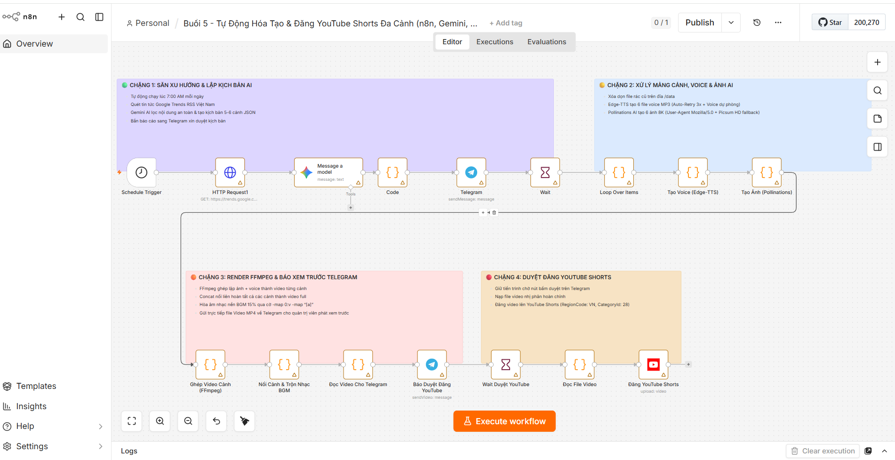
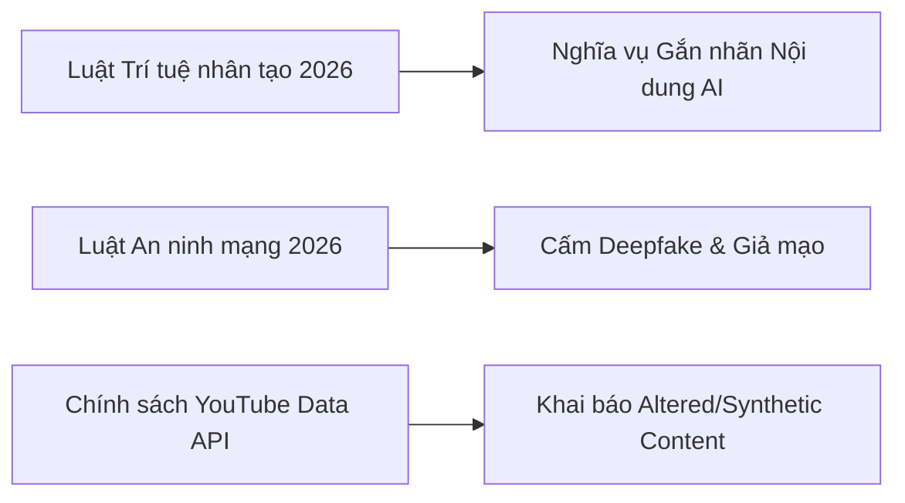
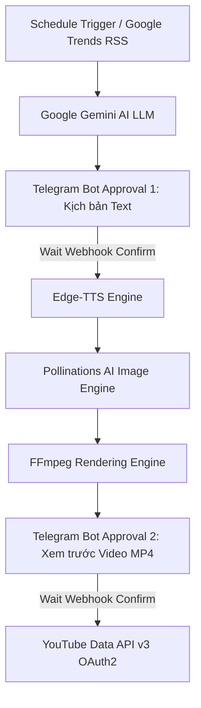

# Buổi 5: Máy Sản Xuất Video YouTube Shorts Tự Động (Gemini AI, Edge-TTS, FFmpeg & Telegram Bot)



## 📖 I. TỔNG QUAN VÀ MỤC TIÊU BÀI HỌC (THỜI LƯỢNG: 120 PHÚT)

Trong bài học này, học viên sẽ được xây dựng một **"Nhà máy sản xuất Video Shorts"** hoàn toàn tự động từ A-Z theo mô hình kiểm duyệt 2 bước **Human-In-The-Loop** chuẩn kiến trúc Kỹ sư AI / Cloud & DevOps:

- **Chặng 1 (Săn xu hướng & Tạo kịch bản)**: Quét tin tức hot từ Google Trends RSS $\rightarrow$ AI Gemini lọc nội dung an toàn & viết kịch bản 5-6 phân cảnh chuẩn JSON $\rightarrow$ Bắn bản nháp sang Telegram xin duyệt.
- **Chặng 2 (Tạo giọng đọc & Sinh ảnh AI)**: Nhận lệnh duyệt kịch bản $\rightarrow$ Chạy vòng lặp mảng bất đồng bộ `$input.all()` $\rightarrow$ Gọi Edge-TTS tạo 6 file âm thanh tiếng Việt MP3 $\rightarrow$ Gọi Pollinations AI sinh 6 hình ảnh AI HD 8K theo từng cảnh.
- **Chặng 3 (Render Video HD & Trộn Nhạc BGM)**: Dùng FFmpeg lặp ảnh ghép voice từng cảnh $\rightarrow$ Nối liên hoàn tất cả các phân cảnh thành video full $\rightarrow$ Hòa âm nhạc nền BGM (`bg_music.mp3`) với âm lượng 15% $\rightarrow$ Đọc file MP3/MP4 nhị phân $\rightarrow$ Gửi trực tiếp file Video MP4 về Telegram cho quản trị viên phát xem thử trực quan.
- **Chặng 4 (1-Click Duyệt đăng YouTube Shorts)**: Quản trị viên bấm nút `🚀 Đăng lên YouTube Shorts` $\rightarrow$ Webhook kích hoạt $\rightarrow$ Đẩy video lên kênh YouTube với các thuộc tính chuẩn SEO (`title`, `description`, `tags`, `regionCode: VN`, `categoryId: 28`).

---

## ⚖️ II. KHUNG PHÁP LÝ & QUY ĐỊNH GẮN NHÃN NỘI DUNG AI (LEGAL COMPLIANCE)

> [!IMPORTANT]
> **LƯU Ý PHÁP LÝ QUAN TRỌNG CHO NHÀ SÁNG TẠO AI NỘI DUNG TỰ ĐỘNG:**
> Khi xây dựng hệ thống tự động hóa nội dung đa phương tiện (Video/Audio/Ảnh AI), kỹ sư AI bắt buộc phải tuân thủ hành lang pháp lý hiện hành của Việt Nam và chính sách toàn cầu của các nền tảng (YouTube/TikTok/Facebook):



### 1. Luật Trí tuệ Nhân tạo Việt Nam (Hiệu lực từ 01/03/2026)

- **Nghĩa vụ gắn nhãn nhận biết (AI Content Labeling)**: Tất cả hình ảnh, âm thanh, video được tạo ra hoặc chỉnh sửa bằng AI BẮT BUỘC phải có dấu hiệu nhận biết rõ ràng để công chúng phân biệt với nội dung thực tế.
- **Hình thức thể hiện**: Chèn dòng chữ Watermark, Text Overlay trên video hoặc bổ sung dòng ghi chú/Hashtag `#CreatedWithAI`, `#GenerativeAI` trong phần Mô tả (Description) của Video.
- **Chế tài vi phạm**: Không tuân thủ quy định gắn nhãn có thể bị xử phạt hành chính hoặc gỡ bỏ toàn bộ kênh tự động hóa theo quy định pháp luật chuyên ngành.

### 2. Luật An ninh mạng (Sửa đổi 2025, Hiệu lực từ 01/07/2026)

- **Nghiêm cấm lạm dụng Deepfake**: Tuyệt đối KHÔNG sử dụng AI để giả mạo hình ảnh, giọng nói, khuôn mặt của cá nhân, tổ chức, khuôn mặt chính trị gia, hoặc tạo dựng các tin tức giả (Fake News) gây hoang mang dư luận.
- **Giải pháp trong Workflow n8n**: Trong Prompt của Node Gemini AI, chúng ta thiết lập cứng danh mục cấm (**Content Safety Guardrails**): Bỏ qua 100% các tin tức hành chính, chính trị, pháp luật, đất đai $\rightarrow$ Chỉ chọn chủ đề thuần Giải trí, Công nghệ, Mẹo vặt đời sống.

### 3. Quy định Bắt buộc của YouTube / Google về Nội dung AI

- **Khai báo Nội dung Tổng hợp (Altered or Synthetic Content)**: YouTube yêu cầu mọi Video Shorts chứa hình ảnh/giọng nói AI phải được khai báo minh bạch khi upload.
- **Hiệu quả thực tế**: Giúp kênh của bạn phát triển bền vững, được ưu tiên phân phối thuật toán Shorts mà không sợ bị gỡ video hay khóa tài khoản Google Cloud OAuth2.

---

## 🏛️ III. NỀN TẢNG KIẾN TRÚC & Ý NGHĨA CÔNG NGHỆ TRỌNG TÂM (TECH STACK RATIONALE)

Trước khi bắt tay vào cấu hình, kỹ sư tự động hóa cần nắm vững bản chất kiến trúc và lý do lựa chọn từng công nghệ cốt lõi trong hệ thống:



### 1. Docker & Containerization (Đóng gói môi trường)

- **Lý do chọn**: Giải quyết triệt để sự cố *"Chạy được trên máy tôi nhưng rớt trên máy học viên"*. n8n cần rất nhiều công cụ CLI của hệ điều hành Linux (FFmpeg, Python3, Edge-TTS, các bộ Font chữ tiếng Việt).
- **Cơ chế Volume Mount (`/data`)**: Gắn kết thư mục đĩa trên máy Host (`local_files/`) với thư mục `/data` bên trong Docker Container. Nhờ đó toàn bộ file ảnh, âm thanh MP3 và video MP4 được lưu trữ bền vững không bị mất khi Restart Container.
- **Biến môi trường `N8N_RUNNERS_ENABLED=false`**: Ép n8n v2.x thực thi mã JavaScript trực tiếp trong tiến trình Container chính, loại bỏ hoàn toàn bẫy lỗi Task Runner Timeout WebSocket (ngắt kết nối khi xử lý video nặng).

### 2. FFmpeg (Động cơ xử lý đa phương tiện công nghiệp)

- **Lý do chọn**: FFmpeg là công cụ CLI chuẩn công nghiệp có tốc độ xử lý video cực nhanh mà không tốn dung lượng RAM như các phần mềm dựng phim đồ họa.
- **Lệnh lặp ảnh ghép voice (`-shortest`)**: Ghép 1 bức ảnh tĩnh với 1 file mp3 giọng đọc, tự động kết thúc video khi giọng đọc kết thúc.
- **Lệnh nối video (`concat`)**: Nối liên hoàn 5-6 phân cảnh `video_scene_1.mp4` $\rightarrow$ `video_scene_6.mp4` thành 1 video dài hợp nhất.
- **Thuật toán hòa âm `amix` & cờ stream `-map 0:v -map "[a]"`**: Trộn giọng đọc AI chính với nhạc nền BGM 15%. Cờ `-map 0:v -map "[a]"` bắt buộc phải có để ánh xạ chính xác luồng âm thanh sau hòa âm vào video đầu ra.

### 3. Edge-TTS (Công nghệ giọng đọc Neural tiếng Việt)

- **Lý do chọn**: Sử dụng kho giọng đọc Neural miễn phí chất lượng cao của Microsoft Edge (`vi-VN-HoaiMyNeural`, `vi-VN-NamMinhNeural`). Giọng đọc truyền cảm, có nhấn nhá tự nhiên, phát âm tiếng Việt chuẩn 100% và **hoàn toàn 0 tốn phí API Key**.
- **Thuật toán Auto-Retry 3x & Voice Fallback**: Khi kết nối mạng chập chờn, mã n8n tự động nghỉ 1.5s để thử lại, nếu quá 3 lần sẽ tự động chuyển sang giọng dự phòng `vi-VN-NamMinhNeural` để đảm bảo luồng chạy không bao giờ đứt đoạn.

### 4. Pollinations AI (Động cơ sinh ảnh AI tự động)

- **Lý do chọn**: Miễn phí 100%, tốc độ sinh ảnh nhanh qua URL.
- **Kỹ thuật giả lập Header `User-Agent: Mozilla/5.0`**: Tránh bị tường lửa Cloudflare của Pollinations AI chặn dạng Bot scraper.
- **Cơ chế HD Photo Fallback**: Nếu dịch vụ AI bị bảo trì, hệ thống tự động chuyển sang tải ảnh chụp HD thật sắc nét (Picsum 350KB) $\rightarrow$ Đảm bảo 100% không bao giờ rớt về phông màu đơn sắc hay bị lỗi dữ liệu `null`.

### 5. Google Gemini AI (Bộ não lập kịch bản)

- **Lý do chọn**: Tốc độ phản hồi cực nhanh, hỗ trợ ép kiểu dữ liệu JSON chuẩn (`jsonOutput: true`), hiểu biết sâu sắc văn hóa và quy định An ninh mạng Việt Nam.

### 6. Telegram Bot API (Giao diện kiểm duyệt Human-In-The-Loop)

- **Lý do chọn**: Gửi thông báo tức thì (Push notification), cho phép phát trực tiếp file Video MP4 ngay trong khung chat và tương tác bấm nút Duyệt 1-Click cực kỳ tiện lợi trên điện thoại di động.

---

## 🔑 IV. CHUẨN BỊ MÔI TRƯỜNG & THIẾT LẬP CREDENTIALS TẬP TRUNG (UPFRONT SETUP)

Học viên tiến hành thiết lập sẵn toàn bộ Môi trường & Credentials ngay ở bước này để khi kéo-thả n8n không bị ngắt quãng.

### 1. Khởi chạy Môi trường Docker Container

Tạo thư mục `n8n-youtube-automation/` trên máy tính và chuẩn bị 2 file cấu hình sau:

#### File `Dockerfile`

```dockerfile
FROM n8nio/n8n:latest

USER root

# Cài đặt FFmpeg, Python3, py3-pip và các công cụ bổ trợ
RUN apk add --no-cache --update \
    ffmpeg \
    python3 \
    py3-pip \
    curl \
    bash

# Cài đặt Edge-TTS
RUN pip3 install edge-tts --break-system-packages

USER node
```

#### File `docker-compose.yml`

```yaml
version: '3.8'

services:
  n8n:
    build: .
    container_name: n8n_video_automation
    restart: always
    ports:
      - "5678:5678"
    environment:
      - N8N_HOST=localtest.me
      - N8N_PORT=5678
      - N8N_PROTOCOL=http
      - WEBHOOK_URL=http://localtest.me:5678/
      - N8N_SECURE_COOKIE=false
      - NODE_ENV=production
      - GENERIC_TIMEZONE=Asia/Ho_Chi_Minh
      - NODE_FUNCTION_ALLOW_BUILTIN=*
      - NODE_FUNCTION_ALLOW_EXTERNAL=*
      # Tắt task-runner sub-process để xử lý FFmpeg/Edge-TTS không bị timeout heartbeat
      - N8N_RUNNERS_ENABLED=false
      - N8N_ENFORCE_SETTINGS_FILE_PERMISSIONS=false
    volumes:
      - n8n_data:/home/node/.n8n
      - ./local_files:/data

volumes:
  n8n_data:
```

Mở Terminal tại thư mục trên và chạy lệnh:

```bash
docker compose up -d
```

Truy cập giao diện n8n tại: `http://localtest.me:5678`

---

### 2. Thiết lập Google Gemini API Key

1. Truy cập [Google AI Studio](https://aistudio.google.com/).
2. Bấm **Get API key** $\rightarrow$ **Create API key**. Sao chép mã API Key.
3. Trên n8n UI: Mở **Credentials** $\rightarrow$ Thêm mới **Google Gemini (PaLM) Api** $\rightarrow$ Dán API Key vào và bấm Save.

---

### 3. Thiết lập Telegram Bot Token & Chat ID

1. Mở Telegram, tìm con bot `@BotFather` $\rightarrow$ Gửi lệnh `/newbot` để tạo bot mới. Sao chép đoạn **Bot Token**.
2. Tìm con bot `@userinfobot` $\rightarrow$ Bấm `/start` để lấy mã **Chat ID** cá nhân của bạn (Ví dụ: `8374731299`).
3. Mở khung chat với con Bot vừa tạo, bấm `/start` để kích hoạt bot.
4. Trên n8n UI: Thêm Credential **Telegram API** $\rightarrow$ Dán Access Token vào và bấm Save.

---

### 4. Thiết lập Google OAuth2 Credentials cho YouTube Data API v3

1. Truy cập [Google Cloud Console](https://console.cloud.google.com/).
2. Tạo dự án mới tên `YouTube Automation`.
3. Mở **APIs & Services** $\rightarrow$ **Library** $\rightarrow$ Tìm `YouTube Data API v3` $\rightarrow$ Bấm **Enable**.
4. Mở **OAuth consent screen**:
   - Chọn **External** $\rightarrow$ Bấm Create.
   - Điền App name, User support email.
   - **BƯỚC QUAN TRỌNG (Test Users)**: Tại mục **Test users**, bấm **+ ADD USERS** $\rightarrow$ Nhập chính xác địa chỉ Email Gmail tài khoản YouTube của bạn vào danh sách.
5. Mở **Credentials** $\rightarrow$ **Create Credentials** $\rightarrow$ **OAuth client ID**:
   - Application type: **Web application**.
   - Authorized redirect URIs: Nhập `http://localtest.me:5678/rest/oauth2-credential/callback`.
   - Bấm Create $\rightarrow$ Sao chép **Client ID** và **Client Secret**.
6. Trên n8n UI: Thêm Credential **YouTube OAuth2 API**:
   - Client ID: Dán Client ID.
   - Client Secret: Dán Client Secret.
   - Bấm **Connect my account** $\rightarrow$ Đăng nhập Gmail $\rightarrow$ Bấm **Continue (Tiếp tục)** để cấp quyền đăng video.

---

## === SUBTAB: 🛠️ Phương pháp 1: Hướng dẫn Cấu hình Chi Tiết Từng Node

## ⚙️ V. HƯỚNG DẪN CẤU HÌNH CHI TIẾT TỪNG NODE (16 NODES)

Học viên kéo-thả từng Node trên n8n canvas và điền thông số theo hướng dẫn bên dưới:

### 🟢 CHẶNG 1: TỰ ĐỘNG LỌC XU HƯỚNG & TẠO KỊCH BẢN AI

#### Node 1: Schedule Trigger (Kích hoạt khung giờ vàng)

* **Type**: `Schedule Trigger`

- **Trigger Interval**: `Hours`
- **Trigger at Hour**: `7` (Tự động khởi động vào 7 giờ sáng hàng ngày).
- **Lý do dùng**: Giúp kênh vận hành tự động theo lịch cố định mà không cần con người can thiệp.

#### Node 2: HTTP Request1 (Quét Google Trends RSS)

* **Type**: `n8n-nodes-base.httpRequest`

- **Method**: `GET`
- **URL**: `https://trends.google.com/trending/rss?geo=VN`
- **Lý do dùng**: Thu thập dữ liệu tin tức đang được tìm kiếm nhiều nhất tại Việt Nam theo thời gian thực.

#### Node 3: Message a model (Gemini AI phân tích & viết kịch bản)

* **Type**: `@n8n/n8n-nodes-langchain.googleGemini`

- **Model**: `models/gemini-3-flash-preview`
- **Credential**: Chọn Credential Gemini đã tạo ở Phần IV.
- **JSON Output**: `true` (Bật công tắc này để ép Gemini trả về định dạng JSON thuần).
- **Prompt Content**:

```prompt
=Bạn là một nhà sáng tạo nội dung YouTube chuyên nghiệp và tuân thủ nghiêm ngặt Luật Trí tuệ nhân tạo & Luật An ninh mạng Việt Nam.

QUY TẮC AN TOÀN NỘI DUNG VÀ TUÂN THỦ PHÁP LÝ (BẮT BUỘC KHÔNG VI PHẠM):
1. TUYỆT ĐỐI BỎ QUA VÀ NÉ TRÁNH các chủ đề liên quan đến: Chính trị, Nhà nước, Chính phủ, Bộ Công An, Quân đội, Luật pháp, VNeID, Căn cước, Sổ đỏ, Thuế, Chính sách đất đai, Tôn giáo, Tranh chấp địa chính trị, hoặc tin tức hành chính.
2. CHỈ CHỌN các chủ đề an toàn thuộc nhóm: Công nghệ (AI, Gadgets, Smartphone, Xe điện), Đời sống & Giải trí (Âm nhạc, Điện ảnh, Game, Thể thao, Du lịch, Ẩm thực, Khoa học vũ trụ, Mẹo vặt đời sống).
3. TUÂN THỦ LUẬT AI 2026: Phần description bắt buộc thêm nhãn gắn minh bạch: "#Shorts #AIContent #CreatedWithAI".

Dựa vào dữ liệu trending sau đây: {{ $json.data }}, hãy lọc bỏ tất cả các tin nhà nước/chính trị và chọn ra 1 chủ đề thuần Giải trí/Công nghệ/Đời sống hấp dẫn nhất để viết kịch bản cho một video YouTube Shorts.

Yêu cầu BẮT BUỘC:
1. Kịch bản BẮT BUỘC phải bao gồm TỐI THIỂU 5 đến 6 CẢNH (scenes) phân biệt rõ ràng.
2. Trả về định dạng JSON chuẩn xác theo cấu trúc sau (không kèm markdown ```json):
{
  "title": "Tiêu đề video cực kỳ thu hút, giật tít",
  "description": "Mô tả video chuẩn SEO #Shorts #AIContent #CreatedWithAI",
  "tags": "trend, cong nghe, giai tri, vietnam, shorts, aicontent",
  "scenes": [
    {
      "scene_number": 1,
      "voiceover_text": "Văn bản tiếng Việt mở đầu (Hook mạnh).",
      "image_prompt": "Cinematic prompt 1, 8k resolution, photorealistic, 16:9 ratio"
    },
    ...
  ]
}
```

- **Lý do dùng**: Ép Gemini trả về mảng `scenes` 5-6 phân cảnh có lời thoại tiếng Việt và câu lệnh vẽ ảnh tiếng Anh riêng biệt cho từng cảnh, đồng thời tự động chèn nhãn tuân thủ Luật AI 2026.

#### Node 4: Code (Parse JSON kịch bản)

* **Type**: `n8n-nodes-base.code`

- **Mode**: `Run Once for All Items`
- **JavaScript**:

```javascript
const text = items[0].json.content?.parts?.[0]?.text || items[0].json.text || items[0].json.message?.content;
return JSON.parse(text);
```

- **Lý do dùng**: Giải mã chuỗi JSON từ phản hồi của Gemini thành Object chuẩn để truyền sang các node tiếp theo.

#### Node 5: Telegram (Báo duyệt kịch bản)

* **Type**: `n8n-nodes-base.telegram`

- **Credential**: Chọn Telegram Credential.
- **Chat ID**: Nhập mã Chat ID của bạn.
- **Text**:

```text
=🎬 BÁO CÁO KỊCH BẢN MỚI 🎬
Tên video: {{ $json.title }}
Số cảnh: {{ $json.scenes.length }} cảnh.

Bạn có muốn duyệt kịch bản này để AI tự động render video không?
```

- **Reply Markup**: `Inline Keyboard`
- **Buttons**:
  - Button 1: Text = `✅ Duyệt & Làm Video` | URL = `={{ $execution.resumeUrl }}&action=approve`
  - Button 2: Text = `❌ Hủy bỏ` | URL = `={{ $execution.resumeUrl }}&action=reject`
- **Lý do dùng**: Áp dụng mô hình Human-In-The-Loop cho phép quản trị viên xem tiêu đề và số lượng cảnh trước khi đồng ý tiêu tốn tài nguyên render.

#### Node 6: Wait (Dừng tiến trình chờ nút bấm)

* **Type**: `n8n-nodes-base.wait`

- **Resume**: `On Webhook Call`
- **Lý do dùng**: Giữ trạng thái Workflow tạm dừng cho đến khi người dùng bấm nút trên Telegram.

---

### 🟡 CHẶNG 2: XỬ LÝ MẢNG CẢNH, TẠO VOICE & SINH ẢNH AI

#### Node 7: Loop Over Items (Phân tách & dọn dẹp file)

* **Type**: `n8n-nodes-base.code`

- **JavaScript**:

```javascript
const fs = require('fs');
// Xóa sạch các file cảnh cũ từ những lần chạy trước để không bị trộn lẫn
const oldFiles = fs.readdirSync('/data').filter(f => f.startsWith('video_scene_') || f.startsWith('scene_'));
for (const file of oldFiles) {
  try { fs.unlinkSync(`/data/${file}`); } catch (e) {}
}

const scriptData = $('Code').first().json;
return scriptData.scenes.map(scene => ({ json: scene }));
```

- **Lý do dùng**: Dọn dẹp đĩa tránh xáo trộn dữ liệu cũ và tách mảng `scenes` thành các item riêng biệt để chạy vòng lặp `$input.all()`.

#### Node 8: Tạo Voice (Edge-TTS)

* **Type**: `n8n-nodes-base.code`

- **JavaScript**:

```javascript
const { exec } = require('child_process');
const util = require('util');
const execPromise = util.promisify(exec);
const sleep = (ms) => new Promise(resolve => setTimeout(resolve, ms));
const results = [];

for (const itemObj of $input.all()) {
  const item = itemObj.json;
  const sceneNum = item.scene_number;
  const text = (item.voiceover_text || '').replace(/"/g, "'").replace(/\n/g, ' ').trim();

  let success = false;
  let attempts = 0;
  while (!success && attempts < 3) {
    attempts++;
    try {
      await execPromise(`edge-tts --voice vi-VN-HoaiMyNeural --text "${text}" --write-media /data/scene_${sceneNum}.mp3`);
      success = true;
    } catch (err) {
      if (attempts >= 3) {
        try {
          await execPromise(`edge-tts --voice vi-VN-NamMinhNeural --text "${text}" --write-media /data/scene_${sceneNum}.mp3`);
          success = true;
        } catch (e2) {}
      } else {
        await sleep(1500);
      }
    }
  }

  results.push({ json: { ...item, voice_file: `/data/scene_${sceneNum}.mp3` } });
}

return results;
```

- **Lý do dùng**: Gọi `edge-tts` bất đồng bộ (`await execPromise`) giúp luồng chính n8n không bị freeze, tự động thử lại 3 lần và chuyển sang giọng nam dự phòng nếu mạng gián đoạn.

#### Node 9: Tạo Ảnh (Pollinations)

* **Type**: `n8n-nodes-base.code`

- **JavaScript**:

```javascript
const { exec } = require('child_process');
const util = require('util');
const execPromise = util.promisify(exec);
const fs = require('fs');
const sleep = (ms) => new Promise(resolve => setTimeout(resolve, ms));
const results = [];
const allItems = $input.all();

for (let i = 0; i < allItems.length; i++) {
  const item = allItems[i].json;
  const sceneNum = item.scene_number || (i + 1);
  const prompt = encodeURIComponent(item.image_prompt || 'Cinematic Vietnamese scenery 8k photorealistic');
  const seed = Math.floor(Math.random() * 1000000);
  const imageUrl = `https://image.pollinations.ai/prompt/${prompt}?width=1920&height=1080&nologo=true&seed=${seed}`;
  const targetPath = `/data/scene_${sceneNum}.jpg`;

  let success = false;
  let attempts = 0;

  while (!success && attempts < 3) {
    attempts++;
    try {
      if (i > 0 || attempts > 1) {
        await sleep(2000);
      }
      const pyCmd = `python3 -c "import urllib.request; req = urllib.request.Request('${imageUrl}', headers={'User-Agent': 'Mozilla/5.0 (Windows NT 10.0; Win64; x64)'}); data = urllib.request.urlopen(req, timeout=15).read(); open('${targetPath}', 'wb').write(data)"`;
      await execPromise(pyCmd);
      
      if (fs.existsSync(targetPath) && fs.statSync(targetPath).size > 5000) {
        success = true;
      }
    } catch (err) {}
  }

  if (!success) {
    try {
      const fallbackUrl = `https://picsum.photos/1920/1080?random=${seed}`;
      const pyFallback = `python3 -c "import urllib.request; req = urllib.request.Request('${fallbackUrl}', headers={'User-Agent': 'Mozilla/5.0'}); data = urllib.request.urlopen(req, timeout=15).read(); open('${targetPath}', 'wb').write(data)"`;
      await execPromise(pyFallback);
    } catch (e) {}
  }

  results.push({ json: { ...item, image_file: targetPath } });
}

return results;
```

- **Lý do dùng**: Giả lập Header `Mozilla/5.0` để không bị chặn HTTP 429, tự động giãn đễ 2s và tự động tải ảnh HD chụp thật sắc nét (Picsum 350KB) nếu server AI bận.

---

### 🟠 CHẶNG 3: RENDER VIDEO FFMPEG, MIX BGM & BÁO XEM TRƯỚC TELEGRAM

#### Node 10: Ghép Video Cảnh (FFmpeg)

* **Type**: `n8n-nodes-base.code`

- **JavaScript**:

```javascript
const { exec } = require('child_process');
const util = require('util');
const execPromise = util.promisify(exec);
const results = [];

for (const itemObj of $input.all()) {
  const item = itemObj.json;
  const sceneNum = item.scene_number;

  await execPromise(`ffmpeg -loop 1 -i /data/scene_${sceneNum}.jpg -i /data/scene_${sceneNum}.mp3 -c:v libx264 -tune stillimage -c:a aac -b:a 192k -pix_fmt yuv420p -shortest /data/video_scene_${sceneNum}.mp4 -y`);
  results.push({ json: { ...item, video_file: `/data/video_scene_${sceneNum}.mp4` } });
}

return results;
```

- **Lý do dùng**: Lặp từng bức ảnh theo đúng độ dài mp3 từng phân cảnh, xuất ra các file `video_scene_1.mp4` $\rightarrow$ `video_scene_6.mp4`.

#### Node 11: Nối Cảnh & Trộn Nhạc BGM

* **Type**: `n8n-nodes-base.code`

- **JavaScript**:

```javascript
const { exec } = require('child_process');
const fs = require('fs');
const util = require('util');
const execPromise = util.promisify(exec);

// 1. Quét tất cả các file video_scene_*.mp4 và sắp xếp thứ tự 1..N
const files = fs.readdirSync('/data')
  .filter(file => file.startsWith('video_scene_') && file.endsWith('.mp4'))
  .sort((a, b) => {
    const numA = parseInt(a.replace('video_scene_', '').replace('.mp4', ''), 10);
    const numB = parseInt(b.replace('video_scene_', '').replace('.mp4', ''), 10);
    return numA - numB;
  });

// 2. Tạo file concat.txt
let concatContent = '';
for (const file of files) {
  concatContent += `file '/data/${file}'\n`;
}
fs.writeFileSync('/data/concat.txt', concatContent);

// 3. Nối tất cả các video phân cảnh lại thành 1 video duy nhất
await execPromise('ffmpeg -f concat -safe 0 -i /data/concat.txt -c copy /data/FINAL_MERGED.mp4 -y');

// 4. Trộn Nhạc Nền BGM (/data/bg_music.mp3 âm lượng 15%)
const hasBgMusic = fs.existsSync('/data/bg_music.mp3');
if (hasBgMusic) {
  await execPromise('ffmpeg -i /data/FINAL_MERGED.mp4 -i /data/bg_music.mp3 -filter_complex "[1:a]volume=0.15[bg];[0:a][bg]amix=inputs=2:duration=first[a]" -map 0:v -map "[a]" -c:v copy -c:a aac /data/FINAL_YOUTUBE_SHORTS.mp4 -y');
} else {
  fs.copyFileSync('/data/FINAL_MERGED.mp4', '/data/FINAL_YOUTUBE_SHORTS.mp4');
}

const scriptData = $('Code').first().json;

return [{
  json: {
    title: scriptData.title,
    description: scriptData.description,
    tags: scriptData.tags,
    video_path: '/data/FINAL_YOUTUBE_SHORTS.mp4',
    total_scenes_merged: files.length
  }
}];
```

- **Lý do dùng**: Ghép nối liên hoàn tất cả các cảnh và hòa âm nhạc nền `bg_music.mp3` với âm lượng 15% bắt tai.

#### Node 12: Đọc Video Cho Telegram

* **Type**: `n8n-nodes-base.code`

- **JavaScript**:

```javascript
const fs = require('fs');
const videoBuffer = fs.readFileSync('/data/FINAL_YOUTUBE_SHORTS.mp4');
const scriptData = $('Nối Cảnh & Trộn Nhạc BGM').first().json;

return [{
  json: scriptData,
  binary: {
    data: await this.helpers.prepareBinaryData(videoBuffer, 'FINAL_YOUTUBE_SHORTS.mp4', 'video/mp4')
  }
}];
```

- **Lý do dùng**: Đọc file MP4 từ đĩa cứng vào bộ nhớ `binary.data` để chuẩn bị đính kèm gửi sang Telegram.

#### Node 13: Báo Duyệt Đăng YouTube (Gửi Video MP4 về Telegram)

* **Type**: `n8n-nodes-base.telegram`

- **Resource**: `message`
- **Operation**: `sendVideo`
- **Binary Data**: `true`
- **Binary Property Name**: `data`
- **Caption**:

```text
=🎉 VIDEO HOÀN CHỈNH ĐÃ RENDER XONG! 🎉

📌 Tiêu đề: {{ $json.title }}
📝 Số cảnh đã ghép: {{ $json.total_scenes_merged }} cảnh.

Video đã được gộp tất cả các cảnh và trộn nhạc nền BGM 15% bên dưới. Bạn hãy xem thử video trên Telegram và chọn có đăng lên YouTube Shorts không?
```

- **Reply Markup**: `Inline Keyboard`
- **Buttons**:
  - Button 1: Text = `🚀 Đăng lên YouTube Shorts` | URL = `={{ $execution.resumeUrl }}&action=upload_youtube`
  - Button 2: Text = `❌ Không đăng` | URL = `={{ $execution.resumeUrl }}&action=cancel_upload`
- **Lý do dùng**: Đính kèm trực tiếp video MP4 vào Telegram chat cho phép quản trị viên bấm xem thử trực tiếp âm thanh/hình ảnh trước khi bấm nút đăng chính thức.

---

### 🔴 CHẶNG 4: KÍCH HOẠT ĐĂNG LÊN YOUTUBE SHORTS

#### Node 14: Wait Duyệt YouTube

* **Type**: `n8n-nodes-base.wait`

- **Resume**: `On Webhook Call`
- **Lý do dùng**: Chờ thao tác xác nhận đăng từ nút bấm Telegram.

#### Node 15: Đọc File Video

* **Type**: `n8n-nodes-base.code`

- **JavaScript**:

```javascript
const fs = require('fs');
const videoBuffer = fs.readFileSync('/data/FINAL_YOUTUBE_SHORTS.mp4');
const scriptData = $('Nối Cảnh & Trộn Nhạc BGM').first().json;

return [{
  json: scriptData,
  binary: {
    data: await this.helpers.prepareBinaryData(videoBuffer, 'FINAL_YOUTUBE_SHORTS.mp4', 'video/mp4')
  }
}];
```

- **Lý do dùng**: Nạp lại dữ liệu file video MP4 hoàn chỉnh cho Node Upload YouTube.

#### Node 16: Đăng YouTube Shorts

* **Type**: `n8n-nodes-base.youTube`

- **Credential**: Chọn YouTube OAuth2 Account đã tạo ở Phần IV.
- **Resource**: `video`
- **Operation**: `upload`
- **Title**: `={{ $json.title }}`
- **Description**: `={{ $json.description }}`
- **Tags**: `={{ $json.tags }}`
- **Region Code**: `VN`
- **Category ID**: `28` (Khoa học & Công nghệ)
- **Privacy Status**: `public`
- **Lý do dùng**: Gọi chính thức YouTube Data API v3 để đưa video Shorts lên kênh cá nhân/doanh nghiệp.

---

## === SUBTAB: 🚀 Phương pháp 2: Nhập nhanh Workflow qua File JSON (1-Click Import)

## 🚀 VI. HƯỚNG DẪN IMPORT 1-CLICK DÀNH CHO BÀI TEST NHANH

Dành cho học viên muốn trải nghiệm nhanh thành phẩm mà không cần kéo-thả từng Node:

1. Tải file mẫu đã được khử thông tin bảo mật tại: [youtube-automation-public.json](file:///r:/_Projects/Eurus_Workspace/AI-automation/n8n-youtube-automation/youtube-automation-public.json).
2. Trên giao diện n8n: Bấm Menu góc trên bên trái $\rightarrow$ Chọn **Import from File**.
3. Chọn file `youtube-automation-public.json`.
4. Gán lại 3 Credentials đã tạo ở **Phần IV**:
   - Node **Message a model**: Chọn Gemini API Account.
   - Node **Telegram** & **Báo Duyệt Đăng YouTube**: Chọn Telegram Account và điền Chat ID của bạn.
   - Node **Đăng YouTube Shorts**: Chọn YouTube OAuth2 Account.
5. Bấm nút màu cam **Test workflow** ở góc dưới n8n và trải nghiệm kết quả trên Telegram & YouTube!

---

## 💡 VII. BẢN ĐỒ XỬ LÝ BẪY LỖI & THỰC CHIẾN (TROUBLESHOOTING)

| Hiện tượng lỗi | Nguyên nhân cốt lõi | Cách xử lý tức thì (5 giây) |
| :--- | :--- | :--- |
| **HTTP 429 Too Many Requests** khi tạo ảnh | Tường lửa Pollinations AI chặn User-Agent mặc định hoặc gửi request quá dồn dập. | Thêm Header `User-Agent: Mozilla/5.0` và thêm hàm `sleep(2000)` dãn cách. |
| **`NoAudioReceived`** ở Node Edge-TTS | Kết nối WebSocket tới server đọc của Microsoft bị chập chờn tạm thời. | Dùng thuật toán Auto-Retry 3x kết hợp chuyển giọng nam dự phòng `vi-VN-NamMinhNeural`. |
| **`amix unconnected`** ở Node FFmpeg | Thiếu cờ chỉ định luồng âm thanh đầu ra sau khi hòa âm. | Bổ sung cờ `-map 0:v -map "[a]"` vào lệnh FFmpeg filter_complex. |
| **`runner became unresponsive`** | Lệnh `execSync` làm CPU Node.js bị đóng băng, rớt nhịp tim Heartbeat n8n. | Đổi sang `await execPromise` bất đồng bộ và thêm `N8N_RUNNERS_ENABLED=false` trong `docker-compose.yml`. |
| **Cảnh báo đỏ ⚠️ `Region Code` & `Category`** | Thiếu quốc gia và danh mục video khi upload YouTube. | Điền `Region Code` = **`VN`** và `Category ID` = **`28`** (Science & Technology). |
| **Video bị gắn cờ / gỡ bỏ trên YouTube** | Không tuân thủ Luật AI 2026 về khai báo nhãn nội dung do AI tạo ra. | Thêm `#AIContent #CreatedWithAI` vào Description và phân loại Altered Content. |

---

## 🎯 VIII. CHECKLIST HOÀN THÀNH BÀI HỌC

- [x] Nắm vững Luật Trí tuệ nhân tạo 2026 & Luật An ninh mạng về nghĩa vụ gắn nhãn nhận biết nội dung AI.
- [x] Hiểu và vận hành trôi chảy hệ thống tự động hóa Video YouTube Shorts 4 Chặng.
- [x] Làm chủ Docker Compose tích hợp FFmpeg, Edge-TTS và Python3.
- [x] Thiết lập thành công Google Gemini API, Telegram Bot API và YouTube OAuth2 API.
- [x] Làm chủ thuật toán xử lý mảng bất đồng bộ `$input.all()`, hòa âm FFmpeg và kiểm duyệt Human-In-The-Loop.
