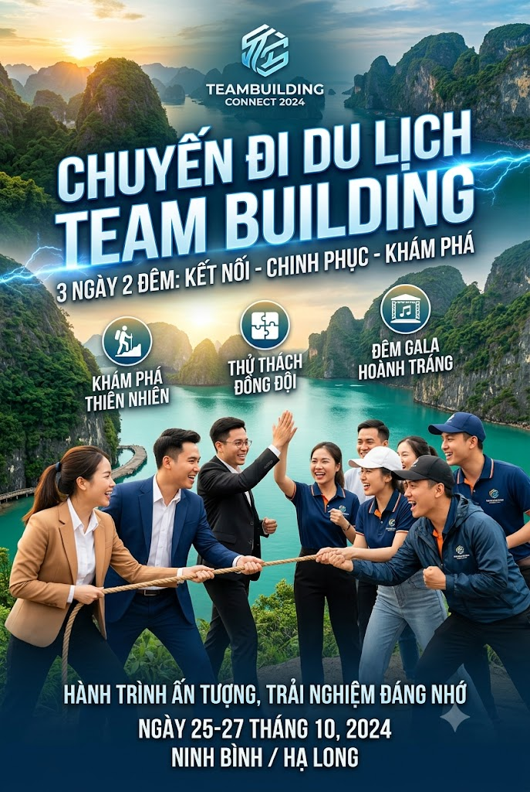

# CASE STUDY THỰC CHIẾN: LẬP KẾ HOẠCH & BỘ TRUYỀN THÔNG CHO CHUYẾN DU LỊCH / TEAM BUILDING NHÓM

---

## BỐI CẢNH DỰ ÁN

* **Tình huống:** Bạn (bất kể nam hay nữ, dân văn phòng hay tự do) được giao hoặc tự mình đứng ra lên kế hoạch cho chuyến đi du lịch / team building 3 ngày 2 đêm cho nhóm bạn hoặc công ty.
* **Mục tiêu:** Trong 90 phút, tự động hóa từ khâu tìm địa điểm, lên lịch trình chi tiết, thiết kế bộ truyền thông (Poster, Video Trailer, Nhạc nền), đến tự động gom các hóa đơn/chuyển khoản từ Gmail về file Google Sheets quản lý thu chi.



---

## MẮT XÍCH 1: DEEP RESEARCH & GUIDED LEARNING (15 PHÚT)

### 📌 Thao tác 1.1: Tìm địa điểm & ý tưởng bằng Deep Research

Copy lệnh dưới đây dán vào Gemini Chat:

```prompt
[BỐI CẢNH & NHIỆM VỤ]
Tôi cần lên kế hoạch cho chuyến du lịch / team building 3 ngày 2 đêm cho nhóm khoảng 10-15 người (nam và nữ, độ tuổi 22-35). Chi phí dự kiến: 3 - 5 triệu VNĐ / người.

[YÊU CẦU THỰC THI]
Hãy kích hoạt Deep Research để thực hiện các bước sau:
1. Quét các địa điểm du lịch hot nhất năm 2026 phù hợp cho nhóm đi 3 ngày 2 đêm (ưu tiên di chuyển thuận tiện từ Hà Nội / TP.HCM).
2. Phân tích ưu/nhược điểm và mức chi phí trung bình của 3 địa điểm hàng đầu.
3. Trích xuất 3 hoạt động gắn kết nhóm (team building) thú vị, hiện đại, không bị sến.
4. Tổng hợp thành báo cáo ngắn gọn có dẫn nguồn cụ thể.
```


### 📌 Thao tác 1.2: Chốt địa điểm & Concept bằng Guided Learning

Dán tiếp lệnh sau khi Gemini trả báo cáo:

```prompt
Dựa trên báo cáo trên, hãy bật tính năng Guided Learning (Học có hướng dẫn) và đưa ra 3 câu hỏi trắc nghiệm tương tác để giúp tôi chọn ra 1 Địa điểm & Concept chuyến đi (Nghỉ dưỡng Chill hay Trải nghiệm Năng động) phù hợp nhất với nhóm.
```

---

## MẮT XÍCH 2: CANVAS & SPARK AUTO BROWSE (25 PHÚT)

### 📌 Thao tác 2.1: Dàn lịch trình chi tiết lên Canvas

Copy lệnh dưới đây dán vào Gemini:

```prompt
[BỐI CẢNH]
Địa điểm và Concept đã chọn: "Chuyến đi Ninh Bình / Đà Lạt 3N2Đ - Phong cách Chill kết hợp trải nghiệm thiên nhiên, ăn uống địa phương".

[YÊU CẦU THỰC THI]
Hãy mở giao diện CANVAS và soạn thảo 2 phần nội dung sau:
1. BẢNG LỊCH TRÌNH CHI TIẾT 3 NGÀY 2 ĐÊM: Chia theo từng khung giờ (Sáng - Trưa - Chiều - Tối) bao gồm: Địa điểm ăn uống, chỗ chơi, phương tiện di chuyển và dự tính chi phí từng mục.
2. KỊCH BẢN VIDEO TRAILER 15 GIÂY: Bảng 3 cột (Thời lượng - Hình ảnh góc quay - Lời thoại/Voiceover) để gửi vào nhóm kêu gọi mọi người chốt đăng ký tham gia.
```


### 📌 Thao tác 2.2: Sửa trực tiếp trên Canvas & Auto Browse

1. **Chỉnh sửa qua Comment:** Bôi đen đoạn *Lời thoại 3 giây đầu* trên Canvas, bấm **Add Comment** ở lề trang và gõ: *"Spark ơi, viết lại câu này hài hước hơn để kích thích mọi người rủ nhau đi đông đủ."*
2. **Cào dữ liệu bằng Auto Browse:** Dán lệnh tiếp theo vào khung chat:

```prompt
Hãy dùng Chrome Auto Browse truy cập vào trang web đặt phòng (như Agoda, Traveloka hoặc Booking), cào bảng giá phòng thực tế của 1 Homestay/Resort phù hợp tại địa điểm đã chọn và chèn thêm 1 Bảng tổng hợp chi phí lưu trú vào cuối trang Canvas cho tôi.
```

---

## MẮT XÍCH 3: XƯỞNG SẢN XUẤT ĐA PHƯƠNG TIỆN (25 PHÚT)

> 💡 **Mẹo Render Song Song:** Tạo Nhạc nền Music ngay khi Veo đang xử lý render Video (mất ~1-2 phút) để không lãng phí thời gian trên lớp!

### 📌 Thao tác 3.1: Tạo Poster chuyến đi (Image Generation)

Copy lệnh dán vào Gemini để xuất Visual:

```prompt
Tạo cho tôi một bức ảnh Poster du lịch chuẩn Cinematic, phong cách hiện đại:
- Bối cảnh: Phong cảnh thiên nhiên hùng vĩ tươi đẹp (núi rừng hoặc bãi biển ngập nắng buổi sáng).
- Đối tượng: Một nhóm bạn trẻ nam và nữ mặc trang phục du lịch năng động, đứng cười đùa tự nhiên bên chiếc xe Jeep/camping.
- Phong cách: Ánh sáng mặt trời rực rỡ, màu sắc tươi sáng, sắc nét chuẩn ảnh tạp chí du lịch.
```

### 📌 Thao tác 3.2: Biến ảnh thành Video Trailer (Veo Integration)

Tải ảnh vừa tạo về, đính kèm lại vào khung chat Gemini và dán lệnh:

```prompt
Tạo một video ngắn 5 giây từ bức ảnh này với yêu cầu:
- Chuyển động Camera: Góc quay Cinematic lướt chậm từ dưới lên cao (Tilt up) mở ra toàn cảnh thiên nhiên.
- Hiệu ứng: Ánh nắng chiếu xuyên qua kẽ lá, mây nhẹ nhàng trôi trên bầu trời, không khí chuyến đi tràn đầy năng lượng.
```


### 📌 Thao tác 3.3: Tạo Nhạc nền Video (Audio/Music Generation)

Dán lệnh tạo đoạn âm thanh chèn vào clip:

```prompt
Tạo một đoạn nhạc nền Audio thời lượng 15 giây phong cách Tropical House / Indie Pop tươi vui, nhịp điệu rộn ràng, mang lại cảm giác hào hứng, tự do cho chuyến đi du lịch mùa hè.
```

---

## MẮT XÍCH 4: STANDING INSTRUCTION 24/7 & CUSTOM GEM (25 PHÚT)

### 📌 Thao tác 4.1: Cài đặt Tự động hóa ghi nhận Thu - Chi chuyến đi

Truy cập **Spark Settings -> Standing Instructions** và dán câu lệnh:

```prompt
[STANDING INSTRUCTION - CHẠY NGẦM 24/7]
Nhiệm vụ: Tự động ghi nhận các email xác nhận đặt vé/khách sạn hoặc bill chuyển khoản của thành viên vào Google Sheets.

Điều kiện kích hoạt: Mỗi khi nhận được Gmail chứa từ khóa ["Xác nhận đặt phòng", "Vé máy bay", "Vé xe", "Chuyển khoản du lịch"].

Hành động tự động:
1. Trích xuất thông tin: Ngày giao dịch, Người gửi/Tên thành viên, Nội dung chi tiêu, Số tiền.
2. Tự động mở file Google Sheets tên 'Quản Lý Thu Chi Du Lịch 2026' trong thư mục 'Spark OS' trên Google Drive.
3. Chèn thông tin vừa trích xuất thành 1 dòng mới trong bảng.
```


### 📌 Thao tác 4.2: Đóng gói thành Custom Gem dùng lâu dài

Vào **Gems -> Create New Gem**, đặt tên `Trợ Lý Lập Kế Hoạch Sự Kiện & Du Lịch` và dán vào mục **Instructions**:

```prompt
[VAI TRÒ]
Bạn là Chuyên gia Lập Kế Hoạch Du Lịch & Tổ Chức Sự Kiện Nhóm.

[QUY TRÌNH TỰ ĐỘNG]
Mỗi khi tôi nhập tên một địa điểm hoặc ý tưởng chuyến đi mới, bạn phải tự động xuất ra:
1. LỊCH TRÌNH 3N2Đ: Lịch trình ăn chơi theo từng khung giờ + Dự toán ngân sách per head.
2. PROMPT ẢNH (Tiếng Anh): Tạo ảnh Poster/Banner truyền thông chuyến đi.
3. PROMPT VIDEO 5S (Tiếng Anh): Dành cho Veo tạo video trailer ngắn kích thích tinh thần nhóm.

[ĐẦU RA]
Trình bày dạng Bảng Markdown rõ ràng. Văn phong hào hứng, hiện đại, dễ hiểu cho tất cả mọi người.
```
