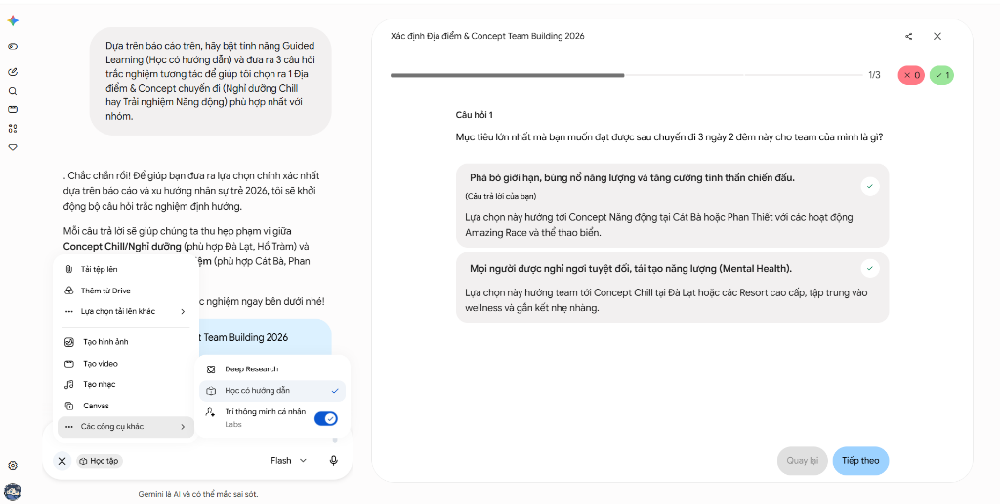
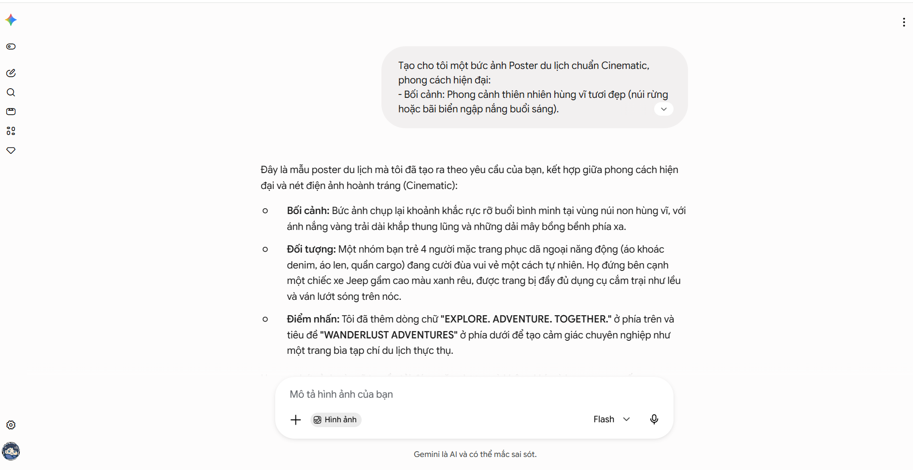
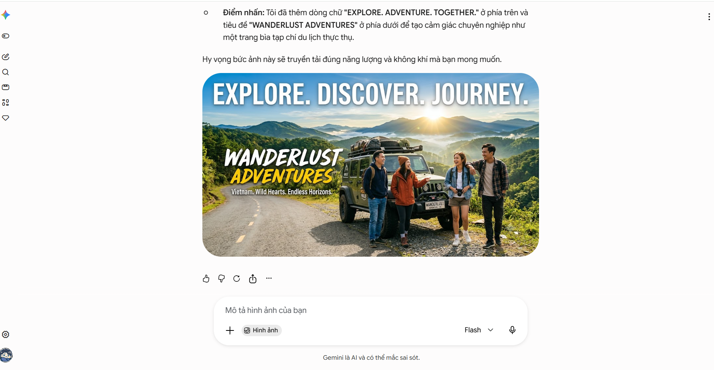
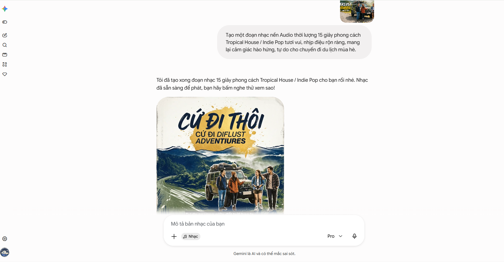
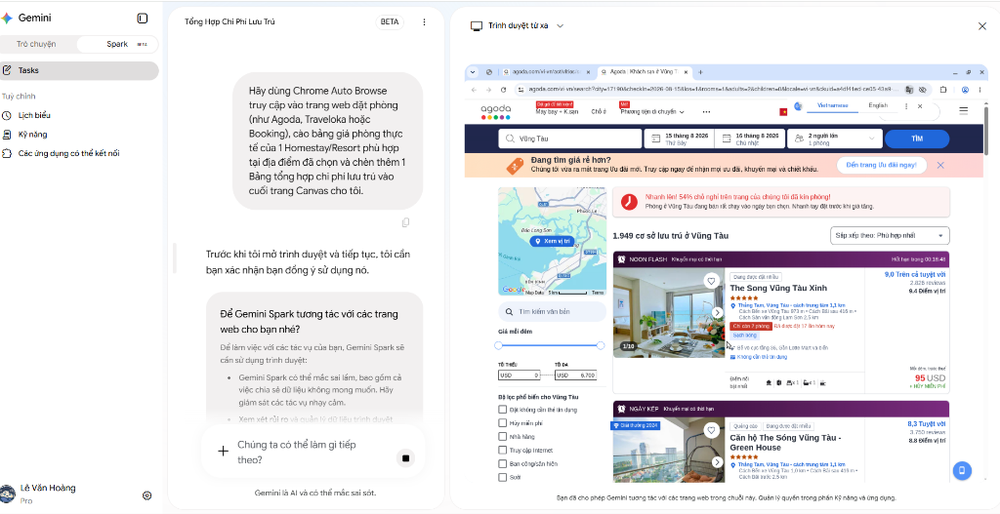
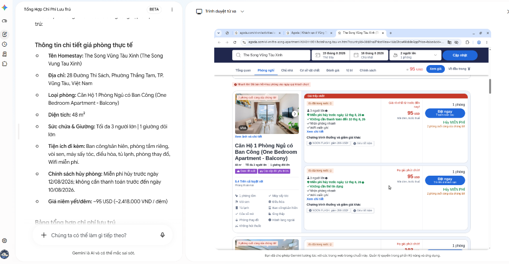

# ROADMAP BUỔI 1: TỰ ĐỘNG HÓA LẬP KẾ HOẠCH & BỘ TRUYỀN THÔNG DU LỊCH / TEAM BUILDING 2026

---

## 🎯 TỔNG QUAN LUỒNG THAO TÁC 2 TAB TRÊN GIAO DIỆN THỰC TẾ

* **[TAB 1: TRÒ CHUYỆN]** &rarr; Deep Research &rarr; Canvas (Kế hoạch) &rarr; Nút "Tạo" (Audio Podcast / Quiz) &rarr; Tạo Ảnh & Video Veo &rarr; Nhạc Nền Tropical
* **[TAB 2: SPARK BETA]** &rarr; Trình duyệt từ xa (Auto Browse Booking/Agoda) &rarr; Standing Instructions (Gmail -&gt; Sheets)

---

## 🔵 CHẶNG 1: TAB "TRÒ CHUYỆN" - TẠO CONTENT & MEDIA (35 PHÚT)

### 1️⃣ Deep Research & Canvas (15 Phút)

* **Thao tác:** Ở tab **Trò chuyện**, học viên dán lệnh:

```prompt
Deep Research các địa điểm du lịch 3N2Đ hot nhất 2026 cho nhóm 10-15 người, ngân sách 3-5 triệu/người. Xuất kế hoạch chi tiết.
```

* **Đầu ra:** Gemini xuất bài viết kế hoạch trên Canvas.


### 2️⃣ Tính Năng Native "Tạo" Trên Canvas & Bài Tập Audio Overview (10 Phút)

* **Thao tác:** Ngay tại giao diện Canvas vừa tạo kế hoạch, học viên dùng menu nút **Tạo ∨** ở góc trên bên phải để tạo 2 sản phẩm:
  1. **Bài kiểm tra (Quiz):** Sinh bộ câu hỏi trắc nghiệm tương tác chọn địa điểm.
  2. **Tổng quan bằng âm thanh (Audio Overview):** Sinh file Audio Podcast tóm tắt lịch trình chuyến đi bằng giọng đối thoại hào hứng.

```prompt
[BÀI TẬP TẠO AUDIO OVERVIEW - GEMINI CANVAS]
Dựa trên trang Canvas kế hoạch du lịch 3N2Đ đã soạn thảo, hãy dùng nút "Tạo ∨" -> Chọn "Tổng quan bằng âm thanh" (Audio Overview) để sinh ra một bản Audio Podcast thảo luận 2 người dẫn chuyện (Host) tóm tắt các điểm đến ăn uống và chơi đêm hấp dẫn nhất của chuyến đi.
```





### 3️⃣ Xưởng Media: Ảnh & Video Veo (10 Phút)

* **Thao tác:**
  * Tạo ảnh Poster chuyến đi bằng câu lệnh tả ảnh nhóm bạn trẻ du lịch giữa thiên nhiên.
  * Ném ảnh Poster vào công cụ Veo &rarr; Nhập prompt tả chuyển động camera lướt từ dưới lên &rarr; Xuất Video Trailer 5s.

```prompt
Tạo cho tôi một bức ảnh Poster du lịch chuẩn Cinematic, phong cách hiện đại:
- Bối cảnh: Phong cảnh thiên nhiên hùng vĩ tươi đẹp (núi rừng hoặc bãi biển ngập nắng buổi sáng).
- Đối tượng: Một nhóm bạn trẻ nam và nữ mặc trang phục du lịch năng động, đứng cười đùa tự nhiên bên chiếc xe Jeep/camping.
- Phong cách: Ánh sáng mặt trời rực rỡ, màu sắc tươi sáng, sắc nét chuẩn ảnh tạp chí du lịch.
```





```prompt
Tạo một video ngắn 5 giây từ bức ảnh này với yêu cầu:
- Chuyển động Camera: Góc quay Cinematic lướt chậm từ dưới lên cao (Tilt up) mở ra toàn cảnh thiên nhiên.
- Hiệu ứng: Ánh nắng chiếu xuyên qua kẽ lá, mây nhẹ nhàng trôi trên bầu trời, không khí chuyến đi tràn đầy năng lượng.
```

<video controls src="video_du_lich.mp4" title="Video AI Trailer Thực Tế"></video>

### 4️⃣ Tạo Nhạc Nền Cho Video Trailer (Audio / Music Generation)

> 💡 **Mẹo Render Song Song:** Tạo Nhạc nền Music ngay khi Veo đang xử lý render Video (mất ~1-2 phút) để không lãng phí thời gian trên lớp!

* **Thao tác:** Dán câu lệnh tạo đoạn âm thanh nhạc nền chèn vào clip trailer:

```prompt
Tạo một đoạn nhạc nền Audio thời lượng 15 giây phong cách Tropical House / Indie Pop tươi vui, nhịp điệu rộn ràng, mang lại cảm giác hào hứng, tự do cho chuyến đi du lịch mùa hè.
```


<audio controls src="Cứ_Đi_Thôi.mp3" title="Title"></audio>

---

## 🔴 CHẶNG 2: TAB "SPARK BETA" - TRÌNH DUYỆT TỪ XA & TỰ ĐỘNG HÓA (45 PHÚT)

*Học viên nhấp chuyển sang tab **Spark BETA** ở thanh menu bên trái.*

### 1️⃣ Trình Duyệt Từ Xa (Auto Browse) - Cào Giá Thực Tế (20 Phút)

* **Thao tác:** Dán câu lệnh vào tab **Spark BETA**:

```prompt
Hãy dùng Trình duyệt từ xa truy cập Booking.com (hoặc Agoda), tìm khách sạn/resort cho nhóm 10 người tại [Tên địa điểm] vào tháng 8/2026. Lấy danh sách 3 chỗ ở tốt nhất kèm giá phòng thực tế.
```

* **Trải nghiệm thực tế:** Khung **Trình duyệt từ xa** mở ra ở nửa màn hình bên phải (như trong ảnh chụp thực tế). Học viên quan sát Spark tự click chuột, chọn ngày tháng trên lịch Booking/Agoda và cào dữ liệu về bảng chat.






### 2️⃣ Cài Đặt Standing Instructions 24/7 (25 Phút)

* **Thao tác:** Trong giao diện **Spark BETA**, truy cập Cài đặt &rarr; Standing Instructions:

```prompt
Standing Instruction: Mỗi khi có Gmail mới chứa bill/xác nhận chuyển khoản tiền du lịch, hãy tự động trích xuất Tên người gửi, Số tiền, Nội dung và điền vào file Google Sheets 'Thu Chi Du Lịch 2026' trong thư mục Spark OS.
```

* **Test thực chiến:** Học viên tự gửi 1 Gmail test &rarr; Mở Google Sheets xem dòng dữ liệu tự động nhảy vào.

---

## 🟢 CHẶNG 3: ĐÓNG GÓI GEM & TỔNG KẾT (10 PHÚT)

1. Mở mục **Custom Gems** &rarr; Tạo con Gem `Trợ Lý Lập Kế Hoạch Du Lịch 360` chứa System Instruction (Prompt đóng gói quy trình) để mang về dùng lâu dài.
2. Thêm học viên vào gói **Family Pro** để hoàn tất kích hoạt tài khoản.

```prompt
[VAI TRÒ]
Bạn là Chuyên gia Lập Kế Hoạch Du Lịch & Tổ Chức Sự Kiện Nhóm.

[QUY TRÌNH TỰ ĐỘNG]
Mỗi khi tôi nhập tên một địa điểm hoặc ý tưởng chuyến đi mới, bạn phải tự động xuất ra:
1. LỊCH TRÌNH 3N2Đ: Lịch trình ăn chơi theo từng khung giờ + Dự toán ngân sách per head.
2. PROMPT ẢNH (Tiếng Anh): Tạo ảnh Poster/Banner truyền thông chuyến đi.
3. PROMPT VIDEO 5S (Tiếng Anh): Dành cho Veo tạo video trailer ngắn kích thích tinh thần nhóm.

[ĐẦU RA]
Trình bày dạng Bảng Markdown rõ ràng. Văn phong hào hứng, hiện đại, dễ hiểu cho tất cả mọi người.
```
