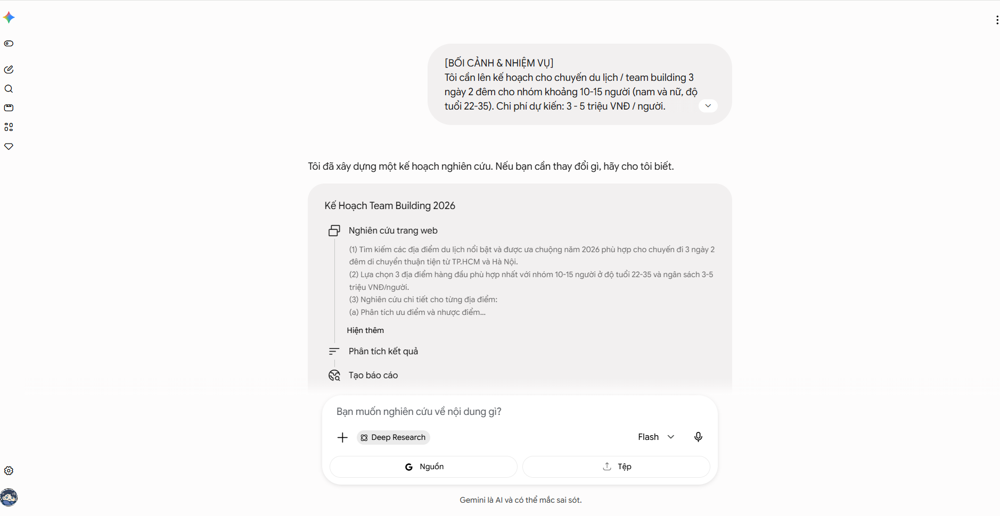
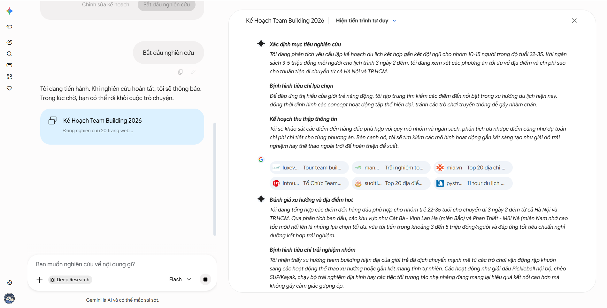
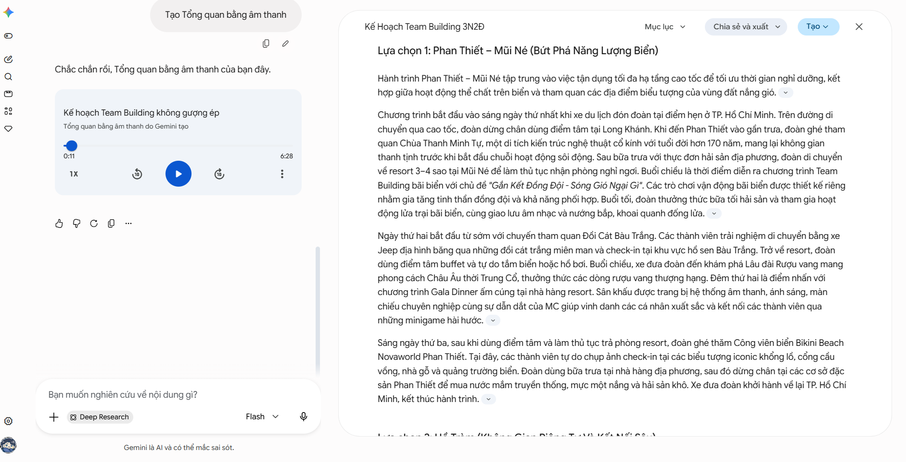
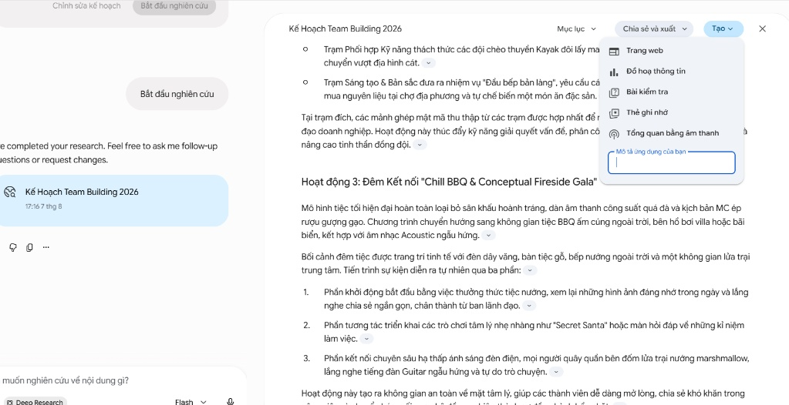
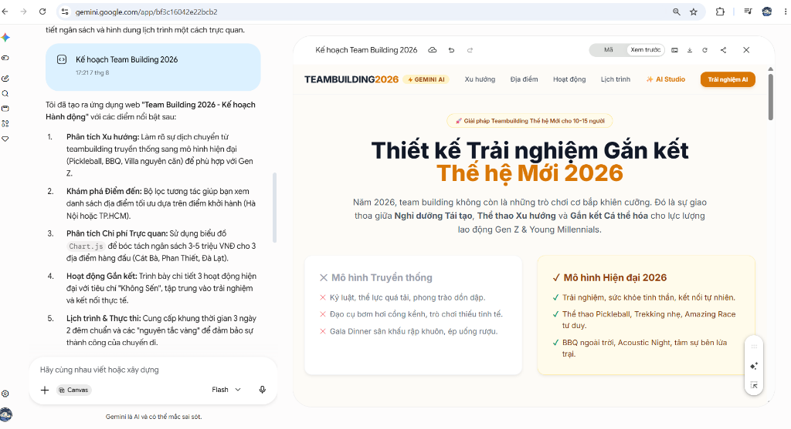

# 🎯 Bài 1: Deep Research & Canvas Lịch Trình Du Lịch

### 1️⃣ Deep Research Lịch Trình Chuyến Đi (15 Phút)

* **Thao tác:** Ở tab **Trò chuyện**, học viên dán câu lệnh:

```prompt
[BỐI CẢNH & NHIỆM VỤ]
Tôi cần lên kế hoạch cho chuyến du lịch / team building 3 ngày 2 đêm cho nhóm khoảng 10-15 người (nam và nữ, độ tuổi 22-35). Chi phí dự kiến: 3 - 5 triệu VNĐ / người.

[YÊU CẦU ĐẦU RA]
Dùng công cụ Deep Research cào và phân tích top 3 địa điểm nổi bật năm 2026 phù hợp (ví dụ: Đà Lạt, Phan Thiết, Măng Đen). Đưa ra ưu/nhược điểm từng nơi về chi phí, phương tiện di chuyển và không gian hoạt động nhóm.
```

* **Đầu ra:** Gemini xuất bài viết kế hoạch trên Canvas.





---

### 2️⃣ Tính Năng Native "Tạo" Trên Canvas & Bài Tập Audio Overview (10 Phút)

* **Thao tác:** Ngay tại giao diện Canvas vừa tạo kế hoạch, học viên dùng menu nút **Tạo ∨** ở góc trên bên phải để tạo 2 sản phẩm:
  - **Bài kiểm tra (Quiz):** Sinh bộ câu hỏi trắc nghiệm tương tác chọn địa điểm.
  - **Tổng quan bằng âm thanh (Audio Overview):** Sinh file Audio Podcast tóm tắt lịch trình chuyến đi bằng giọng đối thoại hào hứng.







