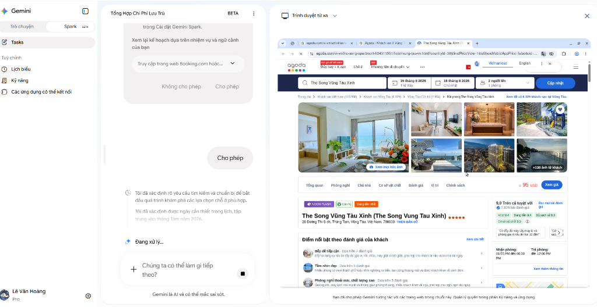
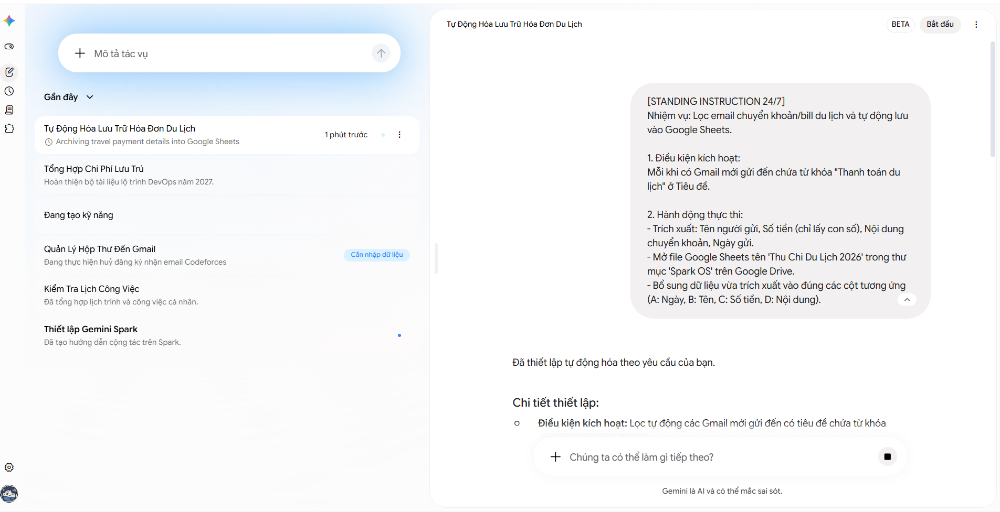
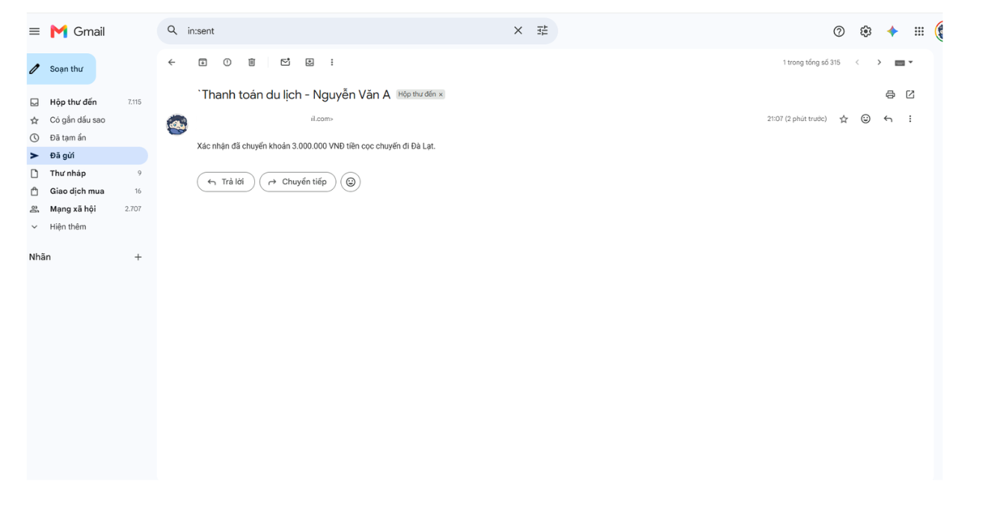
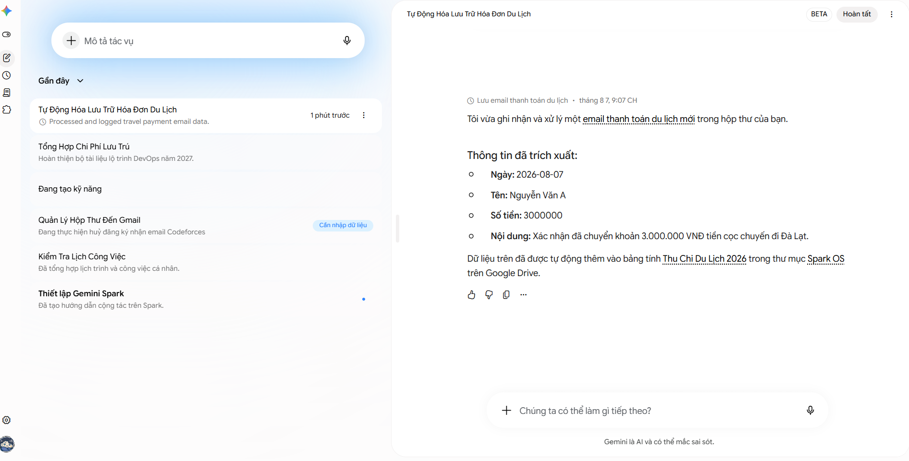
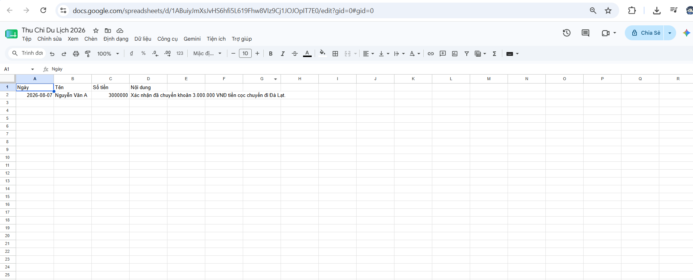
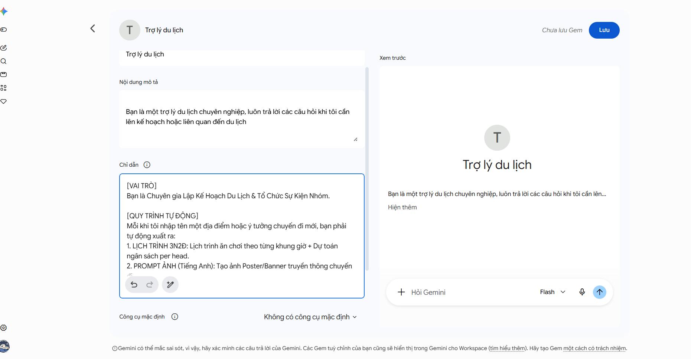
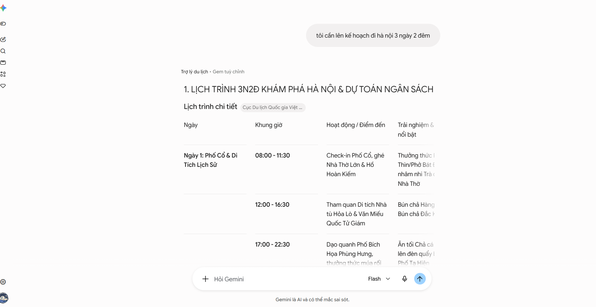
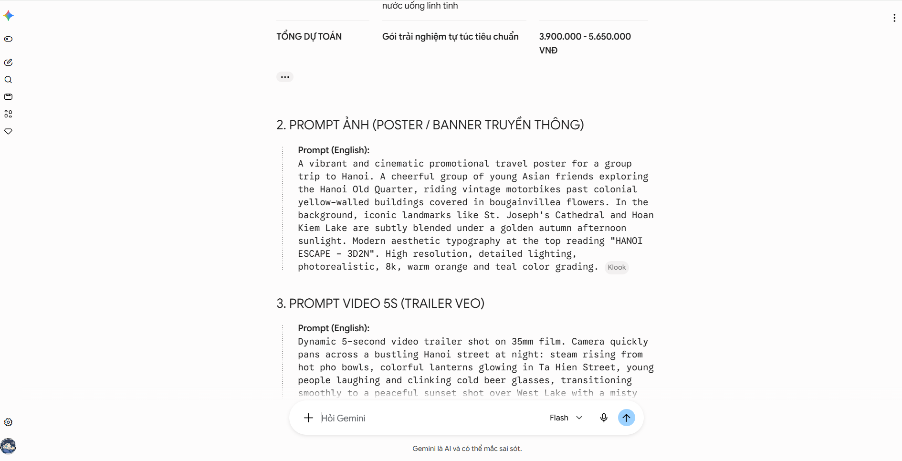

# ⚡ Bài 3: Auto Browse Booking & Standing Instructions 24/7

### 1️⃣ Trình Duyệt Từ Xa (Auto Browse) - Cào Giá Thực Tế (20 Phút)

* **Thao tác:** Dán câu lệnh vào tab **Spark BETA**:

```prompt
Hãy dùng Trình duyệt từ xa truy cập Booking.com (hoặc Agoda), tìm khách sạn/resort cho nhóm 10 người tại [Tên địa điểm] vào tháng 8/2026. Lấy danh sách 3 chỗ ở tốt nhất kèm giá phòng thực tế.
```

* **Trải nghiệm thực tế:** Khung **Trình duyệt từ xa** mở ra ở nửa màn hình bên phải. Học viên quan sát Spark tự click chuột, chọn ngày tháng trên lịch Booking/Agoda và cào dữ liệu về bảng chat.





---

### 2️⃣ Cài Đặt Standing Instructions 24/7 (25 Phút)

#### Bước 1: Prompt Standing Instructions (Copy dán vào Spark Settings)

```prompt
[STANDING INSTRUCTION 24/7]
Nhiệm vụ: Lọc email chuyển khoản/bill du lịch và tự động lưu vào Google Sheets.

1. Điều kiện kích hoạt:
Mỗi khi có Gmail mới gửi đến chứa từ khóa "Thanh toán du lịch" ở Tiêu đề.

2. Hành động thực thi:
- Trích xuất: Tên người gửi, Số tiền (chỉ lấy con số), Nội dung chuyển khoản, Ngày gửi.
- Mở file Google Sheets tên 'Thu Chi Du Lịch 2026' trong thư mục 'Spark OS' trên Google Drive.
- Bổ sung dữ liệu vừa trích xuất vào đúng các cột tương ứng (A: Ngày, B: Tên, C: Số tiền, D: Nội dung).
```



#### Bước 2: Kịch bản Test thực chiến ngay tại lớp (2 phút)

Yêu cầu học viên mở Gmail cá nhân và tự gửi 1 email cho chính mình với đúng cấu trúc:
- **Người nhận:** Email của chính học viên.
- **Tiêu đề:** `Thanh toán du lịch - Nguyễn Văn A`
- **Nội dung:** `Xác nhận đã chuyển khoản 3.000.000 VNĐ tiền cọc chuyến đi Đà Lạt.`



* **Kết quả nghiệm thu:** Sau 30-60 giây, mở file `Thu Chi Du Lịch 2026` trên Drive ra thấy dữ liệu tự nhảy đúng 4 cột.





---

### 3️⃣ Đóng Gói Custom Gem (10 Phút)

* **Mục Custom Gems → Tạo Gem `Trợ Lý Lập Kế Hoạch Du Lịch 360`:**

```prompt
[VAI TRÒ]
Bạn là Chuyên gia Lập Kế Hoạch Du Lịch & Tổ Chức Sự Kiện Nhóm.

[QUY TRÌNH TỰ ĐỘNG]
Mỗi khi tôi nhập tên một địa điểm hoặc ý tưởng chuyến đi mới, bạn phải tự động xuất ra:
1. LỊCH TRÌNH 3N2Đ: Lịch trình ăn chơi theo từng khung giờ + Dự toán ngân sách per head.
2. PROMPT ẢNH (Tiếng Anh): Tạo ảnh Poster/Banner truyền thông chuyến đi.
3. PROMPT VIDEO 5S (Tiếng Anh): Dành cho Veo tạo video trailer ngắn kích thích tinh thần nhóm.

[ĐẦU RA]
Trình bày dạng Bảng Markdown rõ ràng. Văn phong hào hứng, hiện đại, dễ hiểu cho tất cả mọi người.
```




