# Buổi 3: Auto Cào Ý Tưởng RSS Sang Google Sheets (n8n)

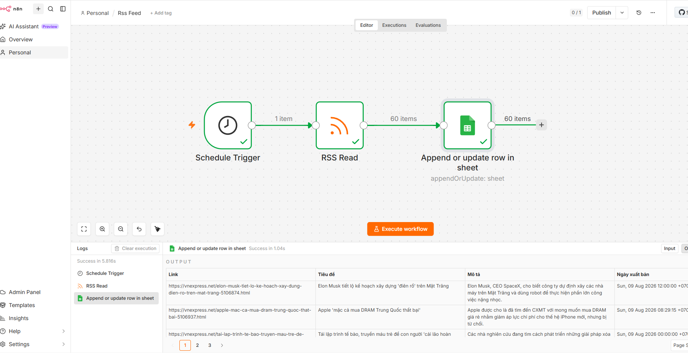

## 📖 TỔNG QUAN BUỔI HỌC

Bắt đầu bước chân vào thế giới Tự Động Hóa Workflow không code với n8n. Tạo hệ thống tự động cào bài viết hot nhất từ báo chí/đối thủ (RSS VNExpress) về lưu vào Google Sheets mỗi ngày mà không bị trùng lặp dữ liệu.

---

=== SUBTAB: ⚡ Cách 1: Import Nhanh Bằng n8n JSON (1-Click Copy / Download) ===

### 📌 QUY TRÌNH IMPORT N8N JSON CHUẨN (4 BƯỚC BẮT BUỘC)

Toàn bộ mã JSON workflow n8n đã được đóng gói sẵn. Học viên cần thực hiện đúng **4 Bước chuẩn bị & cấu hình** bên dưới để luồng chạy tự động 100%:

---

### BƯỚC 1: TẠO FILE GOOGLE SHEETS & ĐỊNH NGHĨA 4 CỘT HEADER

- Truy cập trang [sheets.new](https://sheets.new) để tạo 01 file Google Sheets mới (Đặt tên file: `Data RSS VNExpress`).
- Tại dòng đầu tiên (Header Row 1), tạo đúng 4 tên cột:
  - Cột A: `Tiêu đề`
  - Cột B: `Link`
  - Cột C: `Mô tả`
  - Cột D: `Ngày xuất bản`
- Đóng băng dòng 1 (**View → Freeze → 1 row**).

---

### BƯỚC 2: COPY/PASTE MÃ JSON HOẶC IMPORT FILE VÀO N8N CANVAS

- **Cách A (Dán trực tiếp):** Bấm nút **1-Click Copy Prompt** ở khung mã bên dưới → Mở giao diện n8n Canvas → Nhấn tổ hợp phím **Ctrl + V** (hoặc Cmd + V trên Mac).
- **Cách B (Import từ File):** Bấm nút **Tải xuống** ở bên dưới để lấy file `.json` về máy → Trên menu n8n chọn **Workflows → Import from File**.

- **Tải File Workflow n8n:** [📥 Tải Xuống File Workflow n8n JSON (workflow_buoi_3_rss.json)](/workflow_buoi_3_rss.json)

```json
{
  "name": "Rss Feed",
  "nodes": [
    {
      "parameters": {
        "rule": {
          "interval": [
            {
              "field": "minutes"
            }
          ]
        }
      },
      "type": "n8n-nodes-base.scheduleTrigger",
      "typeVersion": 1.3,
      "position": [
        -480,
        0
      ],
      "id": "2591b947-1275-4199-a4ae-81da810ee7d2",
      "name": "Schedule Trigger"
    },
    {
      "parameters": {
        "url": "https://vnexpress.net/rss/so-hoa.rss",
        "options": {}
      },
      "type": "n8n-nodes-base.rssFeedRead",
      "typeVersion": 1.2,
      "position": [
        -256,
        0
      ],
      "id": "9e5cb201-1fe1-40f4-a675-6bb66c3daf22",
      "name": "RSS Read"
    },
    {
      "parameters": {
        "operation": "appendOrUpdate",
        "documentId": {
          "__rl": true,
          "value": "NHAP_ID_GOOGLE_SHEET_CUA_BAN_VAO_DAY",
          "mode": "list",
          "cachedResultName": "Data RSS VNExpress"
        },
        "sheetName": {
          "__rl": true,
          "value": "gid=0",
          "mode": "list",
          "cachedResultName": "Sheet1"
        },
        "columns": {
          "mappingMode": "defineBelow",
          "value": {
            "Tiêu đề": "={{ $json.title }}",
            "Link": "={{ $json.link }}",
            "Mô tả": "={{ $json.content }}",
            "Ngày xuất bản": "={{ $json.pubDate }}"
          },
          "matchingColumns": [
            "Link"
          ],
          "schema": [
            {
              "id": "Tiêu đề",
              "displayName": "Tiêu đề",
              "required": false,
              "defaultMatch": false,
              "display": true,
              "type": "string",
              "canBeUsedToMatch": true,
              "removed": false
            },
            {
              "id": "Link",
              "displayName": "Link",
              "required": false,
              "defaultMatch": false,
              "display": true,
              "type": "string",
              "canBeUsedToMatch": true,
              "removed": false
            },
            {
              "id": "Mô tả",
              "displayName": "Mô tả",
              "required": false,
              "defaultMatch": false,
              "display": true,
              "type": "string",
              "canBeUsedToMatch": true,
              "removed": false
            },
            {
              "id": "Ngày xuất bản",
              "displayName": "Ngày xuất bản",
              "required": false,
              "defaultMatch": false,
              "display": true,
              "type": "string",
              "canBeUsedToMatch": true,
              "removed": false
            }
          ],
          "attemptToConvertTypes": false,
          "convertFieldsToString": false
        },
        "options": {}
      },
      "type": "n8n-nodes-base.googleSheets",
      "typeVersion": 4.7,
      "position": [
        0,
        0
      ],
      "id": "43bc1c7d-ecf2-4286-acf4-f96496c01add",
      "name": "Append or update row in sheet",
      "credentials": {
        "googleSheetsOAuth2Api": {
          "id": "",
          "name": "Google Sheets account"
        }
      }
    }
  ],
  "pinData": {},
  "connections": {
    "Schedule Trigger": {
      "main": [
        [
          {
            "node": "RSS Read",
            "type": "main",
            "index": 0
          }
        ]
      ]
    },
    "RSS Read": {
      "main": [
        [
          {
            "node": "Append or update row in sheet",
            "type": "main",
            "index": 0
          }
        ]
      ]
    }
  },
  "active": false,
  "settings": {
    "executionOrder": "v1",
    "binaryMode": "separate",
    "availableInMCP": false
  },
  "versionId": "896bff69-5db1-4b13-bdc3-360c55b201b3",
  "meta": {
    "templateCredsSetupCompleted": true,
    "instanceId": ""
  },
  "nodeGroups": [],
  "id": "23Ua20zsAaEGPKPz",
  "tags": []
}
```

---

### BƯỚC 4: THAY SPREADSHEET ID & KẾT NỐI TÀI KHOẢN GOOGLE N8N

- Click đúp vào Node **Append or update row in sheet** trên n8n canvas.
- Dán **Document ID** (lấy ở Bước 2) vào mục **Document**.
- Mục **Credential for Google Sheets**: Chọn tài khoản Google Account của bạn (Bấm *Sign in with Google* nếu chưa kết nối).
- Bấm **Execute workflow** thử nghiệm màu xanh lá → Gạt công tắc **Active** để n8n tự động săn tin ngầm 24/7!

---

=== SUBTAB: 🛠️ Cách 2: Hướng Dẫn Dựng Thủ Công Từng Bước (Step-by-Step UI) ===

### GIAI ĐOẠN 1: KHỞI TẠO CƠ SỞ DỮ LIỆU (DATABASE SETUP)

- **Mục tiêu:** Chuẩn bị kho chứa dữ liệu đích (Data Warehouse) để n8n đổ dữ liệu tin tức về.

1. Truy cập [Google Sheets](https://sheets.new) và tạo một bảng tính mới (VD: `Data RSS VNExpress`).
2. Tại dòng đầu tiên (Header), định nghĩa 4 trường dữ liệu chính (viết chính xác):
   - Cột A: `Tiêu đề`
   - Cột B: `Link`
   - Cột C: `Mô tả`
   - Cột D: `Ngày xuất bản`
3. Đóng băng dòng đầu tiên (**View → Freeze → 1 row**) để dữ liệu đổ xuống không bị lộn xộn.

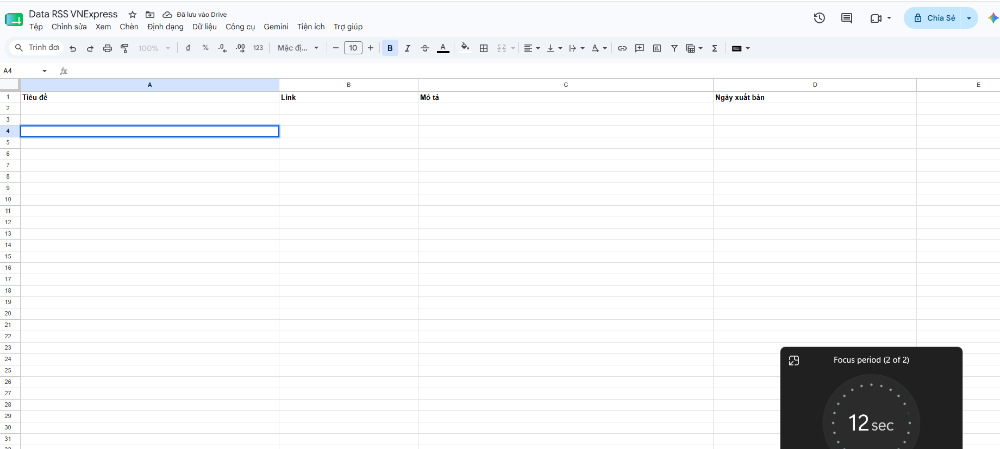

---

### GIAI ĐOẠN 2: DỰNG LUỒNG TRÍCH XUẤT (EXTRACTION PIPELINE)

- **Mục tiêu:** Lên lịch chạy tự động và cào dữ liệu thô từ nguồn tin tức RSS.

#### 1. Thêm Node Kích Hoạt (Schedule Trigger)

- Tìm và thêm Node **Schedule Trigger**.
- Thiết lập khoảng thời gian chạy mong muốn (Ví dụ: `Minutes` hoặc `Hours` → `24` để chạy cập nhật mỗi 24 giờ).

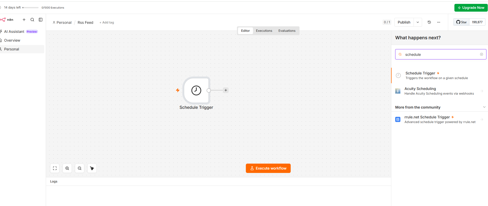

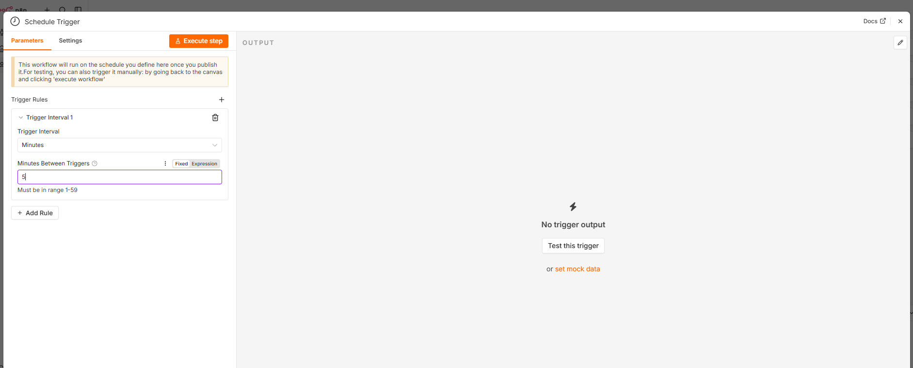

#### 2. Thêm Node Trích Xuất (RSS Read)

- Thêm Node **RSS Read** và nối dây từ `Schedule Trigger` sang.

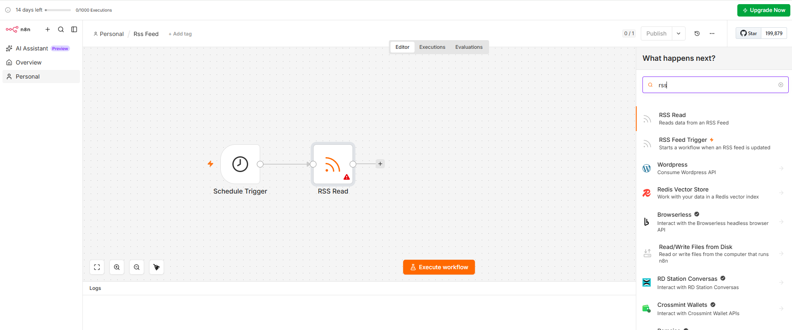

- **Mục URL:** Dán đường link nguồn cấp RSS tin tức (Ví dụ: `https://vnexpress.net/rss/so-hoa.rss`).

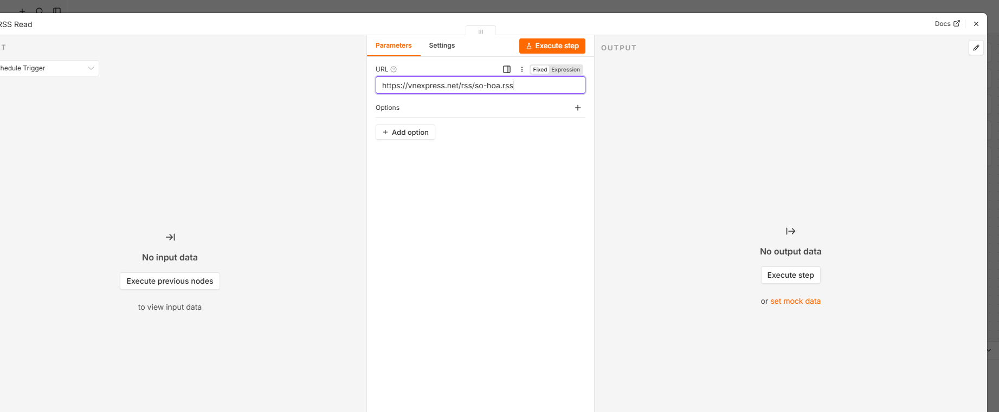

- Bấm nút **Execute step** để hệ thống bóc tách thử XML thành mảng JSON tiêu chuẩn.

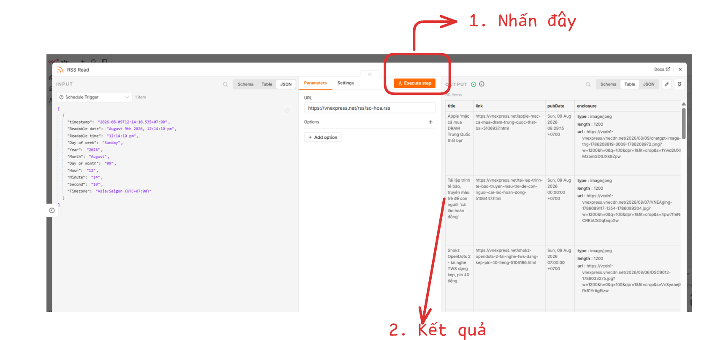

---

### GIAI ĐOẠN 3: KẾT NỐI VÀ ĐỊNH TUYẾN DỮ LIỆU (LOAD & MAPPING)

- **Mục tiêu:** Bơm dữ liệu vào Google Sheets với cơ chế chống trùng lặp dữ liệu (Idempotent).

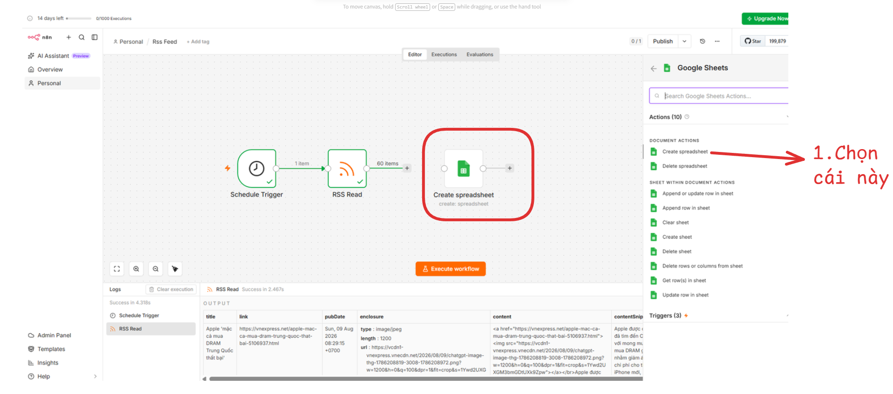

#### 1. Cấu Hình Node Google Sheets

- Thêm Node **Google Sheets** và nối từ `RSS Read` sang.

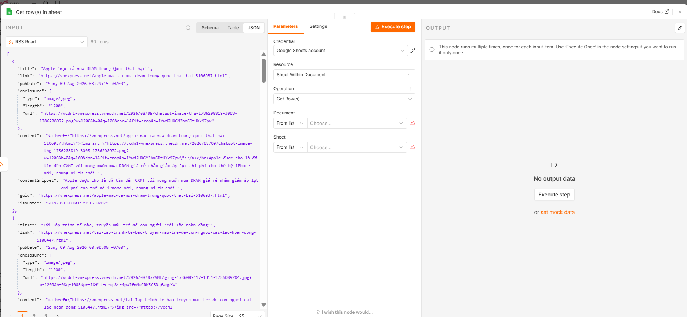

#### 2. Xác Thực Tài Khoản (Authentication)

- Ở mục Credential, chọn **Create New Credential → Google Sheets OAuth2 API**.
- Giữ nguyên chế độ mặc định **Managed OAuth2 (recommended)**.
- Bấm **Sign in with Google**, chọn tài khoản Gmail chứa file Sheets và cấp quyền (hệ thống sẽ báo *Account connected* màu xanh lá).

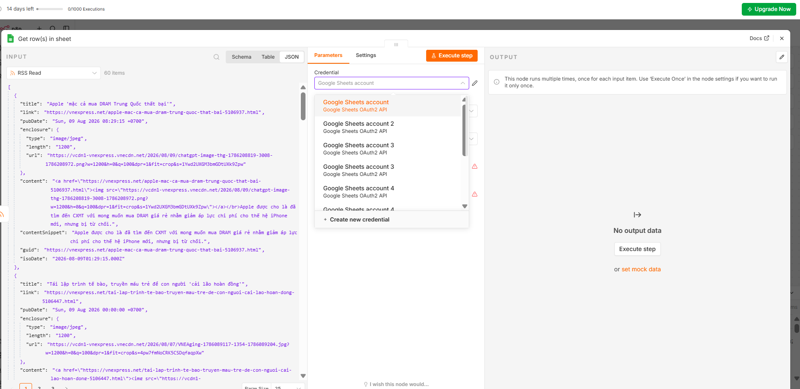

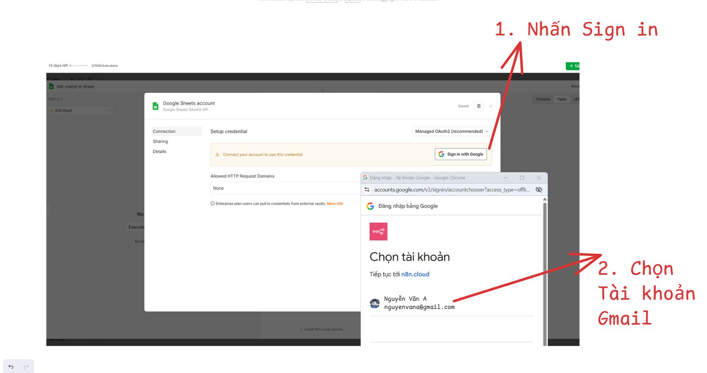

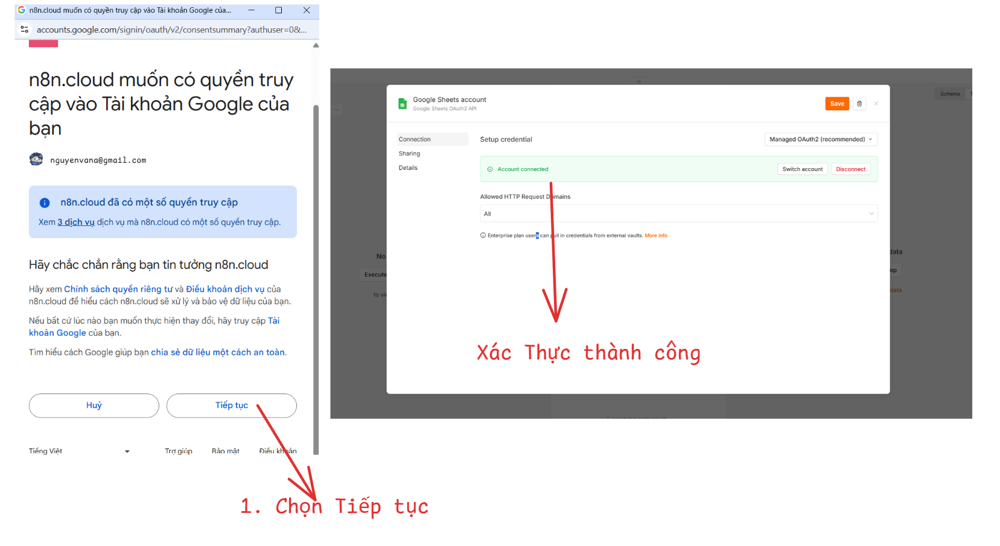

#### 3. Thiết Lập Thao Tác & Ánh Xạ Dữ Liệu (Data Mapping)

- **Resource:** Chọn `Row` (Xử lý theo từng dòng dữ liệu).
- **Operation:** Chọn `Append or Update` (Cốt lõi để bảo vệ tính toàn vẹn dữ liệu, không sinh dòng rác trùng lặp).
- **Document:** Chọn `From list` và chọn file `Data RSS VNExpress` của bạn.
- **Sheet:** Chọn `Sheet1`.
- **Column to match on:** Chọn cột `Link` (Thiết lập cột Link làm Primary Key - nếu link đã tồn tại, n8n sẽ bỏ qua, không tạo trùng).
- **Values to Send:** Chọn `Map Each Column Manually` và kéo thả 4 biến số sang 4 cột:
  - Cột `Tiêu đề`: `{{ $json.title }}`
  - Cột `Link`: `{{ $json.link }}`
  - Cột `Mô tả`: `{{ $json.content }}`
  - Cột `Ngày xuất bản`: `{{ $json.pubDate }}`

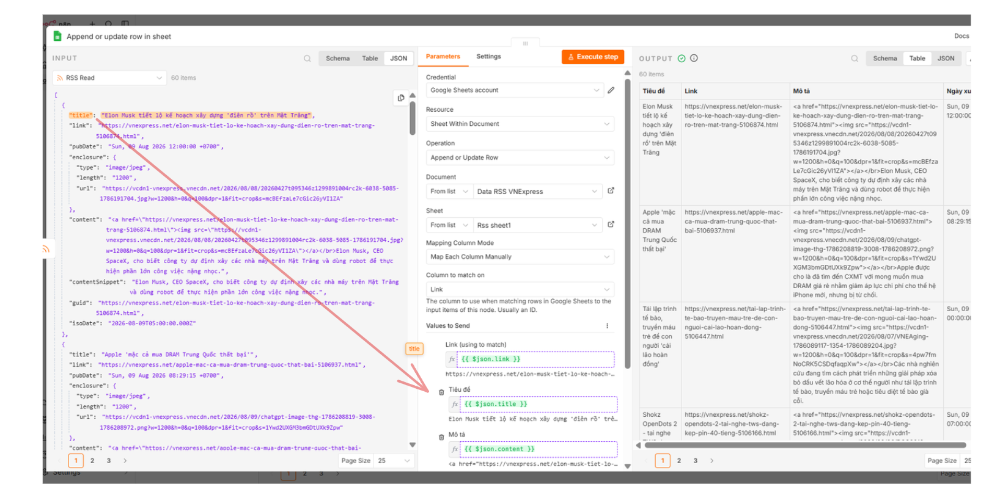

---

### GIAI ĐOẠN 4: NGHIỆM THU VÀ TRIỂN KHAI (TESTING & DEPLOYMENT)

1. Bấm nút màu cam **Execute workflow** ở dưới cùng màn hình để chạy thử nghiệm toàn trình. Kiểm tra cả 3 Node đều báo **Success** (Xanh lá).

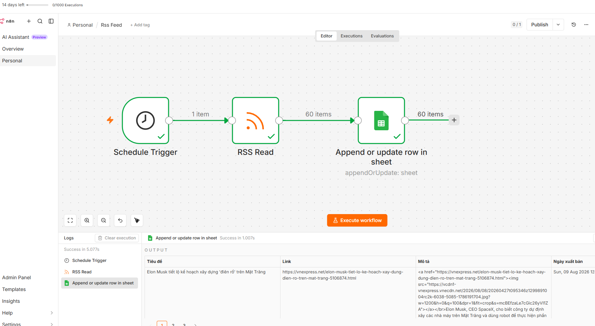

1. Mở file Google Sheets để xác minh dữ liệu tin tức đã được n8n tự động đổ vào đúng các cột.
2. Chuyển trạng thái workflow từ **Inactive** sang **Active** (bấm công tắc góc trên bên phải) để hệ thống tự động chạy ngầm 24/7.

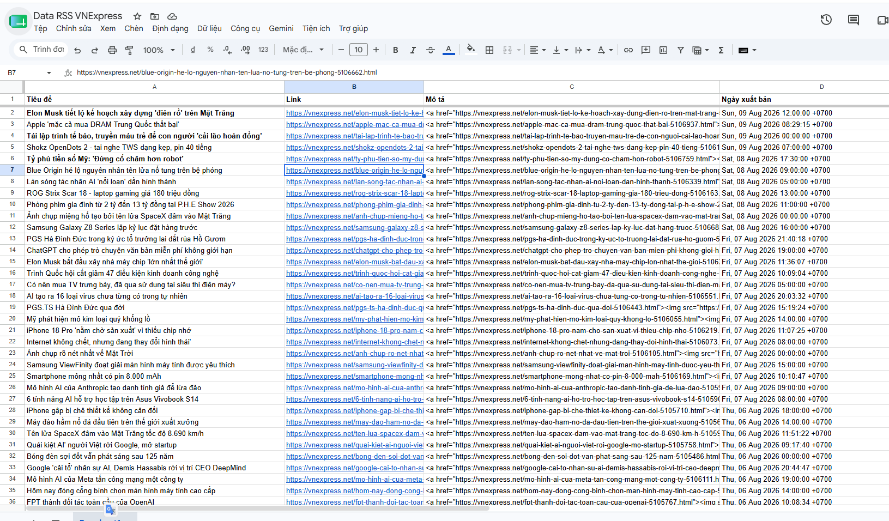

---

## III. CHECKLIST NGHIỆM THU BÀI NỘP (OKR N8N WORKFLOW)

- [ ] **Database Setup:** Đã tạo 4 cột dữ liệu (`Tiêu đề`, `Link`, `Mô tả`, `Ngày xuất bản`) và đóng băng dòng đầu tiên trên Google Sheets.
- [ ] **Credentials Connected:** Đã kết nối thành công Google OAuth2 Credential hiển thị trạng thái màu xanh lá.
- [ ] **Chống trùng lặp:** Đã chọn Operation `Append or Update` và set `Column to match on` là cột `Link`.
- [ ] **Chạy thử nghiệm:** Cả 3 Node đều xuất hiện dấu tick xanh lá `Success` khi bấm *Execute workflow*.
- [ ] **Kích hoạt 24/7:** Đã bật công tắc sang trạng thái **Active** để n8n tự động săn bài viết ngầm.
