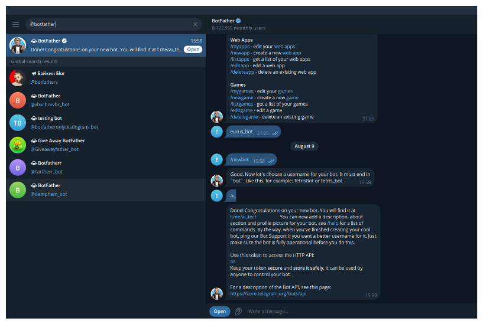

# 📰 Bài 1: Auto RSS Feed sang Google Sheets

### 📌 QUY TRÌNH IMPORT N8N JSON CHUẨN (4 BƯỚC BẮT BUỘC)

Toàn bộ mã JSON workflow n8n đã được đóng gói sẵn. Học viên cần thực hiện đúng **4 Bước chuẩn bị & cấu hình** bên dưới để luồng chạy tự động 100%:

---

### BƯỚC 1: TẠO FILE GOOGLE SHEETS & ĐỊNH NGHĨA 4 CỘT HEADER
- Truy cập trang [sheets.new](https://sheets.new) để tạo 01 file Google Sheets mới (Đặt tên file: `Data RSS VNExpress`).
- Tại dòng đầu tiên (Header Row 1), tạo đúng 4 tên cột:
  - Cột A: `Tiêu đề`
  - Cột B: `Link`
  - Cột C: `Mô tả`
  - Cột D: `Ngày xuất bản`
- Đóng băng dòng 1 (**View → Freeze → 1 row**).

---

### BƯỚC 2: LẤY SPREADSHEET DOCUMENT ID TỪ THANH URL
- Nhìn lên thanh địa chỉ trình duyệt web (URL) của trang Google Sheets vừa tạo, tìm đoạn mã **Document ID** nằm giữa `/d/` và `/edit`:
  - *Ví dụ URL:* `https://docs.google.com/spreadsheets/d/1ABCXYZ_123456789/edit#gid=0`
  - *Đoạn ID cần copy:* `1ABCXYZ_123456789`

---

### BƯỚC 3: COPY/PASTE MÃ JSON HOẶC IMPORT FILE VÀO N8N CANVAS
- **Cách A (Dán trực tiếp):** Bấm nút **1-Click Copy Prompt** ở khung mã bên dưới → Mở giao diện n8n Canvas → Nhấn tổ hợp phím **Ctrl + V** (hoặc Cmd + V trên Mac).
- **Cách B (Import từ File):** Bấm nút **Tải xuống** ở bên dưới để lấy file `.json` về máy → Trên menu n8n chọn **Workflows → Import from File**.

* **Tải File Workflow n8n:** [📥 Tải Xuống File Workflow n8n JSON (workflow_buoi_3_rss.json)](/workflow_buoi_3_rss.json)

```json
{
  "name": "Rss Feed",
  "nodes": [
    {
      "parameters": {
        "rule": {
          "interval": [
            {
              "field": "minutes"
            }
          ]
        }
      },
      "type": "n8n-nodes-base.scheduleTrigger",
      "typeVersion": 1.3,
      "position": [
        -480,
        0
      ],
      "id": "2591b947-1275-4199-a4ae-81da810ee7d2",
      "name": "Schedule Trigger"
    },
    {
      "parameters": {
        "url": "https://vnexpress.net/rss/so-hoa.rss",
        "options": {}
      },
      "type": "n8n-nodes-base.rssFeedRead",
      "typeVersion": 1.2,
      "position": [
        -256,
        0
      ],
      "id": "9e5cb201-1fe1-40f4-a675-6bb66c3daf22",
      "name": "RSS Read"
    },
    {
      "parameters": {
        "operation": "appendOrUpdate",
        "documentId": {
          "__rl": true,
          "value": "NHAP_ID_GOOGLE_SHEET_CUA_BAN_VAO_DAY",
          "mode": "list",
          "cachedResultName": "Data RSS VNExpress"
        },
        "sheetName": {
          "__rl": true,
          "value": "gid=0",
          "mode": "list",
          "cachedResultName": "Sheet1"
        },
        "columns": {
          "mappingMode": "defineBelow",
          "value": {
            "Tiêu đề": "={{ $json.title }}",
            "Link": "={{ $json.link }}",
            "Mô tả": "={{ $json.content }}",
            "Ngày xuất bản": "={{ $json.pubDate }}"
          },
          "matchingColumns": [
            "Link"
          ],
          "schema": [
            {
              "id": "Tiêu đề",
              "displayName": "Tiêu đề",
              "required": false,
              "defaultMatch": false,
              "display": true,
              "type": "string",
              "canBeUsedToMatch": true,
              "removed": false
            },
            {
              "id": "Link",
              "displayName": "Link",
              "required": false,
              "defaultMatch": false,
              "display": true,
              "type": "string",
              "canBeUsedToMatch": true,
              "removed": false
            },
            {
              "id": "Mô tả",
              "displayName": "Mô tả",
              "required": false,
              "defaultMatch": false,
              "display": true,
              "type": "string",
              "canBeUsedToMatch": true,
              "removed": false
            },
            {
              "id": "Ngày xuất bản",
              "displayName": "Ngày xuất bản",
              "required": false,
              "defaultMatch": false,
              "display": true,
              "type": "string",
              "canBeUsedToMatch": true,
              "removed": false
            }
          ],
          "attemptToConvertTypes": false,
          "convertFieldsToString": false
        },
        "options": {}
      },
      "type": "n8n-nodes-base.googleSheets",
      "typeVersion": 4.7,
      "position": [
        0,
        0
      ],
      "id": "43bc1c7d-ecf2-4286-acf4-f96496c01add",
      "name": "Append or update row in sheet",
      "credentials": {
        "googleSheetsOAuth2Api": {
          "id": "",
          "name": "Google Sheets account"
        }
      }
    }
  ],
  "pinData": {},
  "connections": {
    "Schedule Trigger": {
      "main": [
        [
          {
            "node": "RSS Read",
            "type": "main",
            "index": 0
          }
        ]
      ]
    },
    "RSS Read": {
      "main": [
        [
          {
            "node": "Append or update row in sheet",
            "type": "main",
            "index": 0
          }
        ]
      ]
    }
  },
  "active": false,
  "settings": {
    "executionOrder": "v1",
    "binaryMode": "separate",
    "availableInMCP": false
  },
  "versionId": "896bff69-5db1-4b13-bdc3-360c55b201b3",
  "meta": {
    "templateCredsSetupCompleted": true,
    "instanceId": ""
  },
  "nodeGroups": [],
  "id": "23Ua20zsAaEGPKPz",
  "tags": []
}
```

---

### BƯỚC 4: THAY SPREADSHEET ID & KẾT NỐI TÀI KHOẢN GOOGLE N8N
- Click đúp vào Node **Append or update row in sheet** trên n8n canvas.
- Dán **Document ID** (lấy ở Bước 2) vào mục **Document**.
- Mục **Credential for Google Sheets**: Chọn tài khoản Google Account của bạn (Bấm *Sign in with Google* nếu chưa kết nối).
- Bấm **Execute workflow** thử nghiệm màu xanh lá → Gạt công tắc **Active** để n8n tự động săn tin ngầm 24/7!

---

### HƯỚNG DẪN DỰNG THỦ CÔNG TỪNG BƯỚC (STEP-BY-STEP UI)

#### GIAI ĐOẠN 1: KHỞI TẠO CƠ SỞ DỮ LIỆU (DATABASE SETUP)


#### GIAI ĐOẠN 2: DỰNG LUỒNG TRÍCH XUẤT (EXTRACTION PIPELINE)


#### GIAI ĐOẠN 3: KẾT NỐI VÀ ĐỊNH TUYẾN DỮ LIỆU (LOAD & MAPPING)



#### GIAI ĐOẠN 4: NGHIỆM THU VÀ TRIỂN KHAI (TESTING & DEPLOYMENT)


