# 🤖 Bài 2: n8n AI Summarizer sang Telegram / Slack

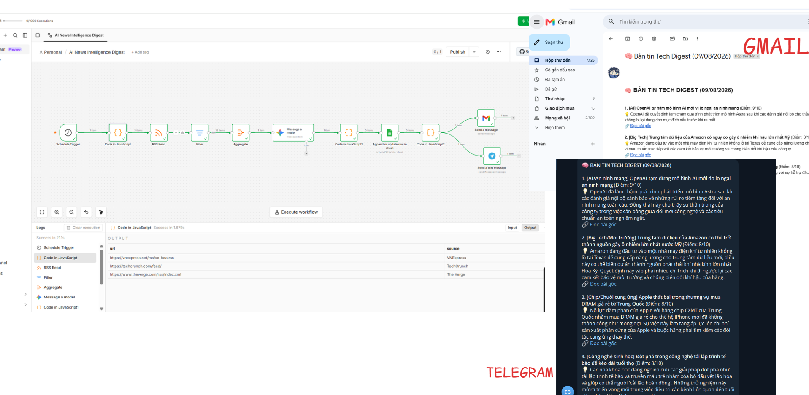

---

=== SUBTAB: 🛠️ Cách 1: Hướng Dẫn Dựng Thủ Công Từng Bước (Step-by-Step UI) ===

### Hướng dẫn toàn tập: Xây dựng hệ thống AI News Intelligence Digest trên n8n

Dưới đây là tài liệu kỹ thuật chi tiết để xây dựng hệ thống tổng hợp tin tức AI News Intelligence Digest, được thiết kế cho luồng chạy tự động hằng ngày.

---

### Phần 1: Chuẩn bị tài khoản và kết nối

Để hệ thống vận hành, bạn cần chuẩn bị sẵn các thông tin xác thực (Credentials) trong n8n:

* Tài khoản **Google Gemini (PaLM) API**.
* Tài khoản **Google Sheets OAuth2 API**.
* Tài khoản **Telegram API** (thông qua BotFather).
* Tài khoản **Gmail OAuth2**.

---

### Phần 2: Cấu hình từng Node chi tiết

#### Bước 1: Thiết lập lịch chạy tự động (Schedule Trigger)
* Thêm node **Schedule Trigger**.
* Tại mục **Rule**, thiết lập **Interval** để luồng chạy tự động vào lúc **7 giờ sáng** mỗi ngày (`triggerAtHour: 7`).

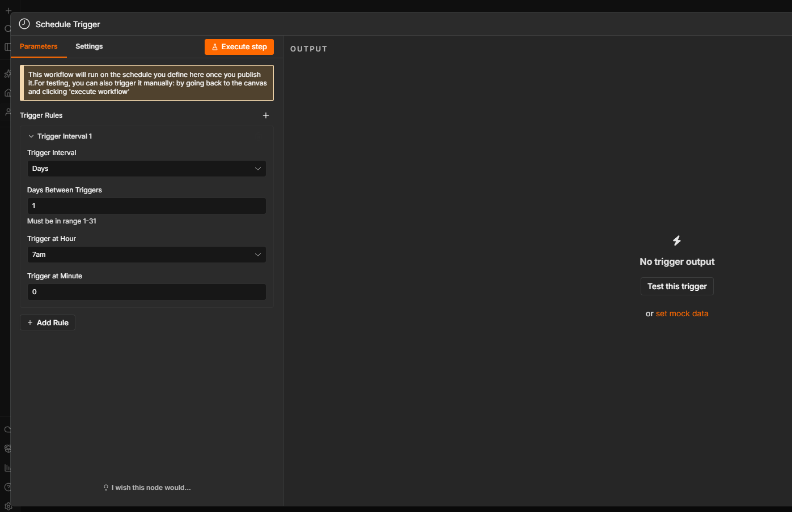

#### Bước 2: Khai báo danh sách nguồn tin (Code in JavaScript)
* Thêm node **Code** (tên: `Code in JavaScript`) kết nối vào sau node Schedule Trigger.
* Dán đoạn mã sau vào node để lấy dữ liệu từ các nguồn RSS:

```javascript
return [
  { json: { url: 'https://vnexpress.net/rss/so-hoa.rss', source: 'VNExpress' } },
  { json: { url: 'https://techcrunch.com/feed/', source: 'TechCrunch' } },
  { json: { url: 'https://www.theverge.com/rss/index.xml', source: 'The Verge' } }
];
```

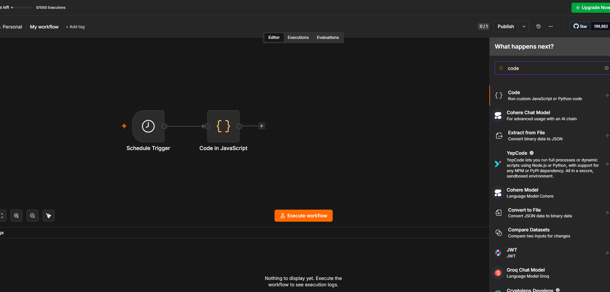
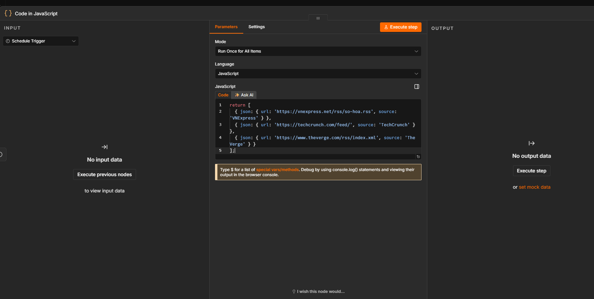

#### Bước 3: Thu thập nội dung (RSS Read)
* Thêm node **RSS Read** nối tiếp vào node Code.
* Tại trường **URL**, bật chế độ Expression và nhập công thức: `{{ $json.url }}`.

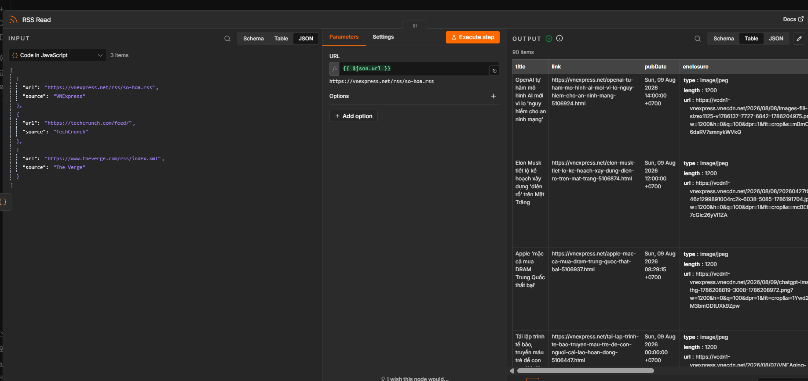
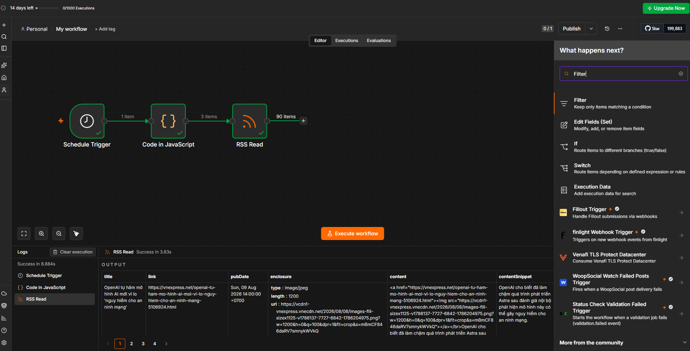

#### Bước 4: Bộ lọc bài viết trong 24 giờ (Filter)
* Thêm node **Filter**.
* **Left Value**: `{{ $json.isoDate }}`.
* **Operator**: Chọn `After` (thuộc nhóm dateTime).
* **Right Value**: `{{ $now.minus({hours: 24}) }}`.

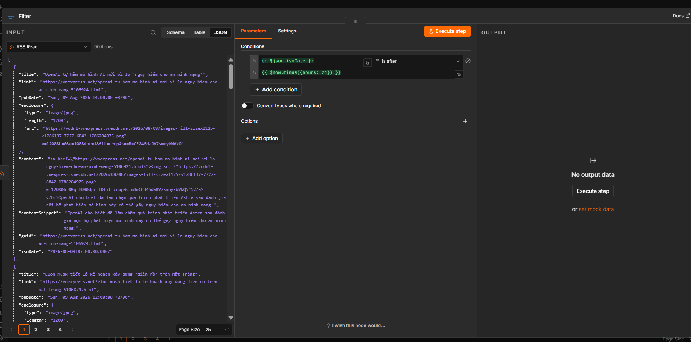

* Ý nghĩa: Lọc các tin mới xuất bản trong vòng 24 giờ qua.

#### Bước 5: Gom nhóm dữ liệu cho AI (Aggregate)
* Thêm node **Aggregate**.
* Tại mục **Fields To Aggregate**, thêm 3 trường dữ liệu cần thiết:
  - Trường 1: `title`.
  - Trường 2: `contentSnippet`.
  - Trường 3: `link`.

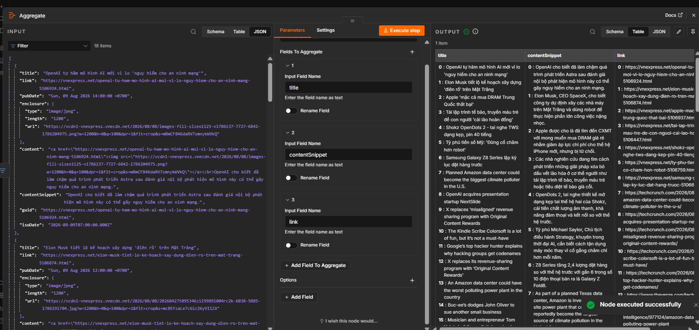
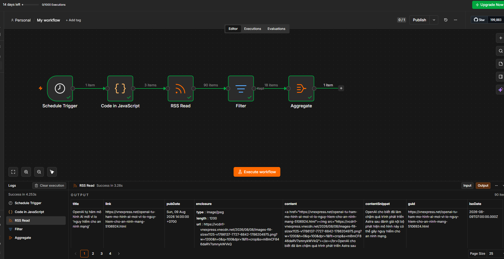

#### Bước 6: Xử lý bằng AI (Message a model - Google Gemini)
* Thêm node **Google Gemini**.

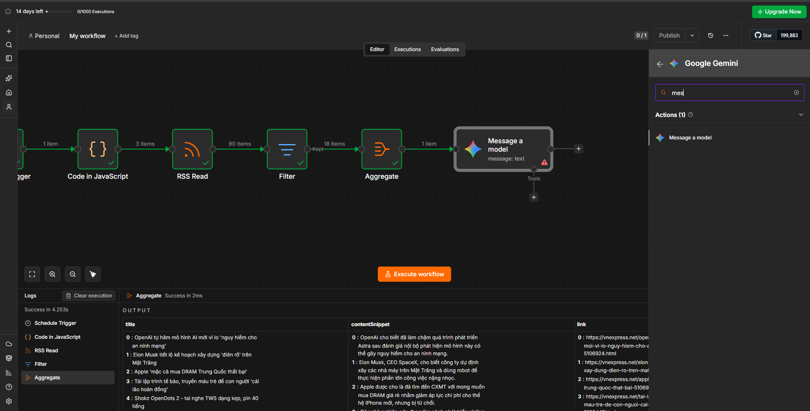
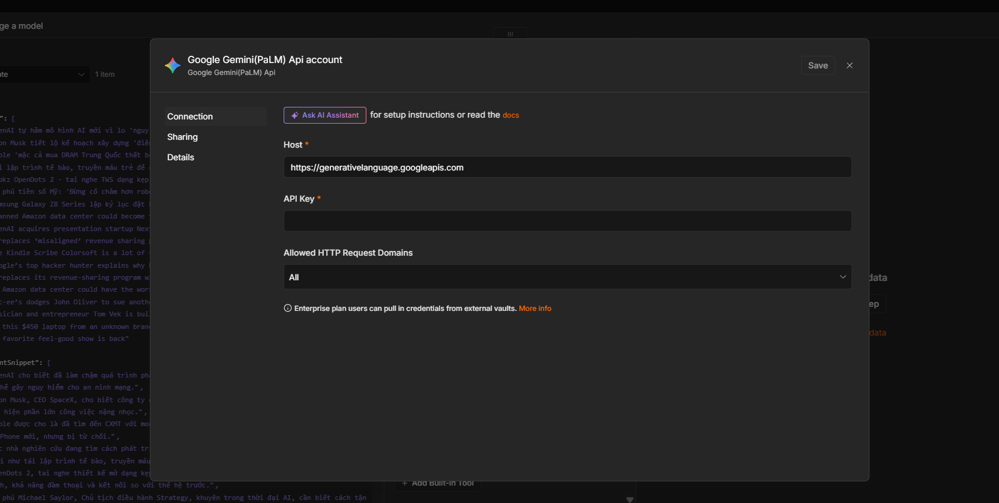
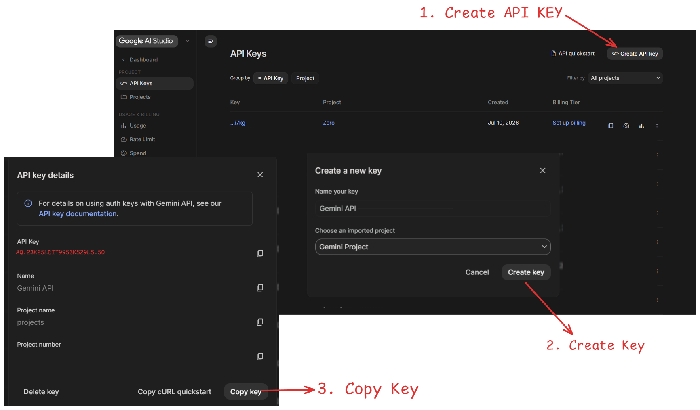

* **Model ID**: Chọn `models/gemini-3-flash-preview`.
* **Output Content as JSON**: Phải bật tính năng này (`jsonOutput: true`).
* Tại mục **Messages**, dán cấu trúc Prompt này vào bằng chế độ Expression:

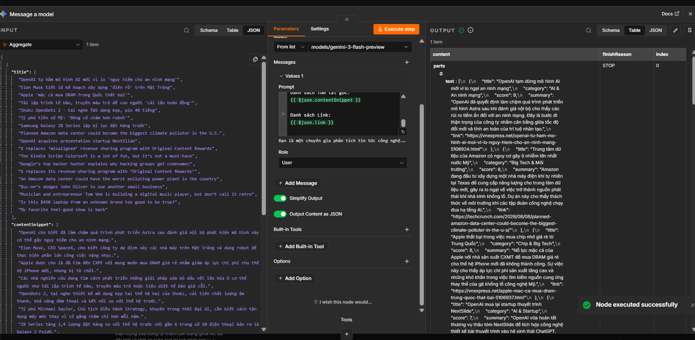

```text
Bạn là một chuyên gia phân tích tin tức công nghệ. Dưới đây là danh sách các bài báo trong ngày.
Nhiệm vụ của bạn:
1. Phát hiện và bỏ qua các bài viết trùng lặp nội dung.
2. Chấm điểm độ quan trọng (1-10) cho từng sự kiện.
3. Chọn ra TOP 5 sự kiện công nghệ đáng chú ý nhất.
4. Tóm tắt mỗi sự kiện ngắn gọn từ 2-3 câu bằng tiếng Việt.
5. Phân loại chủ đề (VD: AI, Chip, An ninh mạng, Startup, Big Tech...).

ĐẦU RA BẮT BUỘC:
Chỉ trả về chuỗi JSON chuẩn định dạng Array, tuyệt đối không kèm markdown (```json) hay bất kỳ câu chữ nào khác ngoài mảng JSON này.

Cấu trúc JSON yêu cầu:
[
  {
    "title": "Tiêu đề tiếng Việt",
    "category": "Chủ đề",
    "score": 9,
    "summary": "Tóm tắt...",
    "link": "Link bài báo"
  }
]

DỮ LIỆU ĐẦU VÀO:
Danh sách Tiêu đề: 
{{ $json.title }}

Danh sách Tóm tắt gốc: 
{{ $json.contentSnippet }}

Danh sách Link: 
{{ $json.link }}
```

#### Bước 7: Bóc tách dữ liệu JSON (Code in JavaScript1)
* Thêm node **Code** (tên: `Code in JavaScript1`).
* Dán đoạn mã dưới đây để phân tách kết quả của AI thành các items độc lập:

```javascript
// Lấy chuỗi văn bản JSON từ kết quả của Gemini
const rawText = $input.first().json.content.parts[0].text;

// Chuyển đổi chuỗi văn bản đó thành một mảng (Array) thực thụ
const parsedData = JSON.parse(rawText);

// Trả về mảng này để n8n tự động tách thành các items (dòng) riêng biệt
return parsedData;
```

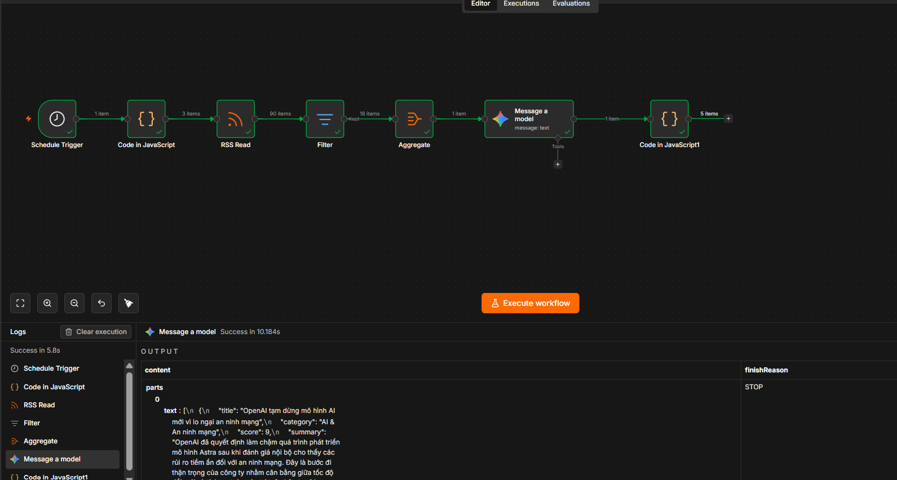

#### Bước 8: Lưu trữ lịch sử (Append or update row in sheet)
* Thêm node **Google Sheets**.

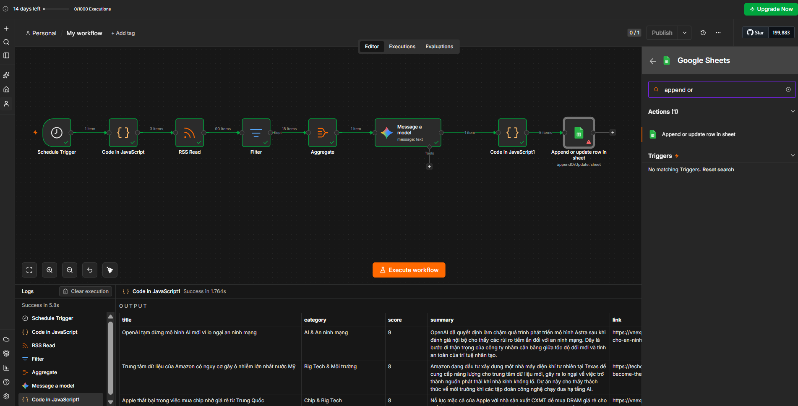
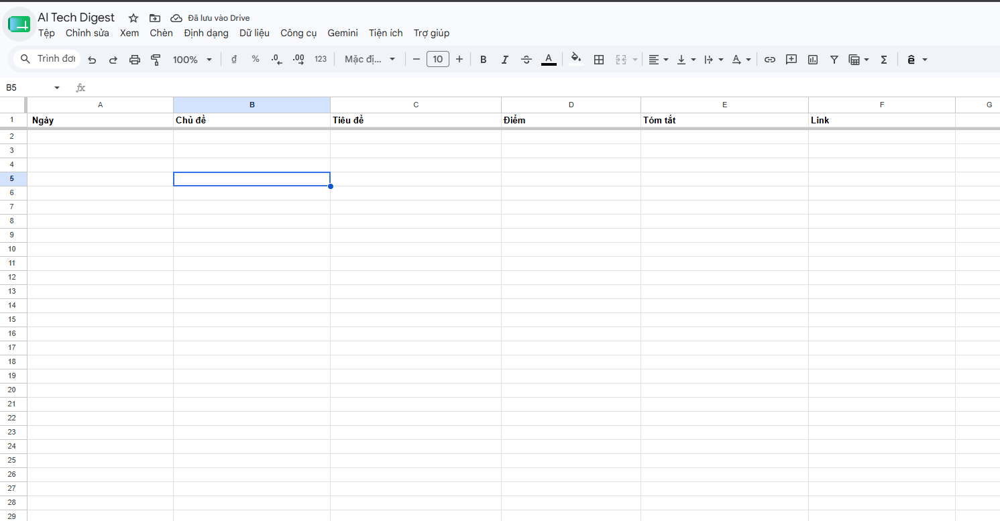

* **Operation**: Chọn `Append or Update Row`.
* **Document ID** & **Sheet Name**: Chọn bảng tính "AI Tech Digest" và trang tính tương ứng của bạn.
* **Column to match on** (Cột đối chiếu): Chọn `Link`.
* **Columns Mapping** (Ghép dữ liệu vào các cột) sử dụng Expression:
  - `Link`: `{{ $json.link }}`.
  - `Ngày`: `{{ $now.setZone('Asia/Ho_Chi_Minh').toFormat('dd/MM/yyyy') }}`.
  - `Tiêu đề`: `{{ $json.title }}`.
  - `Chủ đề`: `{{ $json.category }}`.
  - `Điểm`: `{{ $json.score }}`.
  - `Tóm tắt`: `{{ $json.summary }}`.

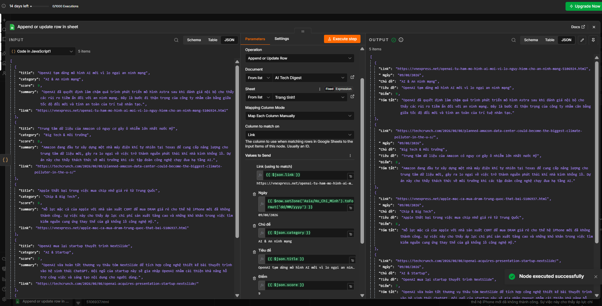

#### Bước 9: Khởi tạo định dạng bản tin đa nền tảng (Code in JavaScript2)
* Thêm node **Code** (tên: `Code in JavaScript2`).
* Dán mã sau để soạn sẵn một phiên bản cho Telegram (dùng `\n`) và một phiên bản cho Email (dùng thẻ `<br>`):

```javascript
// Lấy ngày hiện tại
const today = $now.setZone('Asia/Ho_Chi_Minh').toFormat('dd/MM/yyyy');

// Tạo 2 biến chứa tin nhắn cho Tele (dùng \n) và Email (dùng <br>)
let teleMsg = `<b>🧠 BẢN TIN TECH DIGEST (${today})</b>\n\n`;
let emailMsg = `<h2>🧠 BẢN TIN TECH DIGEST (${today})</h2><br>`;

$input.all().forEach((item, index) => {
    const data = item.json;
    
    // Soạn nội dung chung
    const title = `<b>${index + 1}. [${data['Chủ đề']}] ${data['Tiêu đề']}</b> (Điểm: ${data['Điểm']}/10)`;
    const summary = `💡 ${data['Tóm tắt']}`;
    const link = `🔗 <a href="${data['Link']}">Đọc bài gốc</a>`;

    // Ghép vào bản Telegram
    teleMsg += `${title}\n${summary}\n${link}\n\n`;

    // Ghép vào bản Email
    emailMsg += `${title}<br>${summary}<br>${link}<br><br>`;
});

// Trả về cả 2 phiên bản và ngày tháng để dùng cho các node sau
return [{ 
    json: { 
        telegram_message: teleMsg, 
        email_message: emailMsg,
        today: today
    } 
}];
```

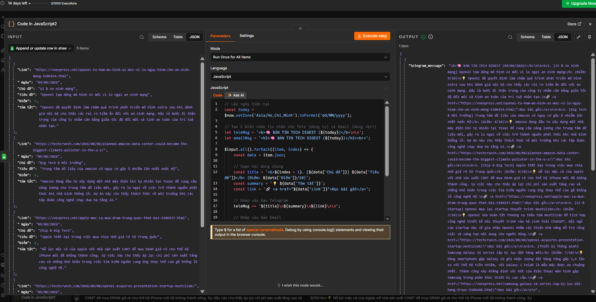

#### Bước 10: Phân phối thông báo (Chia nhánh song song)
Từ đầu ra của Bước 9, kéo ra 2 nhánh gửi tin qua 2 kênh cùng lúc:

* **Nhánh 1: Gửi qua Telegram (Send a text message)**
  - Thêm node **Telegram**.

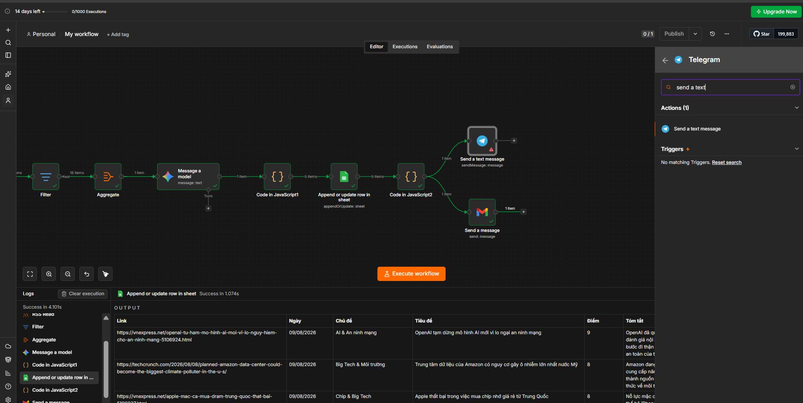

  - **Chuẩn bị kết nối và Lấy Chat ID:**
    1. **Tạo Bot:** Tìm **`@BotFather`** trên Telegram → Gõ `/newbot` → Copy đoạn API Token dán vào Credential Telegram trên n8n.
    
    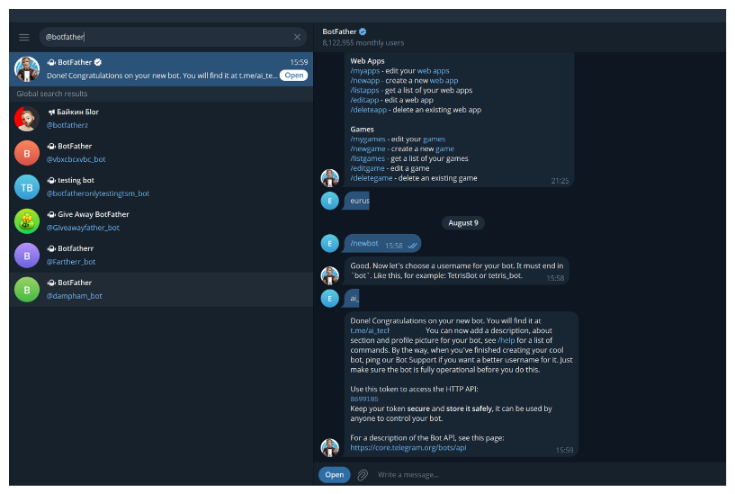
    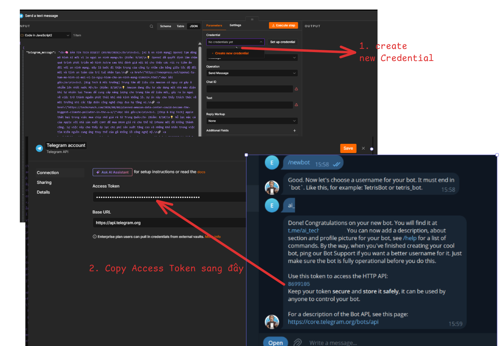

    2. **Lấy ID cá nhân:** Tìm bot **`@userinfobot`** trên Telegram → Bấm **Start** → Copy dãy số ID cá nhân trả về (Ví dụ: `8374731299`).
    
    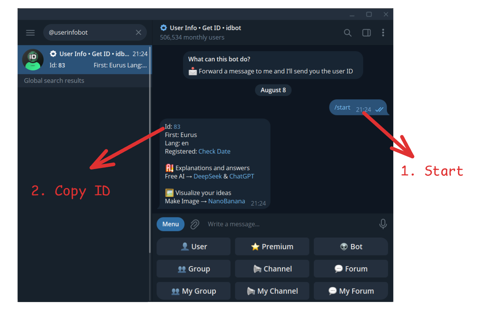

    3. **Kích hoạt Bot:** Tìm tên con bot bạn vừa tạo ở Bước 1 → Bấm **Start** để cấp quyền nhắn tin.

  - **Chat ID:** Nhập dãy số ID cá nhân lấy từ `@userinfobot`.
  - **Text:** Bật Expression (`fx`) và nhập: `={{ $json.telegram_message }}`.
  - **Additional Fields:** Chọn `Parse Mode` → **`HTML`**.

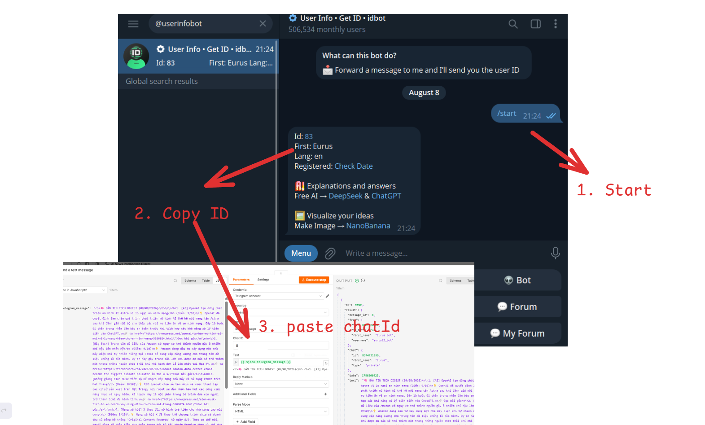
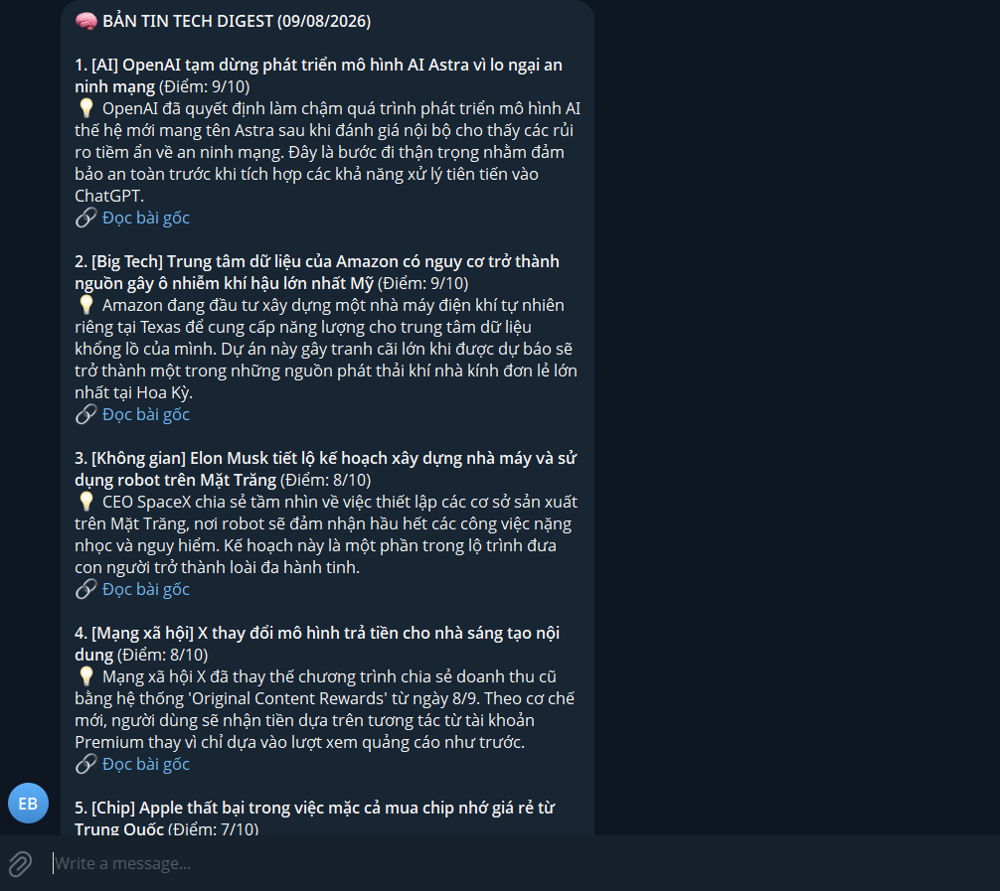

* **Nhánh 2: Gửi qua Gmail (Send a message)**
  - Thêm node **Gmail**.

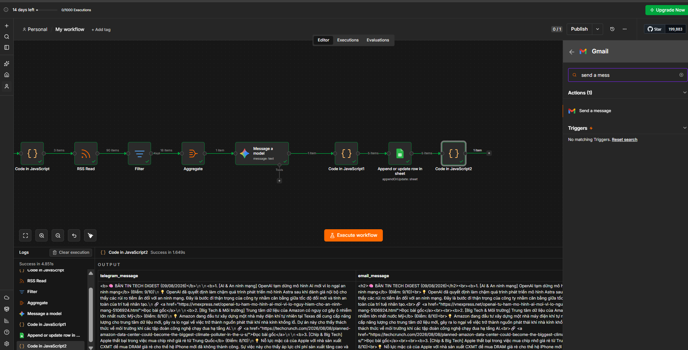

  - **Send To**: Nhập địa chỉ Gmail nhận (Ví dụ: `nguyenvana@gmail.com`).
  - **Subject**: `🧠 Bản tin Tech Digest ({{ $json.today }})`.
  - **Message**: `{{ $json.email_message }}`.

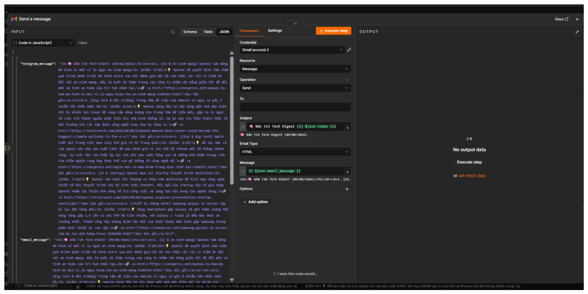
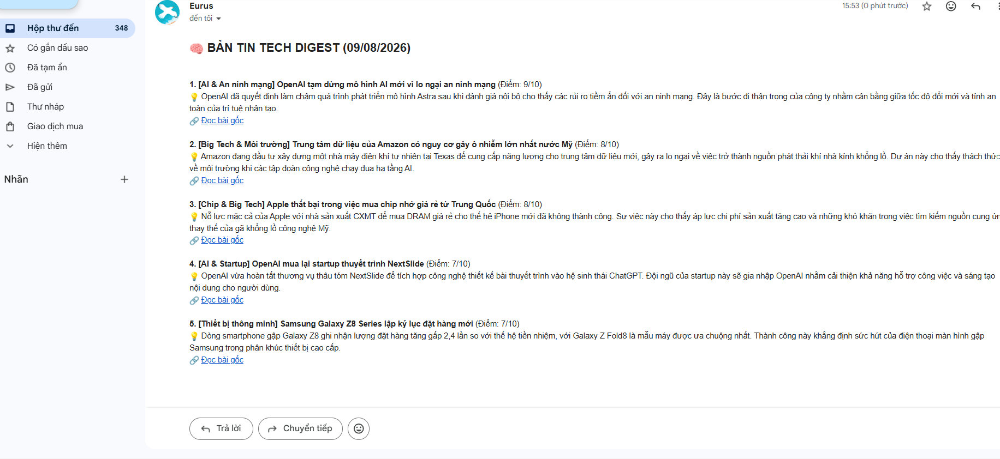

* **Hoàn tất:** Chuyển trạng thái từ `Inactive` sang `Active` để n8n tự vận hành 7:00 AM mỗi ngày.

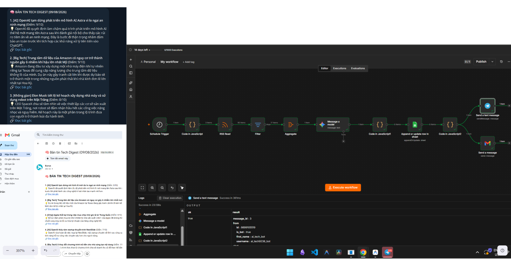

---

=== SUBTAB: ⚡ Cách 2: Import Nhanh Bằng n8n JSON (1-Click Copy / Download) ===

### 📦 MÃ WORKFLOW N8N JSON CHUẨN (10 NODES FULL PIPELINE)

> 💡 **Hướng dẫn Nhanh:** 
> - **Cách A:** Bấm nút **1-Click Copy Prompt** ở khung mã bên dưới, sau đó mở giao diện n8n Canvas và dán trực tiếp (`Ctrl + V`).
> - **Cách B:** Bấm nút **Tải xuống** ở bên dưới để lấy file `.json` về máy, sau đó vào n8n chọn **Workflows → Import from File**.

* **Tải File Workflow n8n Bài 2:** [📥 Tải Xuống File Workflow n8n JSON (workflow_buoi_3_bai_2.json)](/workflow_buoi_3_bai_2.json)

```json
{
  "name": "AI News Intelligence Digest",
  "nodes": [
    {
      "parameters": {
        "rule": {
          "interval": [
            {
              "triggerAtHour": 7
            }
          ]
        }
      },
      "type": "n8n-nodes-base.scheduleTrigger",
      "typeVersion": 1.3,
      "position": [-400, 16],
      "id": "node-schedule",
      "name": "Schedule Trigger"
    },
    {
      "parameters": {
        "jsCode": "return [\n  { json: { url: 'https://vnexpress.net/rss/so-hoa.rss', source: 'VNExpress' } },\n  { json: { url: 'https://techcrunch.com/feed/', source: 'TechCrunch' } },\n  { json: { url: 'https://www.theverge.com/rss/index.xml', source: 'The Verge' } }\n];"
      },
      "type": "n8n-nodes-base.code",
      "typeVersion": 2,
      "position": [-128, 16],
      "id": "node-code-rss",
      "name": "Code in JavaScript"
    },
    {
      "parameters": {
        "url": "={{ $json.url }}",
        "options": {}
      },
      "type": "n8n-nodes-base.rssFeedRead",
      "typeVersion": 1.2,
      "position": [96, 16],
      "id": "node-rss-read",
      "name": "RSS Read"
    },
    {
      "parameters": {
        "conditions": {
          "options": {
            "caseSensitive": true,
            "leftValue": "",
            "typeValidation": "strict",
            "version": 3
          },
          "conditions": [
            {
              "id": "condition-24h",
              "leftValue": "={{ $json.isoDate }}",
              "rightValue": "={{ $now.minus({hours: 24}) }}",
              "operator": {
                "type": "dateTime",
                "operation": "after"
              }
            }
          ],
          "combinator": "and"
        },
        "options": {}
      },
      "type": "n8n-nodes-base.filter",
      "typeVersion": 2.3,
      "position": [320, 16],
      "id": "node-filter-24h",
      "name": "Filter"
    },
    {
      "parameters": {
        "fieldsToAggregate": {
          "fieldToAggregate": [
            { "fieldToAggregate": "title" },
            { "fieldToAggregate": "contentSnippet" },
            { "fieldToAggregate": "link" }
          ]
        },
        "options": {}
      },
      "type": "n8n-nodes-base.aggregate",
      "typeVersion": 1,
      "position": [544, 16],
      "id": "node-aggregate",
      "name": "Aggregate"
    },
    {
      "parameters": {
        "modelId": {
          "__rl": true,
          "mode": "list",
          "value": "models/gemini-3-flash-preview"
        },
        "messages": {
          "values": [
            {
              "content": "=Bạn là một chuyên gia phân tích tin tức công nghệ. Dưới đây là danh sách các bài báo trong ngày.\nNhiệm vụ của bạn:\n1. Phát hiện và bỏ qua các bài viết trùng lặp nội dung.\n2. Chấm điểm độ quan trọng (1-10) cho từng sự kiện.\n3. Chọn ra TOP 5 sự kiện công nghệ đáng chú ý nhất.\n4. Tóm tắt mỗi sự kiện ngắn gọn từ 2-3 câu bằng tiếng Việt.\n5. Phân loại chủ đề (VD: AI, Chip, An ninh mạng, Startup, Big Tech...).\n\nĐẦU RA BẮT BUỘC:\nChỉ trả về chuỗi JSON chuẩn định dạng Array, tuyệt đối không kèm markdown (```json) hay bất kỳ câu chữ nào khác ngoài mảng JSON này.\n\nCấu trúc JSON yêu cầu:\n[\n  {\n    \"title\": \"Tiêu đề tiếng Việt\",\n    \"category\": \"Chủ đề\",\n    \"score\": 9,\n    \"summary\": \"Tóm tắt...\",\n    \"link\": \"Link bài báo\"\n  }\n]\n\nDỮ LIỆU ĐẦU VÀO:\nDanh sách Tiêu đề: \n{{ $json.title }}\n\nDanh sách Tóm tắt gốc: \n{{ $json.contentSnippet }}\n\nDanh sách Link: \n{{ $json.link }}"
            }
          ]
        },
        "jsonOutput": true,
        "builtInTools": {},
        "options": {}
      },
      "type": "@n8n/n8n-nodes-langchain.googleGemini",
      "typeVersion": 1.2,
      "position": [768, 16],
      "id": "node-gemini-ai",
      "name": "Message a model",
      "credentials": {
        "googlePalmApi": {
          "id": "",
          "name": "Google Gemini(PaLM) Api account"
        }
      }
    },
    {
      "parameters": {
        "jsCode": "// Lấy chuỗi văn bản JSON từ kết quả của Gemini\nconst rawText = $input.first().json.content.parts[0].text;\n\n// Chuyển đổi chuỗi văn bản đó thành một mảng (Array) thực thụ\nconst parsedData = JSON.parse(rawText);\n\n// Trả về mảng này để n8n tự động tách thành các items (dòng) riêng biệt\nreturn parsedData;"
      },
      "type": "n8n-nodes-base.code",
      "typeVersion": 2,
      "position": [1136, 16],
      "id": "node-parse-json1",
      "name": "Code in JavaScript1"
    },
    {
      "parameters": {
        "operation": "appendOrUpdate",
        "documentId": {
          "__rl": true,
          "value": "NHAP_ID_GOOGLE_SHEET_CUA_BAN_VAO_DAY",
          "mode": "list",
          "cachedResultName": "AI Tech Digest"
        },
        "sheetName": {
          "__rl": true,
          "value": "gid=0",
          "mode": "list",
          "cachedResultName": "Trang tính1"
        },
        "columns": {
          "mappingMode": "defineBelow",
          "value": {
            "Link": "={{ $json.link }}",
            " Ngày": "={{ $now.setZone('Asia/Ho_Chi_Minh').toFormat('dd/MM/yyyy') }}",
            "Tiêu đề": "={{ $json.title }}",
            "Chủ đề": "={{ $json.category }}",
            "Điểm": "={{ $json.score }}",
            "Tóm tắt": "={{ $json.summary }}"
          },
          "matchingColumns": ["Link"]
        },
        "options": {}
      },
      "type": "n8n-nodes-base.googleSheets",
      "typeVersion": 4.7,
      "position": [1360, 16],
      "id": "node-sheets-save",
      "name": "Append or update row in sheet",
      "credentials": {
        "googleSheetsOAuth2Api": {
          "id": "",
          "name": "Google Sheets account"
        }
      }
    },
    {
      "parameters": {
        "jsCode": "// Lấy ngày hiện tại\nconst today = $now.setZone('Asia/Ho_Chi_Minh').toFormat('dd/MM/yyyy');\n\n// Tạo 2 biến chứa tin nhắn cho Tele (dùng \\n) và Email (dùng <br>)\nlet teleMsg = `<b>🧠 BẢN TIN TECH DIGEST (${today})</b>\\n\\n`;\nlet emailMsg = `<h2>🧠 BẢN TIN TECH DIGEST (${today})</h2><br>`;\n\n$input.all().forEach((item, index) => {\n    const data = item.json;\n    \n    const title = `<b>${index + 1}. [${data['Chủ đề']}] ${data['Tiêu đề']}</b> (Điểm: ${data['Điểm']}/10)`;\n    const summary = `💡 ${data['Tóm tắt']}`;\n    const link = `🔗 <a href=\"${data['Link']}\">Đọc bài gốc</a>`;\n\n    teleMsg += `${title}\\n${summary}\\n${link}\\n\\n`;\n    emailMsg += `${title}<br>${summary}<br>${link}<br><br>`;\n});\n\nreturn [{ \n    json: { \n        telegram_message: teleMsg, \n        email_message: emailMsg,\n        today: today\n    } \n}];"
      },
      "type": "n8n-nodes-base.code",
      "typeVersion": 2,
      "position": [1584, 16],
      "id": "node-format-msg",
      "name": "Code in JavaScript2"
    },
    {
      "parameters": {
        "chatId": "NHAP_TELEGRAM_CHAT_ID_CUA_BAN_VAO_DAY",
        "text": "={{ $json.telegram_message }}",
        "additionalFields": {
          "parse_mode": "HTML"
        }
      },
      "type": "n8n-nodes-base.telegram",
      "typeVersion": 1.2,
      "position": [1920, 144],
      "id": "node-telegram-send",
      "name": "Send a text message",
      "credentials": {
        "telegramApi": {
          "id": "",
          "name": "Telegram account"
        }
      }
    },
    {
      "parameters": {
        "sendTo": "NHAP_EMAIL_CA_NHAN_CUA_BAN_VAO_DAY",
        "subject": "=🧠 Bản tin Tech Digest ({{ $json.today }})",
        "message": "={{ $json.email_message }}",
        "options": {}
      },
      "type": "n8n-nodes-base.gmail",
      "typeVersion": 2.2,
      "position": [1888, -64],
      "id": "node-gmail-send",
      "name": "Send a message",
      "credentials": {
        "gmailOAuth2": {
          "id": "",
          "name": "Gmail account"
        }
      }
    }
  ],
  "connections": {
    "Schedule Trigger": { "main": [[{ "node": "Code in JavaScript", "type": "main", "index": 0 }]] },
    "Code in JavaScript": { "main": [[{ "node": "RSS Read", "type": "main", "index": 0 }]] },
    "RSS Read": { "main": [[{ "node": "Filter", "type": "main", "index": 0 }]] },
    "Filter": { "main": [[{ "node": "Aggregate", "type": "main", "index": 0 }]] },
    "Aggregate": { "main": [[{ "node": "Message a model", "type": "main", "index": 0 }]] },
    "Message a model": { "main": [[{ "node": "Code in JavaScript1", "type": "main", "index": 0 }]] },
    "Code in JavaScript1": { "main": [[{ "node": "Append or update row in sheet", "type": "main", "index": 0 }]] },
    "Append or update row in sheet": { "main": [[{ "node": "Code in JavaScript2", "type": "main", "index": 0 }]] },
    "Code in JavaScript2": {
      "main": [
        [{ "node": "Send a message", "type": "main", "index": 0 }],
        [{ "node": "Send a text message", "type": "main", "index": 0 }]
      ]
    }
  }
}
```

---

### 📌 CÁCH LẤY 5 THÔNG TIN THAY THẾ CHO CÁC VỊ TRÍ PLACEHOLDER IN WORKFLOW

Sau khi dán mã JSON trên vào n8n Canvas, học viên chỉ cần lấy đúng **5 Thông tin xác thực cá nhân** theo chỉ dẫn bên dưới để luồng vận hành tự động 100%:

---

#### 1. CÁCH LẤY GOOGLE SHEET DOCUMENT ID
- **Nơi thay thế:** Trong Node **Append or update row in sheet** → Mục `Document`.
- **Cách lấy chính xác:**
  1. Mở trang file Google Sheets `AI Tech Digest` của bạn.
  2. Nhìn lên thanh địa chỉ trình duyệt web (URL), copy chuỗi ký tự nằm ở giữa đoạn `/d/` và `/edit`:
     - *Ví dụ URL:* `https://docs.google.com/spreadsheets/d/`**`1YpScQoArwt2z2gVhi2n1hUr9UpPpguH9Eyo7au2noUA`**`/edit#gid=0`
     - *Đoạn ID cần copy dán vào ô Document:* `1YpScQoArwt2z2gVhi2n1hUr9UpPpguH9Eyo7au2noUA`

---

#### 2. CÁCH LẤY TELEGRAM CHAT ID CÁ NHÂN
- **Nơi thay thế:** Trong Node **Send a text message** (Telegram) → Mục `Chat ID`.
- **Cách lấy chính xác:**
  1. Mở ứng dụng Telegram trên máy tính hoặc điện thoại.
  2. Tìm kiếm tên bot **`@userinfobot`** và bấm nút **Start**.
  3. Bot sẽ trả về ngay dãy số ID cá nhân của bạn (Ví dụ: `8374731299`). Copy dãy số này dán vào ô `Chat ID` trên n8n.

---

#### 3. CÁCH TẠO TELEGRAM BOT ACCESS TOKEN
- **Nơi thay thế:** Trong Node Telegram → Mục `Credential for Telegram API`.
- **Cách lấy chính xác:**
  1. Tìm kiếm bot **`@BotFather`** trên Telegram → Gõ lệnh `/newbot`.
  2. Đặt tên hiển thị và username cho Bot của bạn.
  3. `@BotFather` sẽ xuất ra đoạn mã **HTTP API Token** (Ví dụ: `7123456789:AAFxxx...`). Copy đoạn mã này dán vào mục *Create New Credential* trên n8n.

---

#### 4. CÁCH LẤY GOOGLE GEMINI API KEY
- **Nơi thay thế:** Trong Node **Message a model** (Google Gemini) → Mục `Credential for Google Gemini(PaLM) API`.
- **Cách lấy chính xác:**
  1. Truy cập trang web [Google AI Studio (aistudio.google.com)](https://aistudio.google.com).
  2. Đăng nhập bằng Gmail cá nhân và nhấp chọn **Get API key** ở thanh menu bên trái.
  3. Bấm **Create API Key** → Copy chuỗi ký tự Key dài màu xám và dán vào n8n.

---

#### 5. ĐỊA CHỈ EMAIL NHẬN BẢN TIN GMAIL
- **Nơi thay thế:** Trong Node **Send a message** (Gmail) → Mục `Send To`.
- **Cách nhập:** Điền chính xác địa chỉ Email Gmail cá nhân của bạn (Ví dụ: `nguyenvana@gmail.com`) để n8n tự động gửi bản tin về hòm thư của bạn mỗi sáng lúc 7:00 AM.
