# Bài 1: Tự Động Hóa Content AI, Tạo Ảnh & Đăng Fanpage Facebook (Kiểm Duyệt Telegram)

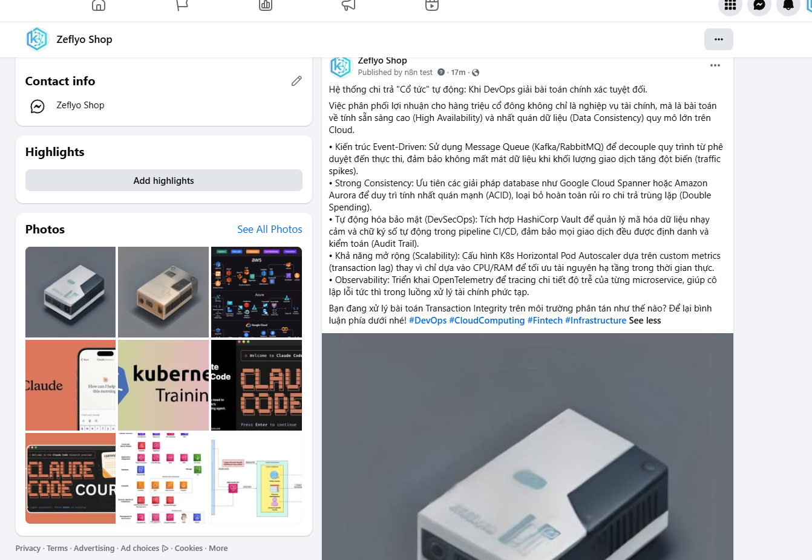

## 📌 I. MỤC TIÊU VÀ CẤU TRÚC WORKFLOW

Hệ thống giúp học viên tự động hóa toàn bộ quy trình tiếp thị nội dung trên mạng xã hội theo mô hình 2 nhánh chuyên nghiệp:

* **Nhánh 1 (Tạo nội dung & Gửi bản nháp)**: Lấy xu hướng từ Google Trends → AI Gemini chọn từ khóa & viết bài → Tạo link ảnh AI tự động → Lưu vào Google Sheets → Bắn bản nháp sang Telegram kèm nút bấm duyệt.
* **Nhánh 2 (Kích hoạt & Đăng Fanpage)**: Quản trị viên bấm nút duyệt trên Telegram → Webhook kích hoạt → Lấy nội dung từ Google Sheets → Đăng bài kèm ảnh trực tiếp lên Fanpage Facebook qua Meta Graph API.

---

## 🛠️ II. CHUẨN BỊ TRƯỚC KHI CẤU HÌNH

1. **Google Sheets**: Tạo 1 file tên `Auto post Fb` chứa 4 cột tiêu đề tại dòng 1: `ID`, `Keyword`, `Content`, `ImageURL`.

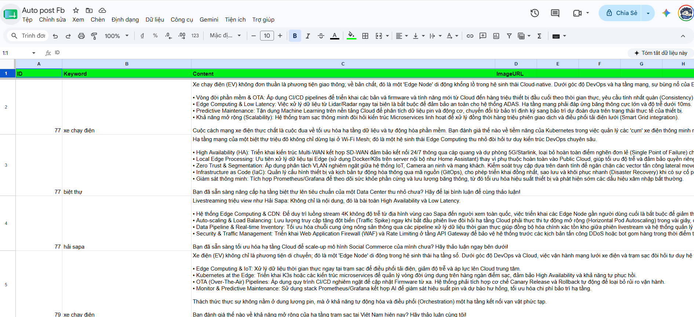

2. **Telegram Bot**: Dùng `@BotFather` tạo con bot mới, lấy **Bot Token** và **Chat ID** cá nhân/nhóm.
3. **Google Gemini API Key**: Khởi tạo API Key miễn phí tại Google AI Studio.
4. **Facebook Fanpage**: Đảm bảo có quyền Admin Fanpage, lấy **Page ID** và **Page Access Token** từ Meta Graph API Explorer.

---

=== SUBTAB: 🛠️ Phương pháp 1: Hướng dẫn Cấu hình Chi Tiết Từng Node

## ⚙️ III. HƯỚNG DẪN CẤU HÌNH CHI TIẾT TỪNG NODE

### 🟢 NHÁNH 1: TỰ ĐỘNG TẠO VÀ CHUẨN BỊ BẢN NHÁP

#### Node 1: Schedule Trigger (Kích hoạt theo giờ)

* **Type**: `Schedule Trigger`
* **Trigger Interval**: `Hours`
* **Trigger at Hour**: `7` (chạy tự động vào 7 giờ sáng hàng ngày).

#### Node 2: RSS Read (Lấy xu hướng từ Google)

* **Type**: `RSS Read`
* **URL**: `https://trends.google.com/trending/rss?geo=VN` (Quét tin tức xu hướng mới nhất tại Việt Nam).

#### Node 3: Limit (Giới hạn số lượng tin)

* **Type**: `Limit`
* **Max Items**: `3` (Chỉ lấy 3 tin tức nổi bật nhất để xử lý).

#### Node 4: Aggregate (Gom dữ liệu)

* **Type**: `Aggregate`
* **Fields To Aggregate**: Thêm item `fieldToAggregate = title` (Gom 3 tiêu đề tin tức thành một danh sách duy nhất).

#### Node 5: Message a model (AI Gemini viết bài)

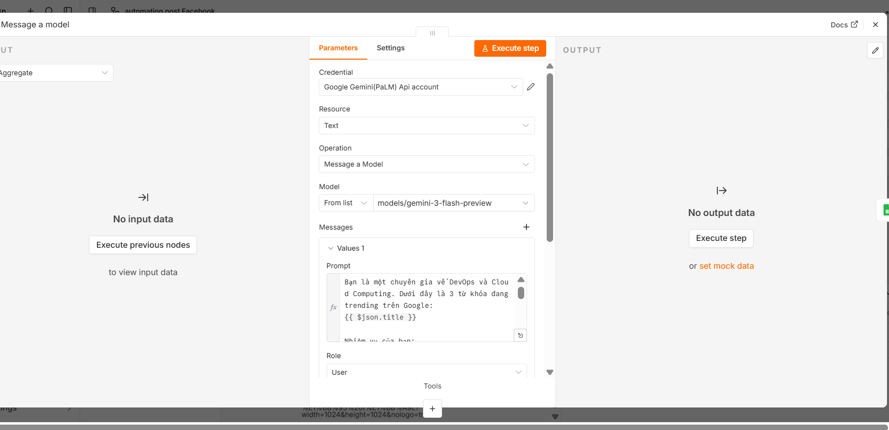

* **Type**: `Google Gemini` (`@n8n/n8n-nodes-langchain.googleGemini`)
* **Model**: `models/gemini-3-flash-preview`
* **Prompt Content (Chế độ Expression)**:

```prompt
=Bạn là một chuyên gia về DevOps và Cloud Computing. Dưới đây là 3 từ khóa đang trending trên Google:
{{ $json.title }}

Nhiệm vụ của bạn:
1. Phân tích và chọn ra đúng 1 từ khóa có tiềm năng ứng dụng công nghệ/hạ tầng mạng nhất.
2. Viết một bài đăng mạng xã hội chuyên sâu dựa trên từ khóa đó (dưới 1200 ký tự). Bỏ qua các từ sáo rỗng. Tập trung đánh giá tác động kỹ thuật, tính khả dụng, hoặc tối ưu hóa tự động hóa.
3. Trình bày bài viết có câu Hook thu hút, dùng ký hiệu (•) cho các ý chính và kết thúc bằng một Call-to-action.

Trả về định dạng JSON BẮT BUỘC:
{
  "trending_keyword": "Từ khóa bạn chọn",
  "social_post": "Nội dung bài viết hoàn chỉnh..."
}
```

#### Node 6: Append or update row in sheet (Ghi dữ liệu vào Google Sheets)

* **Type**: `Google Sheets`
* **Operation**: `Append or Update`
* **Document**: Chọn file `Auto post Fb`
* **Sheet Name**: `Trang tính1`
* **Column to match on**: `ID`
* **Values to Send (Chuyển sang Expression)**:

> 💡 **Lưu ý n8n Pro Tip khi copy Expression (`fx`)**: Khi bạn bật chế độ Expression trên n8n, giao diện n8n đã tự động chèn sẵn dấu `=` ở đầu ô nhập. Do đó khi sao chép các đoạn mã bên dưới, bạn **KHÔNG nhập dấu `=` ở đầu** để tránh bị lỗi cú pháp `=={{ ... }}`!

```javascript
// Cột ID
{{ $execution.id }}

// Cột Keyword
{{ JSON.parse($json.content.parts[0].text.replace(/```json/gi, '').replace(/```/g, '').trim()).trending_keyword }}

// Cột Content
{{ JSON.parse($json.content.parts[0].text.replace(/```json/gi, '').replace(/```/g, '').trim()).social_post }}

// Cột ImageURL
https://image.pollinations.ai/prompt/{{ encodeURIComponent("Tech illustration about " + JSON.parse($json.content.parts[0].text.replace(/```json/gi, '').replace(/```/g, '').trim()).trending_keyword) }}?width=1024&height=1024&nologo=true
```

#### Node 7: Send a text message (Gửi bản nháp qua Telegram)


* **Type**: `Telegram`
* **Chat ID**: Nhập ID tài khoản Telegram của bạn.
* **Text (Expression)**:

```html
<b>🔥 BẢN NHÁP MỚI CẦN DUYỆT</b>

<b>Chủ đề:</b> {{ $json.Keyword }}

{{ $json.Content }}
```

* **Reply Markup**: `Inline Keyboard`
* **Inline Keyboard Buttons**:
  * **Text**: `✅ DUYỆT & ĐĂNG BÀI`
  * **URL (Expression)**: `https://<YOUR_N8N_DOMAIN>/webhook-test/duyet-bai?id={{ $json.ID }}` (Thay đường dẫn Webhook thực tế vào).
* **Additional Fields**: Bật `Parse Mode` chọn `HTML`.

---

### 🔵 NHÁNH 2: LẮNG NGHE LỆNH DUYỆT VÀ ĐĂNG BÀI LÊN FACEBOOK

#### Node 8: Webhook (Cổng nhận lệnh duyệt)

* **Type**: `Webhook`
* **Path**: `duyet-bai`
* **HTTP Method**: `GET`

#### Node 9: Get row(s) in sheet (Tra cứu bài viết theo ID)

* **Type**: `Google Sheets`
* **Operation**: `Get Row(s)`
* **Document**: Chọn file `Auto post Fb`
* **Filter Values**:
  * **Lookup Column**: `ID`
  * **Lookup Value (Expression)**: `{{ $json.query.id }}` (Trích xuất ID gửi kèm từ URL Telegram).

#### Node 10: Facebook Graph API (Đăng bài kèm ảnh)

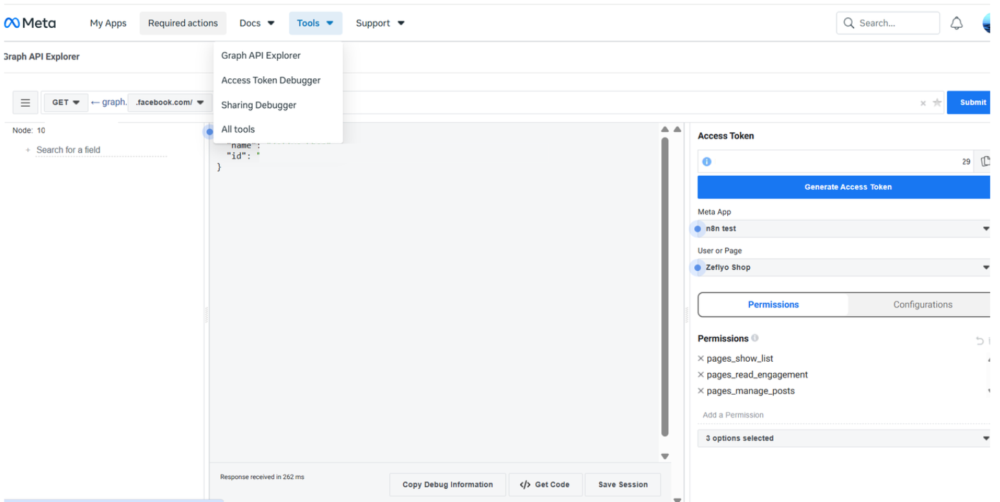

---

### 📘 HƯỚNG DẪN CHI TIẾT TỪ A-Z: THIẾT LẬP META DEVELOPER & LẤY PAGE TOKEN CHO N8N

#### 🔹 GIAI ĐOẠN 1: KHỞI TẠO TÀI KHOẢN META DEVELOPER VÀ TẠO APP

##### Bước 1: Đăng ký tài khoản Meta for Developers

1. Đăng nhập sẵn tài khoản Facebook cá nhân trên trình duyệt.
2. Truy cập vào đường dẫn: [developers.facebook.com](https://developers.facebook.com/).

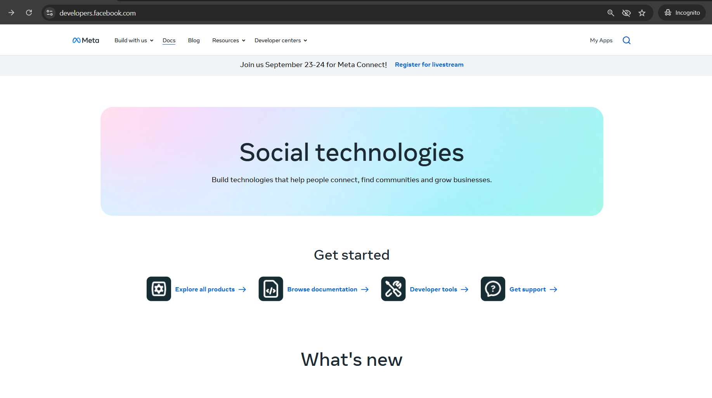

3. Bấm vào nút **Bắt đầu** (Get Started) hoặc **Đăng nhập** ở góc trên bên phải.
4. Xác nhận thông tin cá nhân, chọn vai trò (chọn **Nhà phát triển / Developer** hoặc **Khác / Other**) và hoàn tất đăng ký.

##### Bước 2: Tạo Meta App (Ứng dụng)

1. Sau khi hoàn tất đăng ký, truy cập trang quản lý ứng dụng: [developers.facebook.com/apps](https://developers.facebook.com/apps/).
2. Bấm nút màu xanh **Tạo ứng dụng** (Create App).

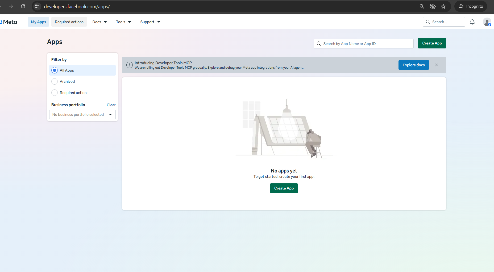

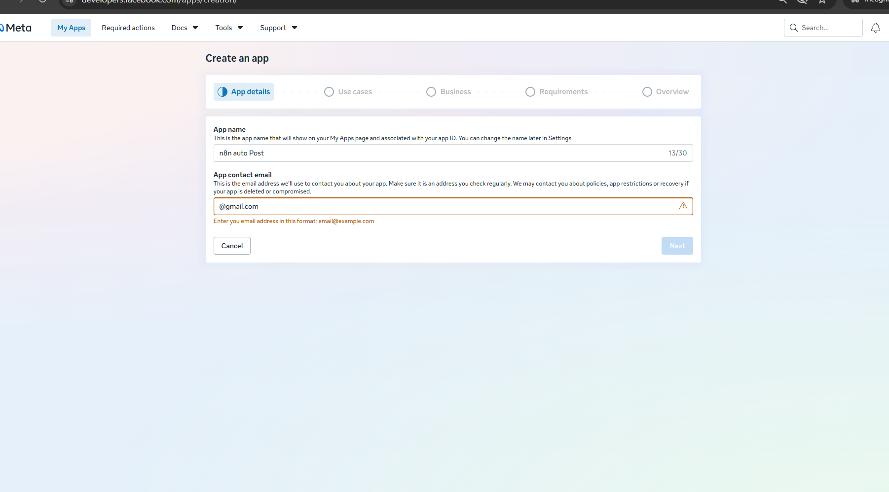

3. **Chọn mục đích sử dụng:**
   * Chọn mục **Khác** (Other) → Bấm **Tiếp tục** (Next).

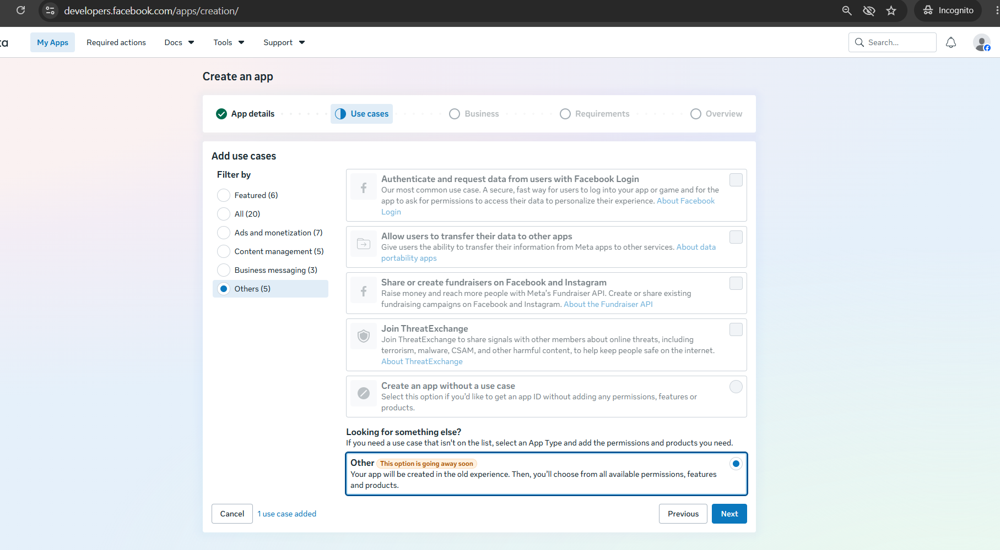

   * Chọn loại ứng dụng: Chọn **Doanh nghiệp** (Business) hoặc **Không có** / **Khác** tùy giao diện hiện tại → Bấm **Tiếp tục**.

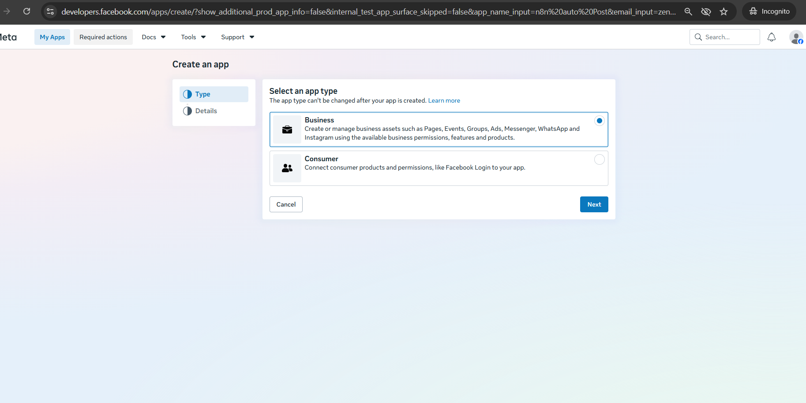

4. **Điền thông tin ứng dụng:**
   * **Tên hiển thị ứng dụng (App Name):** Đặt tên dễ nhớ (ví dụ: `n8n Auto Post`).
   * **Email liên hệ:** Nhập email cá nhân của bạn.

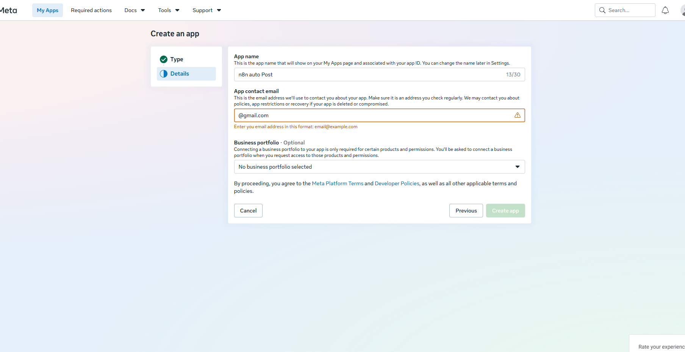

5. Bấm nút **Tạo ứng dụng** (Create App) và nhập lại mật khẩu Facebook để xác minh.

---

##### Bước 3: Thiết lập Facebook Login for Business

1. Tại danh sách sản phẩm, chọn thiết lập **Facebook Login for Business**.

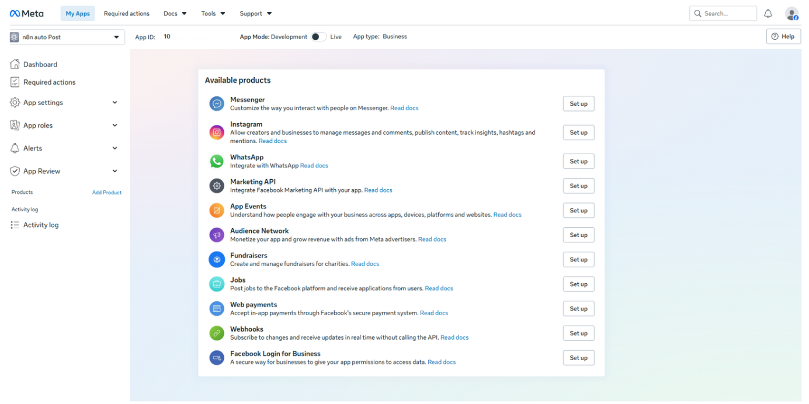

2. Hoàn tất các bước thiết lập cơ bản cho sản phẩm.

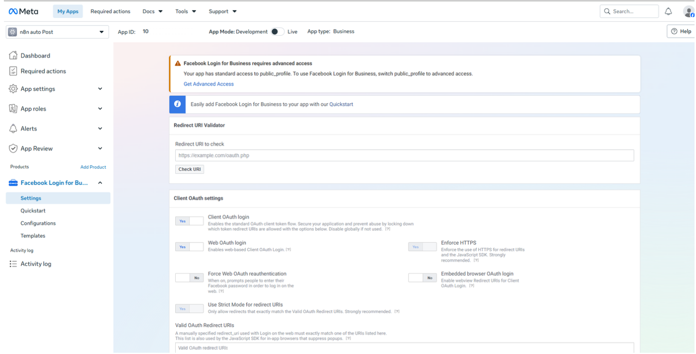

---

#### 🔹 GIAI ĐOẠN 2: CẤP QUYỀN VÀ LẤY PAGE ACCESS TOKEN TỪ GRAPH API EXPLORER

##### Bước 4: Truy cập công cụ Graph API Explorer

1. Truy cập trực tiếp vào công cụ thử nghiệm của Meta: [developers.facebook.com/tools/explorer](https://developers.facebook.com/tools/explorer/).

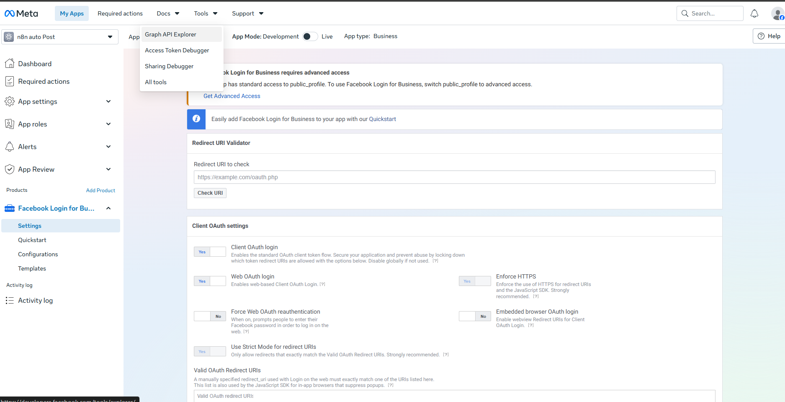

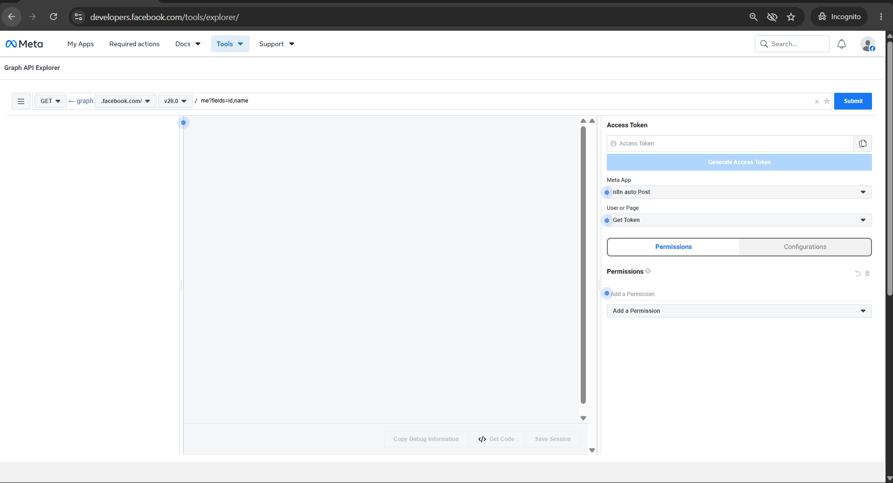

2. Nhìn sang cột **Access Token** nằm ở bên phải màn hình.

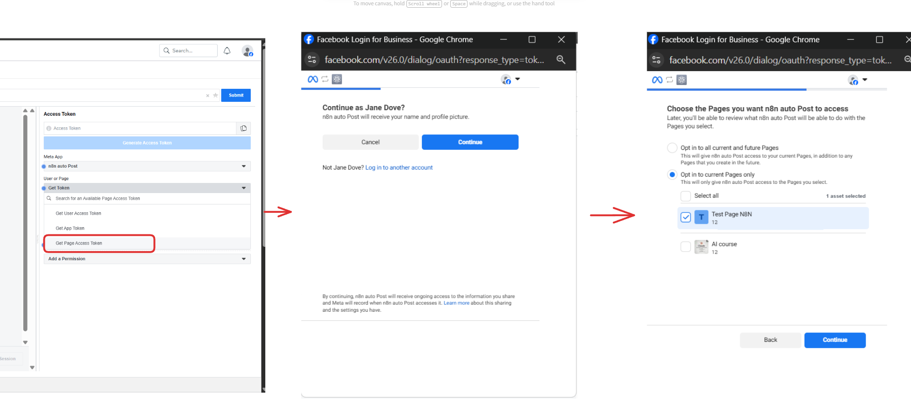

##### Bước 5: Thêm các quyền (Permissions) bắt buộc

1. Tìm đến mục **Permissions** ở góc dưới bên phải.
2. Bấm vào ô **Add a Permission** để tìm và thêm đủ 3 quyền sau:
   * `pages_show_list` (Đọc danh sách Fanpage bạn quản lý)
   * `pages_read_engagement` (Đọc thông tin tương tác Trang)
   * `pages_manage_posts` (Đặc quyền đăng bài lên Fanpage)

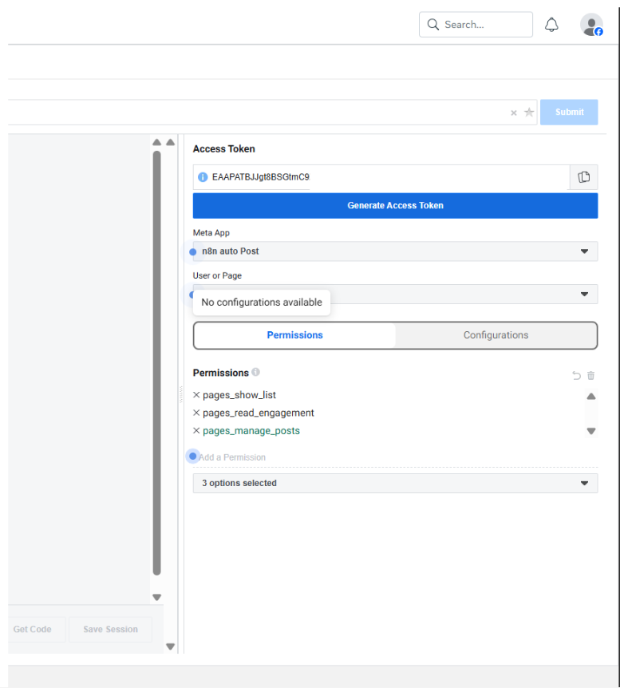

##### Bước 6: Tạo Token người dùng trước (User Token)

1. Ngay bên dưới mục Access Token, tại ô **Meta App**, bấm chọn đúng tên App bạn vừa tạo ở Bước 2 (ví dụ: `n8n Auto Post`).
2. Bấm nút màu xanh **Generate Access Token**.
3. Màn hình sẽ hiện một pop-up của Facebook yêu cầu cấp quyền: Bấm **Tiếp tục dưới tên [Tên bạn]** → Chọn Fanpage bạn muốn kết nối → Bấm **Đồng ý / Hoàn tất**.

##### Bước 7: Đổi sang Page Access Token (BƯỚC QUAN TRỌNG NHẤT)

> ⚠️ **Bẫy lỗi phổ biến:** Mã vừa sinh ra ở Bước 6 chỉ là **User Token** (Mã cá nhân). Nếu dán mã này vào n8n, Facebook sẽ chặn và báo lỗi `403 Forbidden` ngay lập tức!

1. Tại cột bên phải, nhìn vào mục **User or Page** (đang hiển thị chữ `User Token` hoặc tên cá nhân).
2. Bấm vào menu thả xuống và **chọn chính xác tên Fanpage của bạn** (ví dụ: `Fanpage Của Bạn`).
3. Ngay lập tức, chuỗi mã ở ô **Access Token** trên cùng sẽ tự động làm mới. **Đó mới chính là Page Access Token chuẩn.**
4. Bấm vào biểu tượng **Copy Token** bên cạnh ô Access Token để lưu mã này lại.

##### Bước 8: Lấy Page ID (ID Fanpage)

1. Mở một thẻ (tab) mới trên trình duyệt, vào trực tiếp **Fanpage Facebook** của bạn.
2. Vào mục **Giới thiệu (About)** → Cuộn xuống tìm dòng **ID Trang (Page ID)** và copy dãy số này (Ví dụ: `1234567890123456`).
3. *Cách 2:* Hoặc ngay trên trang Graph API Explorer, xóa ô nhập lệnh ở giữa, gõ `me/accounts` rồi bấm **Submit**. Trong khung JSON trả về, tìm tên Fanpage của bạn và copy dãy số `id` ngay bên dưới.

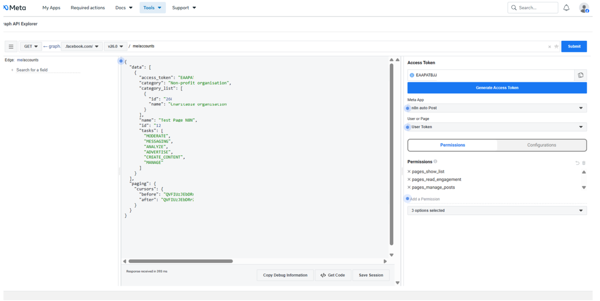

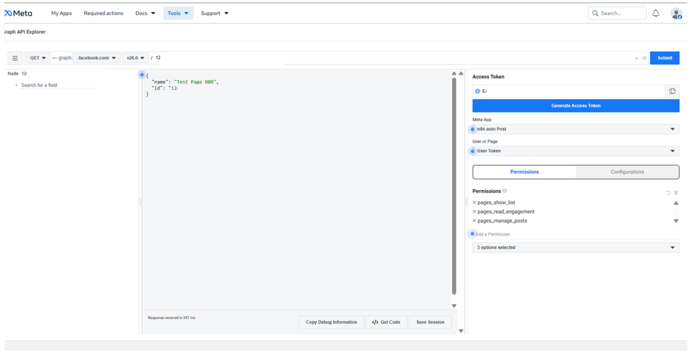

---

#### 🔹 GIAI ĐOẠN 3: ĐƯA THÔNG TIN VÀO N8N

##### Bước 9: Lưu Credential trong n8n

1. Mở n8n, vào mục **Credentials** (hoặc mở Node Facebook Graph API lên).
2. Tạo mới một Credential loại **Facebook Graph API**.
3. Tại ô **Access Token**: Xóa sạch ký tự cũ và **dán đoạn Page Access Token** đã copy ở Bước 7 vào.
4. Bấm **Save** (Lưu lại).

##### Bước 10: Cấu hình chi tiết Node 10 (Facebook Graph API)

Sau khi có credential chuẩn, bạn tiến hành điền các tham số vào Node 10 trong luồng n8n:

* **Type**: `Facebook Graph API`
* **Credential**: Chọn Credential vừa lưu ở Bước 9.
* **HTTP Request Method**: `POST`
* **Graph API Version**: `v25.0` (hoặc giữ mặc định)
* **Node**: Điền **Page ID** đã lấy ở Bước 8 (Ví dụ: `1234567890123456`).
* **Edge**: `photos` (Để đăng bài kèm hình ảnh).
* **Query Parameters**:
  * **Parameter 1**: `Name: message` → `Value (Expression): {{ $json.Content }}`
  * **Parameter 2**: `Name: url` → `Value (Expression): {{ $json.ImageURL }}`

Bấm **Execute step** để kiểm tra bài viết và hình ảnh được đẩy lên tường Fanpage thành công!

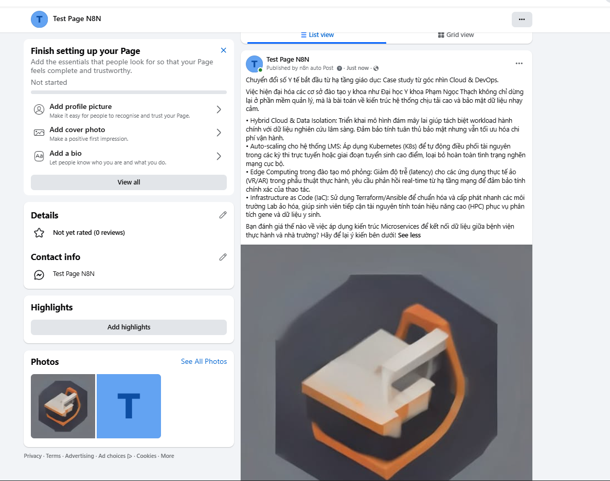

---

=== SUBTAB: ⚡ Phương pháp 2: 1-Click Import Workflow JSON n8n

## ⚡ HƯỚNG DẪN 1-CLICK IMPORT WORKFLOW N8N

Nếu bạn muốn cài đặt nhanh toàn bộ luồng tự động hóa này chỉ trong **10 giây**, hãy làm theo các bước đơn giản bên dưới:

### 1. Copy Mã Workflow JSON Chuẩn Đã Làm Sạch
Bấm nút **`Copy`** ở góc trên bên phải của ô mã JSON bên dưới:

```json
{
  "name": "Buổi 4 - Auto Post Content & Image to Facebook Page (n8n)",
  "nodes": [
    {
      "parameters": {
        "rule": {
          "interval": [
            {
              "triggerAtHour": 7
            }
          ]
        }
      },
      "type": "n8n-nodes-base.scheduleTrigger",
      "typeVersion": 1.3,
      "position": [-592, -16],
      "id": "16b821f2-cfa7-471a-98da-68585d164987",
      "name": "Schedule Trigger"
    },
    {
      "parameters": {
        "url": "https://trends.google.com/trending/rss?geo=VN",
        "options": {}
      },
      "type": "n8n-nodes-base.rssFeedRead",
      "typeVersion": 1.2,
      "position": [-368, -16],
      "id": "a2f2c66e-9f6d-49b1-b102-e27f3c239d8d",
      "name": "RSS Read"
    },
    {
      "parameters": {
        "maxItems": 3
      },
      "type": "n8n-nodes-base.limit",
      "typeVersion": 1,
      "position": [-144, -16],
      "id": "dbad6c0c-a77d-499c-a960-48dd7753d7f0",
      "name": "Limit"
    },
    {
      "parameters": {
        "fieldsToAggregate": {
          "fieldToAggregate": [
            {
              "fieldToAggregate": "title"
            }
          ]
        },
        "options": {}
      },
      "type": "n8n-nodes-base.aggregate",
      "typeVersion": 1,
      "position": [80, -16],
      "id": "b6cb50dd-f676-41ec-8c6a-506cfe1f21a0",
      "name": "Aggregate"
    },
    {
      "parameters": {
        "modelId": {
          "__rl": true,
          "mode": "list",
          "value": "models/gemini-3-flash-preview"
        },
        "messages": {
          "values": [
            {
              "content": "=Bạn là một chuyên gia về DevOps và Cloud Computing. Dưới đây là 3 từ khóa đang trending trên Google:\n{{ $json.title }}\n\nNhiệm vụ của bạn:\n\nPhân tích và chọn ra đúng 1 từ khóa có tiềm năng ứng dụng công nghệ/hạ tầng mạng nhất.\n\nViết một bài đăng mạng xã hội chuyên sâu dựa trên từ khóa đó (dưới 1200 ký tự). Bỏ qua các từ sáo rỗng. Tập trung đánh giá tác động kỹ thuật, tính khả dụng, hoặc tối ưu hóa tự động hóa.\n\nTrình bày bài viết có câu Hook thu hút, dùng ký hiệu (•) cho các ý chính và kết thúc bằng một Call-to-action.\n\nTrả về định dạng JSON BẮT BUỘC:\n{\n\"trending_keyword\": \"Từ khóa bạn chọn\",\n\"social_post\": \"Nội dung bài viết hoàn chỉnh...\"\n}"
            }
          ]
        },
        "builtInTools": {},
        "options": {}
      },
      "type": "@n8n/n8n-nodes-langchain.googleGemini",
      "typeVersion": 1.2,
      "position": [304, -16],
      "id": "11b0a4fb-0102-4103-8562-c875e4511025",
      "name": "Message a model",
      "credentials": {
        "googlePalmApi": {
          "id": "YOUR_GEMINI_CREDENTIAL_ID",
          "name": "Google Gemini(PaLM) Api account"
        }
      }
    },
    {
      "parameters": {
        "operation": "appendOrUpdate",
        "documentId": {
          "__rl": true,
          "value": "YOUR_GOOGLE_SHEET_ID_HERE",
          "mode": "list",
          "cachedResultName": "Auto post Fb"
        },
        "sheetName": {
          "__rl": true,
          "value": "gid=0",
          "mode": "list",
          "cachedResultName": "Trang tính1"
        },
        "columns": {
          "mappingMode": "defineBelow",
          "value": {
            "ID": "={{ $execution.id }}",
            "Keyword": "={{ JSON.parse($json.content.parts[0].text.replace(/```json/gi, '').replace(/```/g, '').trim()).trending_keyword }}",
            "Content": "={{ JSON.parse($json.content.parts[0].text.replace(/```json/gi, '').replace(/```/g, '').trim()).social_post }}",
            "ImageURL": "=https://image.pollinations.ai/prompt/{{ encodeURIComponent(\"Tech illustration about \" + JSON.parse($json.content.parts[0].text.replace(/```json/gi, '').replace(/```/g, '').trim()).trending_keyword) }}?width=1024&height=1024&nologo=true"
          },
          "matchingColumns": ["ID"],
          "schema": [
            { "id": "ID", "displayName": "ID" },
            { "id": "Keyword", "displayName": "Keyword" },
            { "id": "Content", "displayName": "Content" },
            { "id": "ImageURL", "displayName": "ImageURL" }
          ]
        }
      },
      "type": "n8n-nodes-base.googleSheets",
      "typeVersion": 4.7,
      "position": [736, -32],
      "id": "c6a278e8-6241-4421-99b1-7d3b5db6d0a9",
      "name": "Append or update row in sheet",
      "credentials": {
        "googleSheetsOAuth2Api": {
          "id": "YOUR_GOOGLE_SHEETS_CREDENTIAL_ID",
          "name": "Google Sheets account"
        }
      }
    },
    {
      "parameters": {
        "path": "duyet-bai",
        "options": {}
      },
      "type": "n8n-nodes-base.webhook",
      "typeVersion": 2.1,
      "position": [-576, 224],
      "id": "62f591a5-f4cf-4e9f-9f3d-d4c64d4174c5",
      "name": "Webhook"
    },
    {
      "parameters": {
        "chatId": "YOUR_TELEGRAM_CHAT_ID_HERE",
        "text": "=<b>🔥 BẢN NHÁP MỚI CẦN DUYỆT</b>\n\n<b>Chủ đề:</b> {{ $json.Keyword }}\n\n{{ $json.Content }}",
        "replyMarkup": "inlineKeyboard",
        "inlineKeyboard": {
          "rows": [
            {
              "row": {
                "buttons": [
                  {
                    "text": "✅ DUYỆT & ĐĂNG BÀI",
                    "additionalFields": {
                      "url": "=https://<YOUR_N8N_DOMAIN>/webhook-test/duyet-bai?id={{ $json.ID }}"
                    }
                  }
                ]
              }
            }
          ]
        },
        "additionalFields": {
          "parse_mode": "HTML"
        }
      },
      "type": "n8n-nodes-base.telegram",
      "typeVersion": 1.2,
      "position": [1040, -32],
      "id": "bfc0c5f5-8fb6-49cb-9c48-8f3101a6db96",
      "name": "Send a text message",
      "credentials": {
        "telegramApi": {
          "id": "YOUR_TELEGRAM_CREDENTIAL_ID",
          "name": "Telegram account"
        }
      }
    },
    {
      "parameters": {
        "documentId": {
          "__rl": true,
          "value": "YOUR_GOOGLE_SHEET_ID_HERE",
          "mode": "list",
          "cachedResultName": "Auto post Fb"
        },
        "sheetName": {
          "__rl": true,
          "value": "gid=0",
          "mode": "list",
          "cachedResultName": "Trang tính1"
        },
        "filtersUI": {
          "values": [
            {
              "lookupColumn": "ID",
              "lookupValue": "={{ $json.query.id }}"
            }
          ]
        }
      },
      "type": "n8n-nodes-base.googleSheets",
      "typeVersion": 4.7,
      "position": [-352, 224],
      "id": "797b4045-1290-4446-8763-5b8689632e15",
      "name": "Get row(s) in sheet",
      "credentials": {
        "googleSheetsOAuth2Api": {
          "id": "YOUR_GOOGLE_SHEETS_CREDENTIAL_ID",
          "name": "Google Sheets account"
        }
      }
    },
    {
      "parameters": {
        "httpRequestMethod": "POST",
        "graphApiVersion": "v25.0",
        "node": "YOUR_FACEBOOK_PAGE_ID_HERE",
        "edge": "photos",
        "options": {
          "queryParameters": {
            "parameter": [
              {
                "name": "message",
                "value": "={{ $json.Content }}"
              },
              {
                "name": "url",
                "value": "={{ $json.ImageURL }}"
              }
            ]
          }
        }
      },
      "type": "n8n-nodes-base.facebookGraphApi",
      "typeVersion": 1,
      "position": [-128, 224],
      "id": "4ec6e73e-3525-4cfd-8bbc-d4bc52c28011",
      "name": "Facebook Graph API",
      "credentials": {
        "facebookGraphApi": {
          "id": "YOUR_FACEBOOK_GRAPH_API_CREDENTIAL_ID",
          "name": "Facebook Graph account"
        }
      }
    }
  ],
  "connections": {
    "Schedule Trigger": { "main": [[{ "node": "RSS Read", "type": "main", "index": 0 }]] },
    "RSS Read": { "main": [[{ "node": "Limit", "type": "main", "index": 0 }]] },
    "Limit": { "main": [[{ "node": "Aggregate", "type": "main", "index": 0 }]] },
    "Aggregate": { "main": [[{ "node": "Message a model", "type": "main", "index": 0 }]] },
    "Message a model": { "main": [[{ "node": "Append or update row in sheet", "type": "main", "index": 0 }]] },
    "Append or update row in sheet": { "main": [[{ "node": "Send a text message", "type": "main", "index": 0 }]] },
    "Webhook": { "main": [[{ "node": "Get row(s) in sheet", "type": "main", "index": 0 }]] },
    "Get row(s) in sheet": { "main": [[{ "node": "Facebook Graph API", "type": "main", "index": 0 }]] }
  }
}
```

### 2. Các Bước Dán Vào n8n

1. Mở canvas n8n trên trình duyệt của bạn.
2. Bấm phím tắt **`Ctrl + V`** (hoặc `Cmd + V` trên Mac) trên màn hình n8n.
3. n8n sẽ tự động tạo ngay lập tức đầy đủ **10 Node** đã kết nối sẵn đường dây!
4. Thay thế các vị trí placeholder `YOUR_GOOGLE_SHEET_ID_HERE`, `YOUR_TELEGRAM_CHAT_ID_HERE`, và `YOUR_FACEBOOK_PAGE_ID_HERE` bằng thông tin cá nhân của bạn.

---

## 🛠️ IV. BẢN ĐỒ TRÁNH BẪY LỖI CHO HỌC VIÊN (TROUBLESHOOTING)

| Hiện tượng lỗi | Nguyên nhân chính | Cách xử lý nhanh |
| :--- | :--- | :--- |
| **Facebook báo lỗi 403 Forbidden / Invalid Token** | Copy nhầm User Token cá nhân thay vì Page Access Token. | Trên trang Graph API Explorer, tại mục *User or Page*, bắt buộc bấm vào menu thả xuống và chọn chính xác tên Fanpage rồi mới copy token. |
| **Facebook báo lỗi #100 url should represent a valid URL** | Link ảnh bị dính dấu `=` thừa hoặc chứa ký tự tiếng Việt có dấu khiến URL bị gãy. | Kiểm tra lại ô `ImageURL` trong Google Sheets, bắt buộc bọc hàm `encodeURIComponent()` xung quanh từ khóa tiếng Việt. |
| **Google Sheets lỗi SyntaxError: Unexpected token** | Dữ liệu trả về từ Gemini có chứa ký hiệu mã markdown ```json ...``` làm hỏng hàm `JSON.parse`. | Sử dụng đoạn mã làm sạch chuỗi: `.replace(/```json/gi, '').replace(/```/g, '').trim()` trước khi truyền vào `JSON.parse`. |
