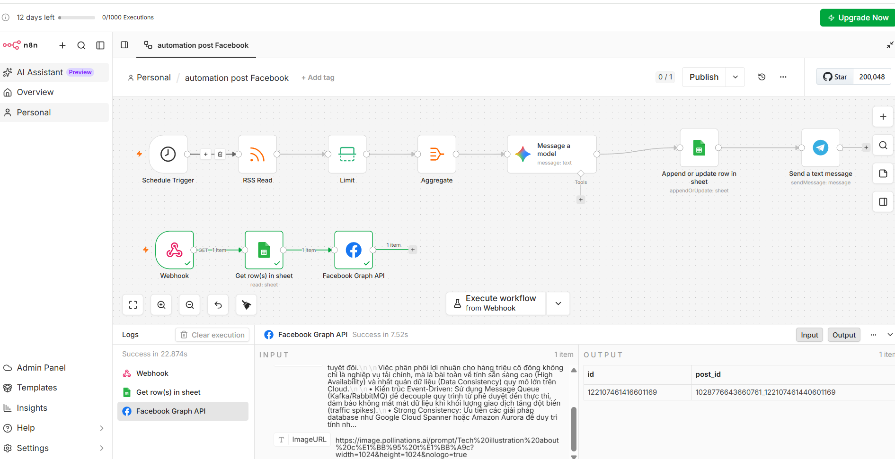

# Buổi 4: Máy Sản Xuất Content Auto Đăng Bài Facebook Page (Kiểm Duyệt Telegram)

## 📖 Tổng Quan Buổi Học

Xây dựng **"Nhà máy sản xuất nội dung"** hoàn toàn tự động cho Facebook Fanpage kết hợp kiểm duyệt con người (Human-In-The-Loop):

- **Nhánh 1**: Quét tin tức hot từ Google Trends → AI Gemini chọn từ khóa & viết bài → Sinh ảnh AI tự động → Lưu Google Sheets → Bắn bản nháp sang Telegram cho quản trị viên duyệt.
- **Nhánh 2**: Bấm nút **✅ DUYỆT & ĐĂNG BÀI** trên Telegram → Webhook n8n kích hoạt → Đăng bài viết + Ảnh AI trực tiếp lên Facebook Fanpage qua Meta Graph API.

---

## 🎯 Mục Tiêu Đạt Được (OKRs)

- [x] Làm chủ tư duy tự động hóa bài viết kết hợp kiểm duyệt **Human-In-The-Loop**.
- [x] Kết nối **Google Trends RSS**, **Gemini AI**, **Pollinations AI Image Generator**, **Google Sheets**, **Telegram Bot** và **Facebook Graph API**.
- [x] Xử lý bẫy lỗi bọc chuỗi tiếng Việt `encodeURIComponent` và làm sạch chuỗi JSON `JSON.parse`.
