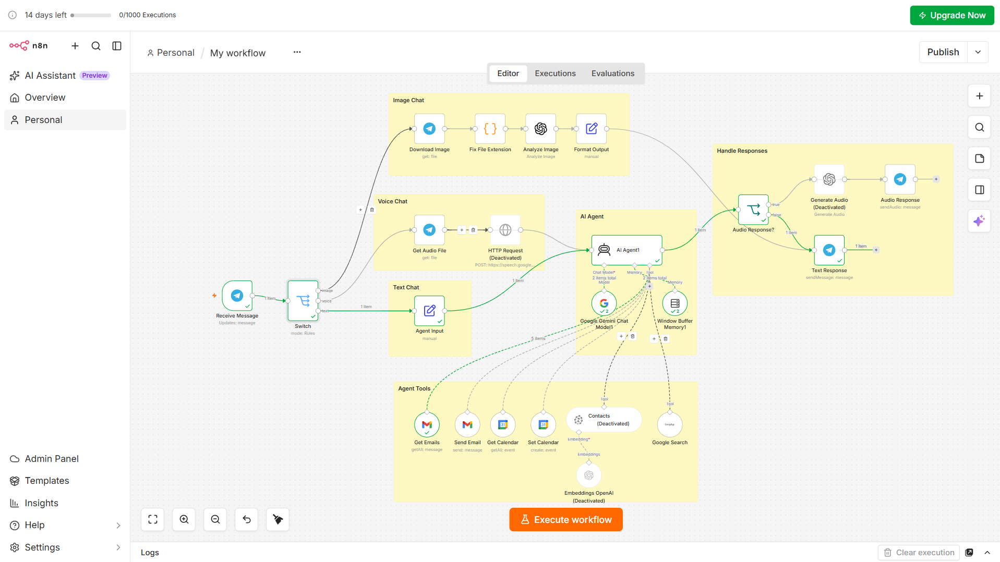
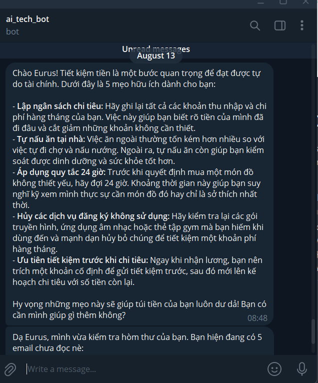
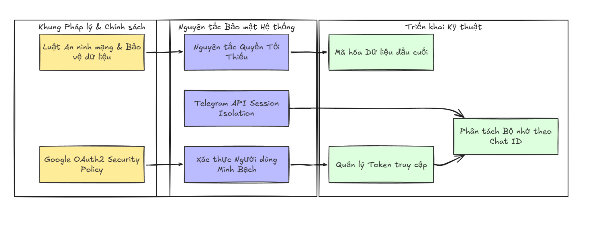

# Bài 1: Trợ Lý AI Siêu Năng Lực Telegram (Multi-Tool Agentic AI: Gmail, Calendar, Web Search & Vision)



Kết quả


## 📖 I. TỔNG QUAN VÀ MỤC TIÊU BÀI HỌC (THỜI LƯỢNG: 120 PHÚT)

Trong bài học này, học viên sẽ được tự tay xây dựng một **"Trợ lý AI Đa Năng Sam Bot"** trên Telegram kết nối n8n AI Agent với 5 Siêu Công cụ (Tools) thực tế:

- **Quản lý Gmail**: Đọc danh sách Email chưa đọc (`UNREAD`) & Tự động soạn/gửi Email theo yêu cầu bằng ngôn ngữ tự nhiên.
- **Lịch biểu Google Calendar**: Tra cứu lịch làm việc cá nhân & Tự khởi tạo lịch họp/nhắc nhở mới vào hệ thống Lịch Google.
- **Tìm kiếm Google Search (SerpAPI)**: Tra cứu thông tin thời gian thực, giá coin, giá vàng, tin tức công nghệ mới nhất trên Internet.
- **Thị giác AI (GPT-4o-mini Vision)**: Nhận diện, phân tích và mô tả chi tiết nội dung hình ảnh gửi từ ứng dụng Telegram.
- **Bộ nhớ hội thoại (Window Buffer Memory)**: Ghi nhớ tên tuổi, sở thích và ngữ cảnh trò chuyện của từng người dùng qua Chat ID.

---

## ⚖️ II. KHUNG PHÁP LÝ & QUY ĐỊNH BẢO MẬT DỮ LIỆU CÁ NHÂN (SECURITY & PRIVACY)

> [!IMPORTANT]
> **LƯU Ý BẢO MẬT QUAN TRỌNG KHI KẾT NỐI API TRỢ LÝ AI VỚI HỘP THƯ & LỊCH CÁ NHÂN:**
> Khi ủy quyền cho AI Agent truy cập các dữ liệu nhạy cảm (Gmail, Google Calendar), kỹ sư AI bắt buộc phải tuân thủ các nguyên tắc an toàn dữ liệu:



1. **Nguyên tắc Quyền tối thiểu (Principle of Least Privilege)**: Chỉ cấp quyền đọc/gửi email cần thiết, không chia sẻ quyền quản trị toàn bộ tài khoản Google Workspace.
2. **Phân tách Bộ nhớ theo Chat ID**: Mã `sessionKey` trong Node Memory bắt buộc phải gán theo `chat.id` của từng người dùng trên Telegram để tránh rò rỉ dữ liệu hội thoại chéo giữa các tài khoản khác nhau.
3. **Định dạng tin nhắn an toàn HTML**: Sử dụng `Parse Mode: HTML` thay cho Markdown để ngăn ngừa lỗi rò rỉ ký tự entity parsing (`can't parse entities`).

---

## 🔑 III. CHUẨN BỊ MÔI TRƯỜNG & THIẾT LẬP CREDENTIALS TẬP TRUNG (UPFRONT SETUP)

Học viên tiến hành thiết lập sẵn toàn bộ Môi trường & Credentials ngay ở bước này để khi kéo-thả n8n không bị ngắt quãng.

### 1. Telegram Bot Token (Miễn phí 100%)
- Mở ứng dụng Telegram $\rightarrow$ Tìm bot `@BotFather`.
- Gõ lệnh `/newbot` $\rightarrow$ Nhập tên Bot và Username cho Bot.
- Copy chuỗi **API Token** được cấp (VD: `8699105519:AAGa7X...`).
- Trên n8n UI: Mở **Credentials** $\rightarrow$ Thêm mới **Telegram account** $\rightarrow$ Dán Access Token vào và bấm Save.

### 2. OpenAI API Key (Model GPT-4o-mini & Vision)
- Truy cập trang [platform.openai.com/api-keys](https://platform.openai.com/api-keys) $\rightarrow$ Đăng nhập tài khoản OpenAI.
- Bấm **Create new secret key** $\rightarrow$ Copy chuỗi API Key (`sk-proj-...`).
- Trên n8n UI: Thêm Credential **OpenAI API account** $\rightarrow$ Dán API Key vào và bấm Save.

### 3. SerpAPI Key (Dùng cho Tool Google Search)
- Truy cập [serpapi.com](https://serpapi.com) $\rightarrow$ Đăng ký tài khoản miễn phí (nhận 100 lượt tìm kiếm/tháng).
- Mở trang Dashboard $\rightarrow$ Copy mã **Private API Key**.
- Trên n8n UI: Thêm Credential **SerpAPI account** $\rightarrow$ Dán Key vào và bấm Save.

### 4. Google OAuth2 Credential (Dùng cho Gmail & Google Calendar)
- Trên n8n UI: Thêm Credential **Gmail OAuth2 API** và **Google Calendar OAuth2 API**.
- Chọn chế độ **Managed OAuth2** $\rightarrow$ Bấm nút **Sign in with Google** $\rightarrow$ Ủy quyền chọn tài khoản Gmail của bạn (Hệ thống sẽ hiện thông báo *Account connected* màu xanh lá).

---

## === SUBTAB: 🛠️ Phương pháp 1: Hướng dẫn Cấu hình Chi Tiết Từng Node

## ⚙️ IV. HƯỚNG DẪN CẤU HÌNH CHI TIẾT TỪNG NODE (13 NODES)

Học viên kéo-thả từng Node trên n8n canvas và điền thông số theo hướng dẫn chi tiết bên dưới:

### 🟢 GIAI ĐOẠN 1: TỰ ĐỘNG NHẬN TIN VÀ PHÂN LOẠI DỮ LIỆU

#### Node 1: Telegram Trigger (`Receive Message`)
- **Type**: `n8n-nodes-base.telegramTrigger`
- **Trigger On**: `Message`
- **Credential**: Chọn `Telegram account`.
- **Lý do dùng**: Tự động lắng nghe sự kiện tin nhắn mới từ người dùng trên Telegram.

#### Node 2: Switch Node (`Switch`)
- **Type**: `n8n-nodes-base.switch`
- **Rules**:
  - **Nhánh 1 (Image)**: `leftValue` = `={{ $json.message.photo }}` | Operator: `exists` | Output Name: `image`
  - **Nhánh 2 (Voice)**: `leftValue` = `={{ $json.message.voice.file_id }}` | Operator: `exists` | Output Name: `voice`
  - **Nhánh 3 (Text)**: `leftValue` = `={{ $json.message.text }}` | Operator: `exists` | Output Name: `text`
- **Lý do dùng**: Định tuyến chính xác văn bản sang AI Agent và hình ảnh sang OpenAI Vision.

---

### 🧠 GIAI ĐOẠN 2: DỰNG AI AGENT VỚI 5 SIÊU CÔNG CỤ (MULTI-TOOL AGENTIC AI)

#### Node 3: AI Agent Node (`AI Agent`)
- **Type**: `@n8n/n8n-nodes-langchain.agent`
- **Prompt Type**: `Define below`
- **Text**: `={{ $json.message.text }}`
- **System Message**:
  ```text
  You are a helpful assistant named Sam. You communicate in a friendly, concise manner. Always format your responses using HTML tags for formatting where appropriate (e.g. <b>bold</b>, <i>italic</i>, <code>code</code>, <a href="...">links</a>, etc.). DO NOT use Markdown syntax such as **bold** or *italic*.
  ```

#### Node 4: OpenAI Chat Model
- **Type**: `@n8n/n8n-nodes-langchain.lmChatOpenAi`
- **Model**: `gpt-4o-mini`
- **Credential**: Chọn `OpenAI API account`.

#### Node 5: Window Buffer Memory
- **Type**: `@n8n/n8n-nodes-langchain.memoryBufferWindow`
- **Session Key**: `={{ $('Receive Message').first().json.message.chat.id }}`
- **Context Window Length**: `20`

#### Node 6: Get Emails (Gmail Tool)
- **Type**: `n8n-nodes-base.gmailTool`
- **Operation**: `GetAll`
- **Limit**: `5`
- **Filters**: `readStatus` = `unread`

#### Node 7: Send Email (Gmail Tool)
- **Type**: `n8n-nodes-base.gmailTool`
- **Operation**: `Send`

#### Node 8: Get Calendar (Google Calendar Tool)
- **Type**: `n8n-nodes-base.googleCalendarTool`
- **Operation**: `GetAll`

#### Node 9: Set Calendar (Google Calendar Tool)
- **Type**: `n8n-nodes-base.googleCalendarTool`
- **Operation**: `Create`

#### Node 10: Google Search (SerpAPI Tool)
- **Type**: `n8n-nodes-base.serpApi`
- **Credential**: Chọn `SerpAPI account`.

---

### 👁️ GIAI ĐOẠN 3: XỬ LÝ HÌNH ẢNH VỚI VISION AI

#### Node 11: OpenAI Vision
- **Type**: `@n8n/n8n-nodes-langchain.openAi`
- **Resource**: `Image`
- **Model**: `gpt-4o-mini`
- **Prompt**: `={{ $json.message.caption || 'Describe this image' }}`

#### Node 12: Format Vision Output (`Format Vision Output`)
- **Type**: `n8n-nodes-base.set`
- **Assignment**: `output` = `={{ $json.content }}`

---

### 🚀 GIAI ĐOẠN 4: PHẢN HỒI TIN NHẮN VỀ TELEGRAM (HTML FORMATTER)

#### Node 13: Send Telegram Response
- **Type**: `n8n-nodes-base.telegram`
- **Chat ID**: `={{ $('Receive Message').first().json.message.chat.id }}`
- **Text**: `={{ $json.output }}`
- **Additional Fields** $\rightarrow$ **Parse Mode**: `HTML`

---

## === SUBTAB: 🚀 Phương pháp 2: Nhập nhanh Workflow qua File JSON (1-Click Import)

## 🚀 V. HƯỚNG DẪN IMPORT 1-CLICK DÀNH CHO BÀI TEST NHANH

1. Tải file mã nguồn n8n JSON chuẩn: [workflow_buoi_6_chatbot_telegram.json](/workflow_buoi_6_chatbot_telegram.json).
2. Trên n8n Canvas: Chọn **Workflows $\rightarrow$ Import from File**.
3. Nối 4 Credential (Telegram, OpenAI, SerpAPI, Google OAuth2).
4. Bấm **`Publish`** (Active) và nhắn tin Telegram trải nghiệm 9 Kịch bản!

---

## 🧪 VI. HƯỚNG DẪN TEST HOÀN CHỈNH (9 KỊCH BẢN CHECKLIST)

Đảm bảo Workflow đã được chuyển sang trạng thái **`🟢 Published`** (Active) trên n8n. Mở ứng dụng Telegram nhắn tin trực tiếp cho Bot Sam để kiểm tra 9 kịch bản:

### 1. Nhánh Text cơ bản (Chào hỏi)
* **Gửi**: `hello`
* **Mong đợi**: Bot trả lời thân thiện, xưng tên Sam. Chữ viết hiển thị chuẩn HTML đẹp mắt.

### 2. Test Định Dạng HTML (Formatting)
* **Gửi**: `Liệt kê giúp tôi 5 mẹo tiết kiệm tiền, có in đậm tiêu đề mỗi mục`
* **Mong đợi**: Danh sách hiển thị gọn gàng, tiêu đề được in đậm bằng thẻ `<b>`, gạch đầu dòng dùng dấu `-`. Không lộ ký tự Markdown thô.

### 3. Nhánh Gmail — Đọc Email Chưa Đọc (Tool Get Emails)
* **Gửi**: `Kiểm tra email chưa đọc của tôi`
* **Mong đợi**: Bot tự gọi Tool Gmail trích xuất tối đa 5 email UNREAD trong hộp thư INBOX, tóm tắt người gửi và tiêu đề.

### 4. Nhánh Gmail — Gửi Email Tự Động (Tool Send Email)
* **Gửi**: `Gửi email tới [email_cua_ban@gmail.com] với tiêu đề "Test Bot Sam" và nội dung "Đây là email thử nghiệm từ Sam"`
* **Mong đợi**: Bot xác nhận đã gửi email thành công $\rightarrow$ Kiểm tra hộp thư đến nhận được email.

### 5. Nhánh Google Calendar — Xem Lịch Làm Việc (Tool Get Calendar)
* **Gửi**: `Hôm nay tôi có lịch gì không?` hoặc `Xem lịch tuần này`
* **Mong đợi**: Bot tra cứu và liệt kê các sự kiện có trên Google Calendar của bạn.

### 6. Nhánh Google Calendar — Tạo Sự Kiện Mới (Tool Set Calendar)
* **Gửi**: `Tạo sự kiện "Họp nhóm Dự án AI" ngày mai lúc 15h đến 16h`
* **Mong đợi**: Bot tự gọi Tool tạo sự kiện trên Google Calendar và gửi thông báo xác nhận đã thêm vào lịch.

### 7. Nhánh Google Search — Tra Cứu Real-time (Tool SerpAPI)
* **Gửi**: `Tìm giúp tôi giá Bitcoin hôm nay` hoặc `Tin tức công nghệ mới nhất về n8n`
* **Mong đợi**: Bot dùng SerpAPI tìm kiếm web real-time và tổng hợp câu trả lời chính xác.

### 8. Nhánh Image — Thị Giác AI (OpenAI Vision)
* **Gửi**: *[Gửi một tấm ảnh bất kỳ lên Telegram]* kèm caption: `Mô tả tấm ảnh này giúp tôi`
* **Mong đợi**: Bot nhận diện ảnh qua GPT-4o-mini Vision và trả lời chi tiết nội dung bức ảnh.

### 9. Test Bộ Nhớ Hội Thoại (Window Buffer Memory)
* **Gửi lần 1**: `Tên tôi là Minh, nhớ nhé`
* **Gửi lần 2**: `Tên tôi là gì?`
* **Mong đợi**: Bot ghi nhớ Chat ID và trả lời chính xác tên "Minh".

---

## 💡 VII. BẢN ĐỒ XỬ LÝ BẪY LỖI & THỰC CHIẾN (TROUBLESHOOTING)

| Hiện tượng lỗi | Nguyên nhân cốt lõi | Cách xử lý tức thì (5 giây) |
| :--- | :--- | :--- |
| **`can't parse entities`** | Telegram báo lỗi khi dùng Markdown syntax chứa ký tự `*` hoặc `_` chưa escape. | Chuyển `Parse Mode` thành **`HTML`** và ép AI dùng thẻ `<b>`, `<i>`. |
| **`Cannot read properties of undefined (reading 'trim')`** | Biến `$json.message.text` bị trống do tham chiếu nhầm node trung gian. | Đổi biểu thức sang: `{{ $('Receive Message').first().json.message.text }}`. |
| **`Bad Request: bad webhook: An HTTPS URL must be provided`** | n8n Local tự gửi link `http://` khi đăng ký Webhook với Telegram. | Bật n8n qua ngrok HTTPS hoặc dùng link Cloud HTTPS. |
| **`Parameter "Model" is required`** | n8n chưa lưu tên model trong dropdown UI. | Bấm chọn lại `gpt-4o-mini` trong dropdown Model. |

---

## 🎯 VIII. CHECKLIST HOÀN THÀNH BÀI HỌC

- [x] Nắm vững nguyên tắc an toàn dữ liệu và phân tách bộ nhớ hội thoại theo Chat ID.
- [x] Kết nối thành công 4 loại Credentials (Telegram, OpenAI, SerpAPI, Google OAuth2).
- [x] Xây dựng luồng AI Agent đa năng tự động gọi 5 Tools (Gmail, Calendar, SerpAPI).
- [x] Tích hợp mô hình Vision GPT-4o-mini nhận diện hình ảnh từ Telegram.
- [x] Làm chủ định dạng tin nhắn HTML hiển thị chuẩn đẹp không lỗi Parse Entities trên Telegram.
