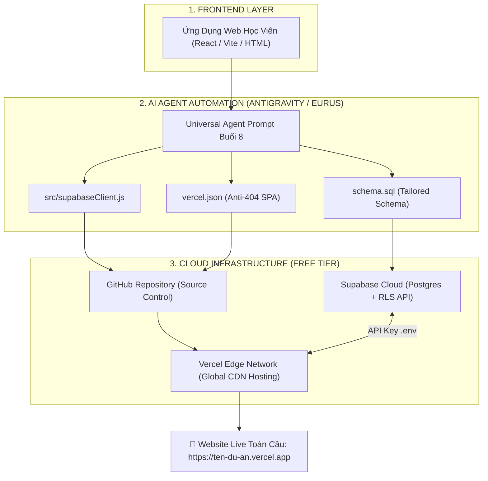

# Bài 1: Đưa Ứng Dụng Web Lên Internet Toàn Cầu Với Vercel & Quản Trị Cơ Sở Dữ Liệu Supabase


## 📖 I. TỔNG QUAN VÀ MỤC TIÊU BÀI HỌC (THỜI LƯỢNG: 120 PHÚT)

Sau khi hoàn thành sản phẩm ở Buổi 7 thông qua phương pháp **Vibe Coding với AI Agent**, buổi học cuối cùng này sẽ giúp bạn hoàn tất chặng đường trở thành một **Nhà Sáng Tạo AI Độc Lập (Full-Stack AI Creator)**:

- **Mục tiêu 1**: Chuyển đổi ứng dụng từ chế độ chạy cục bộ (`localhost`) thành một trang web chính thức chạy trên Internet toàn cầu với tên miền `https://ten-du-an.vercel.app` (Miễn phí 100%, có SSL HTTPS bảo mật và mạng phân phối CDN toàn cầu).
- **Mục tiêu 2**: Kết nối cơ sở dữ liệu đám mây **Supabase (PostgreSQL)** để lưu trữ an toàn mọi dữ liệu người dùng (Form đăng ký, Đơn hàng, Kết quả Quiz, Khách hàng tiềm năng Leads) theo thời gian thực (Real-time).
- **Mục tiêu 3**: Làm chủ **Universal Agent Prompt (Prompt Vạn Năng)** để điều khiển AI Agent tự động phân tích mã nguồn dự án riêng của bạn, tự sinh file kết nối, tự viết mã SQL Schema và tự tạo cấu hình Vercel chuẩn xác không gặp lỗi.

---

## 🏛️ II. KIẾN TRÚC TRIỂN KHAI PRODUCTION ĐA NĂNG (JAMSTACK ARCHITECTURE)



---

## 🤖 III. 01 UNIVERSAL AGENT PROMPT BUỔI 8 (PROMPT VẠN NĂNG CHO MỌI DỰ ÁN)

> [!TIP]
> **HƯỚNG DẪN DÀNH CHO HỌC VIÊN:**
> Vì ở Buổi 7 mỗi bạn đã tạo ra một dự án khác nhau (Landing Page, Quiz Studio, Quản lý chi tiêu, Web Portfolio,...), bạn chỉ cần mở **Antigravity IDE** hoặc công cụ **AI Agent** của mình, copy toàn bộ nội dung trong khung bên dưới và dán vào:

```prompt
Bạn là Chuyên gia DevOps & Cloud Architecture cấp cao. Hãy phân tích toàn bộ mã nguồn của dự án hiện tại và giúp tôi thiết lập kết nối Supabase Database cùng cấu hình Vercel Deployment theo chuẩn Zero-Error.

Nhiệm vụ cụ thể của bạn:
1. PHÂN TÍCH DỮ LIỆU DỰ ÁN:
   - Quét xem dự án hiện tại đang có những Form nhập liệu, bài Quiz, hay bảng dữ liệu nào cần lưu trữ.
   - Tạo 01 file 'schema.sql' ở thư mục gốc chứa câu lệnh SQL tạo bảng Supabase tương ứng với các trường dữ liệu đó (bao gồm khóa chính UUID, timestamp created_at và chính sách Row Level Security 'Allow public insert/select' để người dùng bên ngoài có thể gửi dữ liệu an toàn).

2. TẠO MODULE KẾT NỐI SUPABASE CLIENT:
   - Tạo file 'src/supabaseClient.js' (hoặc 'src/lib/supabase.js') sử dụng thư viện '@supabase/supabase-js'.
   - Đọc biến môi trường an toàn: import.meta.env.VITE_SUPABASE_URL và import.meta.env.VITE_SUPABASE_ANON_KEY (kèm fallback xử lý lỗi nếu chưa nạp biến).

3. NỐI SỰ KIỆN LƯU DỮ LIỆU TRÊN FRONTEND:
   - Cập nhật hàm xử lý Submit Form hoặc kết thúc bài test/quiz để gọi 'supabase.from("tên_bảng").insert([...])'.
   - Thêm trạng thái Loading và thông báo Toast/Alert thành công đẹp mắt cho người dùng.

4. CẤU HÌNH DEPLOY VERCEL:
   - Tạo file 'vercel.json' ở thư mục gốc với quy tắc rewrite: {"rewrites": [{"source": "/(.*)", "destination": "/"}]} để chống lỗi 404 Not Found khi F5 tải lại trang trên Vercel.
   - Tạo file '.env.example' mẫu và đảm bảo file '.env' cùng '.env.local' đã nằm trong '.gitignore'.

Hãy thực hiện tự động và giải thích ngắn gọn các bước tiếp theo để tôi nạp Key và Deploy!
```

---

## 🔑 IV. CHUẨN BỊ MÔI TRƯỜNG & CREDENTIALS UPFRONT (3 BƯỚC 5 PHÚT)

Học viên chuẩn bị sẵn 3 tài khoản dịch vụ miễn phí dưới đây:

### 1. Tài Khoản Supabase (Cơ Sở Dữ Liệu PostgreSQL Đám Mây)
- Truy cập [supabase.com](https://supabase.com) $\rightarrow$ Bấm **Sign In** (Đăng nhập bằng tài khoản GitHub của bạn).
- Bấm **New Project** $\rightarrow$ Đặt tên dự án (VD: `my-ai-app`) $\rightarrow$ Tạo mật khẩu Database $\rightarrow$ Chọn Region `Singapore (ap-southeast-1)` để có tốc độ truy xuất nhanh nhất về Việt Nam $\rightarrow$ Bấm **Create new project**.

### 2. Tài Khoản GitHub (Lưu Trữ Mã Nguồn)
- Truy cập [github.com](https://github.com) $\rightarrow$ Đăng nhập tài khoản.
- Tạo một Repository mới (VD: `my-ai-project-2026`) ở chế độ **Public** hoặc **Private**.

### 3. Tài Khoản Vercel (Nền Tảng Xuất Bản Website)
- Truy cập [vercel.com](https://vercel.com) $\rightarrow$ Chọn **Sign Up** hoặc **Log In** với tài khoản **GitHub**.

---

## === SUBTAB: 🛠️ Phương pháp 1: Quy Trình Triển Khai Thực Chiến Từng Bước (Step-by-Step)

## ⚙️ V. HƯỚNG DẪN TRIỂN KHAI THỰC CHIẾN (QUY TRÌNH 4 BƯỚC CHUẨN)

### 🟢 BƯỚC 1: KHỞI TẠO BẢNG DỮ LIỆU TRÊN SUPABASE

1. Trên Dashboard Supabase của bạn, ở menu bên trái chọn biểu tượng **SQL Editor** (Hình biểu tượng đoạn code `>_`).
2. Mở file `schema.sql` mà AI Agent vừa tạo cho bạn ở Phần III (hoặc dán mẫu chuẩn bên dưới) $\rightarrow$ Bấm nút màu xanh **RUN**:

```sql
-- 1. Tạo bảng lưu trữ thông tin đăng ký / dữ liệu người dùng
CREATE TABLE IF NOT EXISTS public.submissions (
    id UUID PRIMARY KEY DEFAULT gen_random_uuid(),
    full_name TEXT NOT NULL,
    email TEXT NOT NULL,
    phone TEXT,
    message TEXT,
    metadata JSONB DEFAULT '{}'::jsonb,
    created_at TIMESTAMP WITH TIME ZONE DEFAULT timezone('utc'::text, now()) NOT NULL
);

-- 2. Bật tính năng Row Level Security (RLS) để kiểm soát an ninh
ALTER TABLE public.submissions ENABLE ROW LEVEL SECURITY;

-- 3. Tạo chính sách (Policy) cho phép khách truy cập web gửi dữ liệu (INSERT)
CREATE POLICY "Cho phep khach gui form cong khai" 
ON public.submissions 
FOR INSERT 
TO anon 
WITH CHECK (true);

-- 4. Tạo chính sách (Policy) cho phép xem dữ liệu
CREATE POLICY "Cho phep doc du lieu cong khai" 
ON public.submissions 
FOR SELECT 
TO anon 
USING (true);
```

3. Mở mục **Table Editor** trên menu trái $\rightarrow$ Bạn sẽ thấy bảng `submissions` đã được tạo sẵn sàng nhận dữ liệu.
4. Mở mục **Project Settings (Biểu tượng Bánh răng)** $\rightarrow$ Chọn mục **Data API**:
   - Sao chép **Project URL** (VD: `https://xyzcompany.supabase.co`).
   - Sao chép **anon public key** (chuỗi ký tự bắt đầu bằng `eyJhbGci...`).

---

### 🟡 BƯỚC 2: CÀI ĐẶT THƯ VIỆN & CẤU HÌNH BIẾN MÔI TRƯỜNG CỤC BỘ

1. Mở Terminal trong thư mục dự án của bạn và chạy lệnh cài đặt SDK Supabase:
   ```bash
   npm install @supabase/supabase-js
   ```

2. Kiểm tra file `src/supabaseClient.js` đã được AI Agent tạo với nội dung:
   ```javascript
   import { createClient } from '@supabase/supabase-js';

   const supabaseUrl = import.meta.env.VITE_SUPABASE_URL || '';
   const supabaseAnonKey = import.meta.env.VITE_SUPABASE_ANON_KEY || '';

   if (!supabaseUrl || !supabaseAnonKey) {
     console.warn('⚠️ Cảnh báo: Chưa cấu hình VITE_SUPABASE_URL hoặc VITE_SUPABASE_ANON_KEY trong file .env');
   }

   export const supabase = createClient(supabaseUrl, supabaseAnonKey);
   ```

3. Tạo file `.env.local` ở thư mục gốc của dự án và điền 2 mã vừa lấy ở Bước 1:
   ```env
   VITE_SUPABASE_URL=https://your-project-id.supabase.co
   VITE_SUPABASE_ANON_KEY=eyJhbGciOiJIUzI1NiIsInR5cCI6IkpXVCJ9...
   ```

4. Chạy lệnh `npm run dev` $\rightarrow$ Mở trang web thử nhập Form hoặc làm Quiz để kiểm tra dữ liệu đã gửi thành công vào Supabase!

---

### 🟠 BƯỚC 3: ĐẨY MÃ NGUỒN LÊN GITHUB

1. Kiểm tra file `.gitignore` đảm bảo đã có dòng `.env` và `.env.local` để không làm lộ Key bí mật:
   ```gitignore
   node_modules
   dist
   .env
   .env.local
   ```

2. Mở Terminal tại thư mục dự án và chạy chuỗi lệnh Git để đẩy toàn bộ code lên GitHub:
   ```bash
   git add .
   git commit -m "feat: complete project and integrate supabase database"
   git branch -M main
   git remote add origin https://github.com/TEN_GITHUB_CUA_BAN/TEN_REPO.git
   git push -u origin main
   ```

---

### 🔴 BƯỚC 4: XUẤT BẢN WEBSITE LÊN VERCEL (1-CLICK DEPLOY)

1. Truy cập [vercel.com/dashboard](https://vercel.com/dashboard).
2. Bấm nút màu đen **Add New...** $\rightarrow$ Chọn **Project**.
3. Tại danh sách Repository GitHub, tìm tên dự án của bạn $\rightarrow$ Bấm **Import**.
4. Tại mục **Environment Variables** (Mục quan trọng nhất):
   - **Key 1**: `VITE_SUPABASE_URL` | **Value**: Dán Project URL Supabase của bạn.
   - **Key 2**: `VITE_SUPABASE_ANON_KEY` | **Value**: Dán anon key Supabase của bạn.
   - Bấm **Add** cho từng biến.

5. Bấm nút **Deploy**!
   - Vercel sẽ tự động tải mã nguồn, cài đặt thư viện và build dự án trong vòng 30 - 45 giây.
   - Màn hình sẽ bắn pháo hoa kèm thông báo: **"Congratulations! Your project has been deployed"**!
   - Bấm vào hình ảnh xem trước để truy cập trang web chính thức của bạn trên Internet với đường dẫn `https://ten-du-an.vercel.app`!

---

## === SUBTAB: 🚀 Phương pháp 2: File Cấu Hình Mẫu Sẵn Dùng (1-Click Files)

## 📦 VI. BỘ FILE CẤU HÌNH CHUẨN ĐÓNG GÓI SẴN

Học viên có thể tải hoặc sao chép nhanh 3 file cấu hình cốt lõi dưới đây vào dự án của mình:

### 1. File `vercel.json` (Đặt ở thư mục gốc dự án)
```json
{
  "rewrites": [
    {
      "source": "/(.*)",
      "destination": "/"
    }
  ]
}
```

### 2. File `src/supabaseClient.js`
```javascript
import { createClient } from '@supabase/supabase-js';

const supabaseUrl = import.meta.env.VITE_SUPABASE_URL || '';
const supabaseAnonKey = import.meta.env.VITE_SUPABASE_ANON_KEY || '';

export const supabase = createClient(supabaseUrl, supabaseAnonKey);

// Hàm tiện ích mẫu: Gửi dữ liệu vào Supabase
export async function submitLead(formData) {
  try {
    const { data, error } = await supabase
      .from('submissions')
      .insert([formData])
      .select();

    if (error) throw error;
    return { success: true, data };
  } catch (error) {
    console.error('Lỗi khi gửi dữ liệu vào Supabase:', error.message);
    return { success: false, error: error.message };
  }
}
```

### 3. File `schema.sql` (Chạy trên Supabase SQL Editor)
```sql
CREATE TABLE IF NOT EXISTS public.leads (
    id UUID PRIMARY KEY DEFAULT gen_random_uuid(),
    full_name TEXT NOT NULL,
    email TEXT NOT NULL,
    phone TEXT,
    note TEXT,
    created_at TIMESTAMP WITH TIME ZONE DEFAULT timezone('utc'::text, now()) NOT NULL
);

ALTER TABLE public.leads ENABLE ROW LEVEL SECURITY;

CREATE POLICY "Allow public insert" ON public.leads FOR INSERT TO anon WITH CHECK (true);
CREATE POLICY "Allow public select" ON public.leads FOR SELECT TO anon USING (true);
```

---

## 🧪 VII. HƯỚNG DẪN TEST TOÀN TRÌNH SAU KHI DEPLOY (5 BƯỚC TESTING)

Sau khi nhận link Vercel, học viên tiến hành nghiệm thu theo 5 bài test:

1. **Test 1 (Kiểm tra truy cập Internet)**: Mở đường link Vercel trên điện thoại di động hoặc chế độ ẩn danh (Incognito) để xác nhận trang web tải mượt mà không bị giới hạn mạng nội bộ.
2. **Test 2 (Kiểm tra chống lỗi 404 khi F5)**: Bấm phím **F5** (hoặc Reload) nhiều lần ở các trang con $\rightarrow$ Trang web vẫn hiển thị bình thường nhờ file `vercel.json`.
3. **Test 3 (Gửi dữ liệu thực tế)**: Nhập thông tin thử nghiệm vào Form đăng ký / Làm bài Quiz trên trang web live $\rightarrow$ Bấm nút Gửi.
4. **Test 4 (Xác minh Real-time trên Supabase)**: Mở tab **Table Editor** trên Supabase $\rightarrow$ Dòng dữ liệu bạn vừa nhập trên web live xuất hiện ngay lập tức trong bảng!
5. **Test 5 (Kiểm tra bảo mật)**: Nhấn `F12` mở Console trình duyệt $\rightarrow$ Không có cảnh báo lộ Secret Key hay lỗi kết nối API.

---

## 💡 VIII. BẢN ĐỒ XỬ LÝ BẪY LỖI THỰC CHIẾN (TROUBLESHOOTING MAP)

| Hiện tượng lỗi | Nguyên nhân cốt lõi | Cách xử lý tức thì (10 giây) |
| :--- | :--- | :--- |
| **404: NOT_FOUND khi F5 tải lại trang trên Vercel** | Dự án Single Page App (Vite/React) thiếu file định tuyến trên máy chủ Vercel. | Thêm file `vercel.json` ở thư mục gốc chứa `{"rewrites": [{"source": "/(.*)", "destination": "/"}]}` $\rightarrow$ Git commit & push lại. |
| **`new row violates row-level security policy`** | Bảng Supabase đang bật chế độ bảo mật RLS nhưng chưa cấp quyền cho người dùng `anon`. | Vào Supabase **SQL Editor** $\rightarrow$ Chạy lệnh: `CREATE POLICY "Allow anon insert" ON [ten_bang] FOR INSERT TO anon WITH CHECK (true);`. |
| **Dữ liệu không lưu / Biến môi trường báo `undefined`** | Đặt tên biến thiếu tiền tố `VITE_` hoặc chưa điền Environment Variables trên Vercel. | Đổi tên biến thành `VITE_SUPABASE_URL` và `VITE_SUPABASE_ANON_KEY`. Vào Vercel Settings $\rightarrow$ Environment Variables $\rightarrow$ Điền Key $\rightarrow$ Redeploy. |
| **Lỗi Build Vercel: `Failed to compile` do TypeScript/Linter** | Quá trình build kiểm tra kiểu dữ liệu nghiêm ngặt. | Thêm `"build": "vite build"` trong `package.json` (bỏ qua `tsc` nếu code thử nghiệm). |
| **Trang web trắng tinh sau khi Deploy** | Đường dẫn tài nguyên base path trong `vite.config.js` bị sai. | Đảm bảo `base: './'` hoặc `base: '/'` trong `vite.config.js`. |

---

## 🎓 IX. TỔNG KẾT HÀNH TRÌNH 8 BUỔI & CHECKLIST TỐT NGHIỆP

Chúc mừng bạn đã hoàn thành trọn vẹn khóa học **AI & Automation Masterclass 8 Buổi Thực Chiến**!

### 🏆 Bảng Tiêu Chí Nghiệm Thu Tốt Nghiệp (Capstone Checklist):
- [x] **Buổi 1 - 2**: Làm chủ Kỹ nghệ Prompting ChatGPT, Tự động hóa bảng tính Google Sheets & Slide báo cáo bằng AI.
- [x] **Buổi 3 - 6**: Xây dựng 4 Hệ thống n8n Tự động hóa đỉnh cao (Cào RSS, Máy sản xuất Video Shorts YouTube, Chatbot AI Telegram Đa Năng Sam Bot).
- [x] **Buổi 7**: Làm chủ Tư duy Kỹ nghệ AI Agent & Vibe Coding kiến tạo ứng dụng phần mềm độc lập.
- [x] **Buổi 8**: Xuất bản sản phẩm web live toàn cầu trên Vercel và kết nối Cơ sở dữ liệu Cloud Supabase thời gian thực.
